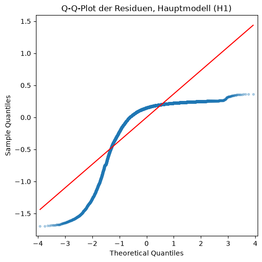
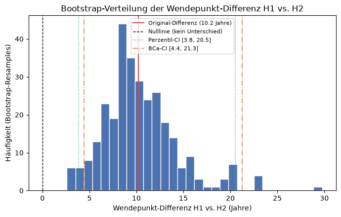
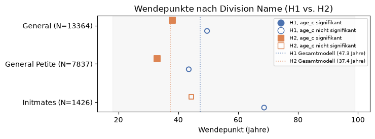
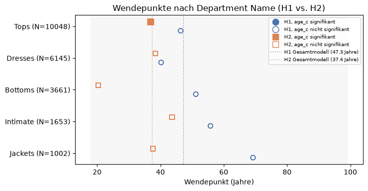
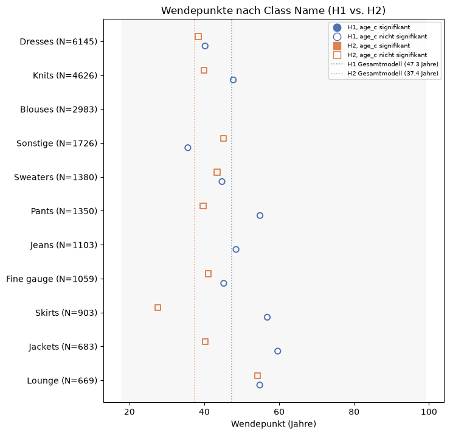

# 04 – Regression: H1, H2 & H3

Dieses Notebook prüft:

- **H1**: `VADER Compound` (Sentiment) ~ `Age` + `Age²` (OLS)
- **H2**: `Rating` ~ `Age` + `Age²` (ordinal, `OrderedModel`), inkl. Test der Proportional-Odds-Annahme (Brant-Test + LR-Cross-Check)
- **H3**: Zusammenhang zwischen `VADER Compound` und `Rating`, ohne Alter oder weitere Kontrollvariablen, geprüft als `Rating ~ VADER Compound` (ordinal, `OrderedModel`, inkl. Proportional-Odds-Test), ergänzt um eine deskriptive Verteilungsanalyse sowie Pearson-/Spearman-Korrelation

Für H1 und H2 wird jeweils ein **Basismodell**, ein **Hauptmodell** (mit Kontrollvariablen) sowie **Robustheitsprüfungen** gerechnet. `Positive Feedback Count` und `Recommended IND` werden aus den Hauptmodellen ausgeschlossen und nur als separate Robustheitsprüfungen mitgeführt. Der Grund dafür ist, dass beide Kennzahlen erst *nach* der Bewertung durch Reaktionen anderer Kund:innen beziehungsweise als direkte Konsequenz der eigenen Bewertung entstehen und somit "bad control" post-treatment-Variablen im Sinne von Angrist & Pischke (2009) sind. H3 kommt ohne diese Kontrollvariablen aus, da hier ausschliesslich der direkte Zusammenhang zwischen den beiden Bewertungsmethoden von Interesse ist.

**Zentrierung von Age:** `Age` liegt nur in einem engen, rein positiven Wertebereich (18–99, Mittelwert ≈ 43). `Age` und `Age²` sind dadurch stark korreliert, was sich in einer hohen Condition Number niederschlägt (Multikollinearität, keine strukturelle Fehlspezifikation). Alle Modelle werden daher mit der **mittelwertzentrierten** Altersvariable `Age_c = Age - mean(Age)` und `Age_c² ` geschätzt. Das ist eine reine Reparametrisierung. Da alle Modelle einen freien Achsenabschnitt (OLS) bzw. freie Schwellenwerte (OrderedModel) besitzen, der/die eine konstante Verschiebung vollständig auffängt, bleiben Modellanpassung (R², Pseudo-R², AIC, Log-Likelihood) **exakt identisch**. Nur die Koeffizienten, ihre Standardfehler und die Condition Number ändern sich. Das wird weiter unten numerisch bestätigt. (Für H3 ist diese Zentrierung nicht relevant, da `Age` dort nicht als Prädiktor verwendet wird.)


```python
import numpy as np
import pandas as pd
import statsmodels.api as sm
import statsmodels.formula.api as smf
from statsmodels.iolib.summary2 import summary_col
from statsmodels.miscmodels.ordinal_model import OrderedModel
from scipy.stats import chi2, pearsonr, spearmanr
import matplotlib.pyplot as plt
from pathlib import Path

pd.set_option("display.max_columns", None)
pd.set_option("display.width", 120)
```


```python
PROJECT_ROOT = Path.cwd().parent
PROCESSED_DIR = PROJECT_ROOT / "data" / "processed"
RESULTS_DIR = PROJECT_ROOT / "results"
RESULTS_DIR.mkdir(parents=True, exist_ok=True)
FIGURES_DIR = PROJECT_ROOT / "figures"
FIGURES_DIR.mkdir(parents=True, exist_ok=True)

df = pd.read_csv(PROCESSED_DIR / "reviews_vader.csv")
df.shape
```


    (22640, 18)


Die 22640 Zeilen stimmen mit dem Endergebnis aus `03_VADER.ipynb` überein. Die 18 Spalten setzen sich aus den vorherigen 13 (aus dem `03_VADER.ipynb` Notebook) sowie 5 neuen Spalten zusammen: den 4 VADER-Werten (Negative, Neutral, Positive, Compound) und `VADER Sentiment` (die Klassenkategorie).

## Age zentrieren

Neben dem zentrierten Alter `Age_c` und dessen Quadrat `Age_c_sq` wird zur Veranschaulichung auch das unzentrierte `Age_sq` berechnet. Für die Modellschätzung werden jedoch ausschliesslich `Age_c` und `Age_c_sq` verwendet.


```python
age_mean = df["Age"].mean()
df["Age_sq"] = df["Age"] ** 2
df["Age_c"] = df["Age"] - age_mean
df["Age_c_sq"] = df["Age_c"] ** 2

print(f"age_mean = {age_mean:.4f}")
df[["Age", "Age_sq", "Age_c", "Age_c_sq"]].describe()
```

    age_mean = 43.2807


<div>
<style scoped>
    .dataframe tbody tr th:only-of-type {
        vertical-align: middle;
    }

    .dataframe tbody tr th {
        vertical-align: top;
    }

    .dataframe thead th {
        text-align: right;
    }
</style>
<table border="1" class="dataframe">
  <thead>
    <tr style="text-align: right;">
      <th></th>
      <th>Age</th>
      <th>Age_sq</th>
      <th>Age_c</th>
      <th>Age_c_sq</th>
    </tr>
  </thead>
  <tbody>
    <tr>
      <th>count</th>
      <td>22640.000000</td>
      <td>22640.000000</td>
      <td>2.264000e+04</td>
      <td>22640.000000</td>
    </tr>
    <tr>
      <th>mean</th>
      <td>43.280654</td>
      <td>2025.167668</td>
      <td>-4.017203e-17</td>
      <td>151.952682</td>
    </tr>
    <tr>
      <th>std</th>
      <td>12.327181</td>
      <td>1161.464059</td>
      <td>1.232718e+01</td>
      <td>207.782487</td>
    </tr>
    <tr>
      <th>min</th>
      <td>18.000000</td>
      <td>324.000000</td>
      <td>-2.528065e+01</td>
      <td>0.078767</td>
    </tr>
    <tr>
      <th>25%</th>
      <td>34.000000</td>
      <td>1156.000000</td>
      <td>-9.280654e+00</td>
      <td>18.323996</td>
    </tr>
    <tr>
      <th>50%</th>
      <td>41.000000</td>
      <td>1681.000000</td>
      <td>-2.280654e+00</td>
      <td>76.027000</td>
    </tr>
    <tr>
      <th>75%</th>
      <td>52.000000</td>
      <td>2704.000000</td>
      <td>8.719346e+00</td>
      <td>203.937070</td>
    </tr>
    <tr>
      <th>max</th>
      <td>99.000000</td>
      <td>9801.000000</td>
      <td>5.571935e+01</td>
      <td>3104.645551</td>
    </tr>
  </tbody>
</table>
</div>


Der Mittelwert von `Age_c` liegt bei praktisch 0 (-4.02e-17, numerisch bedingte Rundungsabweichung), was die korrekte Zentrierung bestätigt. Das Alter selbst bewegt sich weiterhin im ursprünglichen Bereich von 18 bis 99 Jahren.

Zur einheitlichen Auswertung der nachfolgenden Modelle werden drei Hilfsfunktionen definiert:
1. `params_table` fasst die Koeffizienten eines Modells übersichtlich zusammen
2. `turning_point` berechnet den Wendepunkt der quadratischen Alters-Beziehung auf der ursprünglichen Altersskala
3. `cond_number` quantifiziert die Multikollinearität einer Designmatrix.


```python
def params_table(res, model_label):
    """Koeffizienten-Tabelle (Term/Koeffizient/SE/Statistik/p) eines Modells, mit Modelltyp-Spalte."""
    return pd.DataFrame({
        "Modelltyp": model_label,
        "Term": res.params.index,
        "Koeffizient": res.params.values,
        "SE": res.bse.values,
        "Statistik": res.tvalues.values,
        "p_Wert": res.pvalues.values,
    })


def turning_point(beta_age_c, beta_age_c_sq, mean_age=age_mean):
    """Wendepunkt auf der echten Altersskala: zuerst in zentrierten Einheiten berechnen,
    dann den Mittelwert zurücktransformieren (-beta_age_c / (2*beta_age_c_sq) + mean_age)."""
    return -beta_age_c / (2 * beta_age_c_sq) + mean_age


def cond_number(X):
    """Condition Number einer Designmatrix (np.linalg.cond)."""
    return np.linalg.cond(np.asarray(X))
```

---

# H1: VADER Compound ~ Age + Age² (OLS)

1. **Basismodell**: nur `Age_c` + `Age_c²`
2. **Hauptmodell**: zusätzlich `Division Name`, `Department Name`
3. **Robustheitsmodell A**: Hauptmodell + `Recommended IND` (post-treatment-Variable, s. u.)
4. **Robustheitsmodell B**: Hauptmodell + `Positive Feedback Count` (post-treatment-Variable,
   s. u.)

`Recommended IND` wird, genau wie `Positive Feedback Count`, als "bad control" im Sinne von
Angrist & Pischke (2009) behandelt: Ob eine Kundin ein Produkt weiterempfiehlt, ist eine
Konsequenz ihrer Bewertung (Sentiment und Rating), nicht deren Ursache. Die Variable wird daher
aus dem Hauptmodell entfernt und stattdessen nur als separates Robustheitsmodell mitgeführt.

`Class Name` wird weiterhin nicht aufgenommen, da es inhaltlich mit `Department Name`
überlappt.


## Modell-Datensatz vorbereiten


```python
h1_cols = {
    "VADER Compound": "vader_compound",
    "Age": "age",
    "Age_sq": "age_sq",
    "Age_c": "age_c",
    "Age_c_sq": "age_c_sq",
    "Division Name": "division_name",
    "Department Name": "department_name",
    "Recommended IND": "recommended_ind",
    "Positive Feedback Count": "positive_feedback_count",
}

h1_df = df[list(h1_cols.keys())].rename(columns=h1_cols)
h1_df.isna().sum()
```


    vader_compound              0
    age                         0
    age_sq                      0
    age_c                       0
    age_c_sq                    0
    division_name              13
    department_name            13
    recommended_ind             0
    positive_feedback_count     0
    dtype: int64


13 Zeilen ohne `Division Name`/`Department Name` werden von `statsmodels` im Hauptmodell und in den beiden Robustheitsmodellen automatisch listenweise ausgeschlossen. Das Basismodell (nur Alter) nutzt weiterhin alle 22.640 Beobachtungen.

Zu jedem Modell wird zusätzlich kurz die **unzentrierte** Variante geschätzt, was ausschliesslich zum Vergleich der Condition Number und zur Bestätigung, dass die Modellgüte durch die Zentrierung unverändert bleibt, dient. Gespeichert/berichtet wird am Ende nur die zentrierte
Variante.


## Basismodell: Age + Age²


```python
h1_basis_raw = smf.ols("vader_compound ~ age + age_sq", data=h1_df).fit()
h1_basis = smf.ols("vader_compound ~ age_c + age_c_sq", data=h1_df).fit()
print(h1_basis.summary())
```

                                OLS Regression Results                            
    ==============================================================================
    Dep. Variable:         vader_compound   R-squared:                       0.000
    Model:                            OLS   Adj. R-squared:                  0.000
    Method:                 Least Squares   F-statistic:                     4.336
    Date:                Sun, 30 Aug 2026   Prob (F-statistic):             0.0131
    Time:                        12:53:03   Log-Likelihood:                -9410.2
    No. Observations:               22640   AIC:                         1.883e+04
    Df Residuals:                   22637   BIC:                         1.885e+04
    Df Model:                           2                                         
    Covariance Type:            nonrobust                                         
    ==============================================================================
                     coef    std err          t      P>|t|      [0.025      0.975]
    ------------------------------------------------------------------------------
    Intercept      0.7349      0.003    236.664      0.000       0.729       0.741
    age_c         -0.0003      0.000     -1.407      0.160      -0.001       0.000
    age_c_sq    3.706e-05   1.27e-05      2.927      0.003    1.22e-05    6.19e-05
    ==============================================================================
    Omnibus:                    11014.983   Durbin-Watson:                   1.980
    Prob(Omnibus):                  0.000   Jarque-Bera (JB):            53398.272
    Skew:                          -2.430   Prob(JB):                         0.00
    Kurtosis:                       8.744   Cond. No.                         328.
    ==============================================================================
    
    Notes:
    [1] Standard Errors assume that the covariance matrix of the errors is correctly specified.


Das Basismodell erklärt kaum Varianz (R² ≈ 0.000), ist jedoch als Gesamtmodell statistisch signifikant (p = 0.0131). Der lineare Term `age_c` ist nicht signifikant (p = 0.160), der quadratische Term `age_c_sq` hingegen schon (p = 0.003). Dies liefert einen ersten Hinweis auf einen nicht-linearen Zusammenhang zwischen Alter und Sentiment, auch wenn der Effekt insgesamt sehr schwach ausgeprägt ist. Die Condition Number von 328 liegt in einem unproblematischen Bereich.

## Hauptmodell: + Division Name, Department Name

`Recommended IND` wird hier bewusst nicht aufgenommen (siehe Begründung oben sowie
Robustheitsmodell A weiter unten).


```python
h1_haupt_raw = smf.ols(
    "vader_compound ~ age + age_sq + C(division_name) + C(department_name)",
    data=h1_df,
).fit()
h1_haupt = smf.ols(
    "vader_compound ~ age_c + age_c_sq + C(division_name) + C(department_name)",
    data=h1_df,
).fit()
print(h1_haupt.summary())

```

                                OLS Regression Results                            
    ==============================================================================
    Dep. Variable:         vader_compound   R-squared:                       0.001
    Model:                            OLS   Adj. R-squared:                  0.001
    Method:                 Least Squares   F-statistic:                     2.887
    Date:                Sun, 30 Aug 2026   Prob (F-statistic):            0.00206
    Time:                        12:53:03   Log-Likelihood:                -9400.4
    No. Observations:               22627   AIC:                         1.882e+04
    Df Residuals:                   22617   BIC:                         1.890e+04
    Df Model:                           9                                         
    Covariance Type:            nonrobust                                         
    ======================================================================================================
                                             coef    std err          t      P>|t|      [0.025      0.975]
    ------------------------------------------------------------------------------------------------------
    Intercept                              0.7434      0.007    113.358      0.000       0.731       0.756
    C(division_name)[T.General Petite]     0.0075      0.005      1.428      0.153      -0.003       0.018
    C(division_name)[T.Initmates]          0.0006      0.027      0.023      0.981      -0.052       0.053
    C(department_name)[T.Dresses]         -0.0130      0.008     -1.700      0.089      -0.028       0.002
    C(department_name)[T.Intimate]        -0.0202      0.025     -0.799      0.424      -0.070       0.029
    C(department_name)[T.Jackets]         -0.0105      0.013     -0.803      0.422      -0.036       0.015
    C(department_name)[T.Tops]            -0.0117      0.007     -1.655      0.098      -0.026       0.002
    C(department_name)[T.Trend]           -0.1195      0.034     -3.485      0.000      -0.187      -0.052
    age_c                                 -0.0003      0.000     -1.471      0.141      -0.001       0.000
    age_c_sq                            3.803e-05   1.27e-05      3.000      0.003    1.32e-05    6.29e-05
    ==============================================================================
    Omnibus:                    10998.416   Durbin-Watson:                   1.980
    Prob(Omnibus):                  0.000   Jarque-Bera (JB):            53263.994
    Skew:                          -2.427   Prob(JB):                         0.00
    Kurtosis:                       8.738   Cond. No.                     3.81e+03
    ==============================================================================
    
    Notes:
    [1] Standard Errors assume that the covariance matrix of the errors is correctly specified.
    [2] The condition number is large, 3.81e+03. This might indicate that there are
    strong multicollinearity or other numerical problems.


Ohne `Recommended IND` erklärt das Hauptmodell praktisch keine Varianz mehr (R² = 0.0011 statt 0.1920 mit `Recommended IND` im Modell), was zeigt, dass fast die gesamte vorherige Erklärungskraft von dieser post-treatment-Variable stammte. Der lineare Alterseffekt `age_c` ist jetzt nicht mehr signifikant (p = 0.141), der quadratische Term `age_c_sq` bleibt jedoch signifikant (p = 0.003). Der U-förmige, nicht-lineare Alterseffekt besteht also weiterhin, ist aber insgesamt schwach und wird primär vom quadratischen Term getragen. Von den Produktkategorien bleibt `Department Name` = Trend signifikant (p < 0.001).


## Robustheitsmodell A: Hauptmodell + Recommended IND

**"Bad control"-Problematik (Angrist & Pischke, 2009):** Ob eine Kundin das Produkt weiterempfiehlt (`Recommended IND`), ist eine Konsequenz ihrer Bewertung und damit zeitlich nachgelagert zum gemessenen Sentiment (`VADER Compound`), nicht dessen Ursache. Eine Konditionierung auf eine solche post-treatment-Variable im Hauptmodell würde den geschätzten Alterseffekt potenziell verzerren. `Recommended IND` wird daher **nicht** ins Hauptmodell aufgenommen, sondern nur zur Robustheitsprüfung ergänzt.


```python
h1_robust_a_raw = smf.ols(
    "vader_compound ~ age + age_sq + C(division_name) + C(department_name) + recommended_ind",
    data=h1_df,
).fit()
h1_robust_a = smf.ols(
    "vader_compound ~ age_c + age_c_sq + C(division_name) + C(department_name) + recommended_ind",
    data=h1_df,
).fit()
print(h1_robust_a.summary())

```

                                OLS Regression Results                            
    ==============================================================================
    Dep. Variable:         vader_compound   R-squared:                       0.192
    Model:                            OLS   Adj. R-squared:                  0.192
    Method:                 Least Squares   F-statistic:                     537.5
    Date:                Sun, 30 Aug 2026   Prob (F-statistic):               0.00
    Time:                        12:53:03   Log-Likelihood:                -7001.0
    No. Observations:               22627   AIC:                         1.402e+04
    Df Residuals:                   22616   BIC:                         1.411e+04
    Df Model:                          10                                         
    Covariance Type:            nonrobust                                         
    ======================================================================================================
                                             coef    std err          t      P>|t|      [0.025      0.975]
    ------------------------------------------------------------------------------------------------------
    Intercept                              0.3924      0.008     51.599      0.000       0.378       0.407
    C(division_name)[T.General Petite]     0.0036      0.005      0.749      0.454      -0.006       0.013
    C(division_name)[T.Initmates]         -0.0079      0.024     -0.330      0.741      -0.055       0.039
    C(department_name)[T.Dresses]          0.0054      0.007      0.787      0.431      -0.008       0.019
    C(department_name)[T.Intimate]        -0.0127      0.023     -0.559      0.576      -0.057       0.032
    C(department_name)[T.Jackets]         -0.0028      0.012     -0.239      0.811      -0.026       0.020
    C(department_name)[T.Tops]             0.0051      0.006      0.800      0.424      -0.007       0.018
    C(department_name)[T.Trend]           -0.0764      0.031     -2.476      0.013      -0.137      -0.016
    age_c                                 -0.0007      0.000     -3.577      0.000      -0.001      -0.000
    age_c_sq                            2.489e-05   1.14e-05      2.183      0.029    2.54e-06    4.72e-05
    recommended_ind                        0.4168      0.006     73.097      0.000       0.406       0.428
    ==============================================================================
    Omnibus:                     9391.364   Durbin-Watson:                   2.001
    Prob(Omnibus):                  0.000   Jarque-Bera (JB):            42368.899
    Skew:                          -2.029   Prob(JB):                         0.00
    Kurtosis:                       8.337   Cond. No.                     3.81e+03
    ==============================================================================
    
    Notes:
    [1] Standard Errors assume that the covariance matrix of the errors is correctly specified.
    [2] The condition number is large, 3.81e+03. This might indicate that there are
    strong multicollinearity or other numerical problems.


Die Aufnahme von `Recommended IND` verändert das Modell drastisch: R² springt von 0.0011 (Hauptmodell) auf 0.1920, `Recommended IND` selbst trägt mit einem Koeffizienten von 0.4168 (p < 0.001) fast die gesamte zusätzliche Erklärungskraft bei. Zugleich wird `age_c` durch die Aufnahme von `Recommended IND` wieder signifikant (p < 0.001), der Wendepunkt verschiebt sich auf 57.13 Jahre (siehe Wendepunkt-Vergleich weiter unten). Dieses Muster belegt die eingangs beschriebene "bad control"-Problematik: `Recommended IND` steht dem Sentiment kausal nachgelagert und verändert bei Aufnahme ins Modell den geschätzten Alterseffekt spürbar. Es wird daher bewusst nicht im Hauptmodell, sondern nur hier zur Robustheitsprüfung geführt.


## Robustheitsmodell B: Hauptmodell + Positive Feedback Count

**"Bad control"-Problematik (Angrist & Pischke, 2009):** `Positive Feedback Count` zählt, wie viele andere Kund:innen eine Review nachträglich als hilfreich markiert haben. Dieser Wert entsteht also *zeitlich nach* der Review (und damit nach dem gemessenen Sentiment) und kann selbst vom Sentiment/Inhalt der Review beeinflusst sein. Eine Konditionierung auf eine solche post-treatment-Variable im Hauptmodell würde den geschätzten Alterseffekt potenziell verzerren. `Positive Feedback Count` wird daher **nicht** ins Hauptmodell aufgenommen, sondern nur zur Robustheitsprüfung ergänzt (analog zu Robustheitsmodell A und `Recommended IND`).


```python
h1_robust_b_raw = smf.ols(
    "vader_compound ~ age + age_sq + C(division_name) + C(department_name)"
    " + positive_feedback_count",
    data=h1_df,
).fit()
h1_robust_b = smf.ols(
    "vader_compound ~ age_c + age_c_sq + C(division_name) + C(department_name)"
    " + positive_feedback_count",
    data=h1_df,
).fit()
print(h1_robust_b.summary())

```

                                OLS Regression Results                            
    ==============================================================================
    Dep. Variable:         vader_compound   R-squared:                       0.002
    Model:                            OLS   Adj. R-squared:                  0.001
    Method:                 Least Squares   F-statistic:                     3.738
    Date:                Sun, 30 Aug 2026   Prob (F-statistic):           4.91e-05
    Time:                        12:53:04   Log-Likelihood:                -9394.7
    No. Observations:               22627   AIC:                         1.881e+04
    Df Residuals:                   22616   BIC:                         1.890e+04
    Df Model:                          10                                         
    Covariance Type:            nonrobust                                         
    ======================================================================================================
                                             coef    std err          t      P>|t|      [0.025      0.975]
    ------------------------------------------------------------------------------------------------------
    Intercept                              0.7466      0.007    112.666      0.000       0.734       0.760
    C(division_name)[T.General Petite]     0.0075      0.005      1.423      0.155      -0.003       0.018
    C(division_name)[T.Initmates]         -0.0002      0.027     -0.007      0.994      -0.053       0.052
    C(department_name)[T.Dresses]         -0.0116      0.008     -1.511      0.131      -0.027       0.003
    C(department_name)[T.Intimate]        -0.0198      0.025     -0.781      0.435      -0.069       0.030
    C(department_name)[T.Jackets]         -0.0095      0.013     -0.726      0.468      -0.035       0.016
    C(department_name)[T.Tops]            -0.0113      0.007     -1.592      0.112      -0.025       0.003
    C(department_name)[T.Trend]           -0.1178      0.034     -3.436      0.001      -0.185      -0.051
    age_c                                 -0.0003      0.000     -1.313      0.189      -0.001       0.000
    age_c_sq                            3.723e-05   1.27e-05      2.937      0.003    1.24e-05    6.21e-05
    positive_feedback_count               -0.0014      0.000     -3.374      0.001      -0.002      -0.001
    ==============================================================================
    Omnibus:                    10985.782   Durbin-Watson:                   1.980
    Prob(Omnibus):                  0.000   Jarque-Bera (JB):            53129.632
    Skew:                          -2.425   Prob(JB):                         0.00
    Kurtosis:                       8.731   Cond. No.                     3.81e+03
    ==============================================================================
    
    Notes:
    [1] Standard Errors assume that the covariance matrix of the errors is correctly specified.
    [2] The condition number is large, 3.81e+03. This might indicate that there are
    strong multicollinearity or other numerical problems.


Die Aufnahme von `Positive Feedback Count` verändert die Modellgüte kaum (R² steigt nur marginal von 0,001 auf 0,002), der Wendepunkt bleibt mit 47,06 Jahren nahe am Hauptmodell (47,42 Jahre). Anders als bei `Recommended IND` ist `Positive Feedback Count` hier selbst signifikant (Koeffizient −0,0014, p = 0,001), ohne jedoch, wie im Hauptmodell, einen signifikanten linearen Alterseffekt zu erzeugen: `age_c` bleibt weiterhin nicht signifikant (p = 0,189), während `age_c_sq` signifikant bleibt (p = 0,003). Die insgesamt verschwindend geringe Verbesserung von R² bestätigt dennoch die Entscheidung, `Positive Feedback Count` als post-treatment-Variable nicht ins Hauptmodell aufzunehmen.


## Condition Number vorher/nachher & Bestätigung gleicher Modellgüte


```python
h1_model_pairs = {
    "Basismodell": (h1_basis_raw, h1_basis),
    "Hauptmodell": (h1_haupt_raw, h1_haupt),
    "Robustheitsmodell A (+ Recommended IND)": (h1_robust_a_raw, h1_robust_a),
    "Robustheitsmodell B (+ Positive Feedback Count)": (h1_robust_b_raw, h1_robust_b),
}

h1_cond_check = pd.DataFrame([
    {
        "Modelltyp": label,
        "Cond_No_roh": cond_number(raw.model.exog),
        "Cond_No_zentriert": cond_number(centered.model.exog),
        "R2_roh": raw.rsquared,
        "R2_zentriert": centered.rsquared,
        "AIC_roh": raw.aic,
        "AIC_zentriert": centered.aic,
        "max_abs_diff_R2_AIC": max(abs(raw.rsquared - centered.rsquared), abs(raw.aic - centered.aic)),
    }
    for label, (raw, centered) in h1_model_pairs.items()
])
h1_cond_check

```


<div>
<style scoped>
    .dataframe tbody tr th:only-of-type {
        vertical-align: middle;
    }

    .dataframe tbody tr th {
        vertical-align: top;
    }

    .dataframe thead th {
        text-align: right;
    }
</style>
<table border="1" class="dataframe">
  <thead>
    <tr style="text-align: right;">
      <th></th>
      <th>Modelltyp</th>
      <th>Cond_No_roh</th>
      <th>Cond_No_zentriert</th>
      <th>R2_roh</th>
      <th>R2_zentriert</th>
      <th>AIC_roh</th>
      <th>AIC_zentriert</th>
      <th>max_abs_diff_R2_AIC</th>
    </tr>
  </thead>
  <tbody>
    <tr>
      <th>0</th>
      <td>Basismodell</td>
      <td>25703.825235</td>
      <td>328.065154</td>
      <td>0.000383</td>
      <td>0.000383</td>
      <td>18826.487834</td>
      <td>18826.487834</td>
      <td>2.220446e-16</td>
    </tr>
    <tr>
      <th>1</th>
      <td>Hauptmodell</td>
      <td>34517.569759</td>
      <td>3805.412896</td>
      <td>0.001148</td>
      <td>0.001148</td>
      <td>18820.860405</td>
      <td>18820.860405</td>
      <td>7.275958e-12</td>
    </tr>
    <tr>
      <th>2</th>
      <td>Robustheitsmodell A (+ Recommended IND)</td>
      <td>34521.941747</td>
      <td>3805.706567</td>
      <td>0.192036</td>
      <td>0.192036</td>
      <td>14023.919467</td>
      <td>14023.919467</td>
      <td>0.000000e+00</td>
    </tr>
    <tr>
      <th>3</th>
      <td>Robustheitsmodell B (+ Positive Feedback Count)</td>
      <td>34519.629762</td>
      <td>3805.685120</td>
      <td>0.001650</td>
      <td>0.001650</td>
      <td>18811.474115</td>
      <td>18811.474115</td>
      <td>7.275958e-12</td>
    </tr>
  </tbody>
</table>
</div>


Die Tabelle bestätigt die eingangs beschriebene Reparametrisierung: R² und AIC sind zwischen roher und zentrierter Variante in allen vier Modellen identisch (max. Abweichung im Bereich der Rechenungenauigkeit). Die Condition Number sinkt durch die Zentrierung dagegen deutlich, was die Multikollinearität spürbar reduziert.


## Modellvergleich (R², AIC)


```python
h1_comparison = summary_col(
    [h1_basis, h1_haupt, h1_robust_a, h1_robust_b],
    model_names=["Basismodell", "Hauptmodell", "Robustheitsmodell A (+Recommended IND)", "Robustheitsmodell B (+PFC)"],
    stars=True,
    info_dict={
        "N": lambda x: f"{int(x.nobs)}",
        "R2": lambda x: f"{x.rsquared:.4f}",
        "Adj. R2": lambda x: f"{x.rsquared_adj:4f}",
        "AIC": lambda x: f"{x.aic:.1f}",
        "BIC": lambda x: f"{x.bic:.1f}",
    },
)
print(h1_comparison)

```

    
    ============================================================================================================================
                                       Basismodell Hauptmodell Robustheitsmodell A (+Recommended IND) Robustheitsmodell B (+PFC)
    ----------------------------------------------------------------------------------------------------------------------------
    Intercept                          0.7349***   0.7434***   0.3924***                              0.7466***                 
                                       (0.0031)    (0.0066)    (0.0076)                               (0.0066)                  
    age_c                              -0.0003     -0.0003     -0.0007***                             -0.0003                   
                                       (0.0002)    (0.0002)    (0.0002)                               (0.0002)                  
    age_c_sq                           0.0000***   0.0000***   0.0000**                               0.0000***                 
                                       (0.0000)    (0.0000)    (0.0000)                               (0.0000)                  
    C(division_name)[T.General Petite]             0.0075      0.0036                                 0.0075                    
                                                   (0.0053)    (0.0047)                               (0.0053)                  
    C(division_name)[T.Initmates]                  0.0006      -0.0079                                -0.0002                   
                                                   (0.0267)    (0.0240)                               (0.0267)                  
    C(department_name)[T.Dresses]                  -0.0130*    0.0054                                 -0.0116                   
                                                   (0.0077)    (0.0069)                               (0.0077)                  
    C(department_name)[T.Intimate]                 -0.0202     -0.0127                                -0.0198                   
                                                   (0.0253)    (0.0228)                               (0.0253)                  
    C(department_name)[T.Jackets]                  -0.0105     -0.0028                                -0.0095                   
                                                   (0.0131)    (0.0118)                               (0.0131)                  
    C(department_name)[T.Tops]                     -0.0117*    0.0051                                 -0.0113                   
                                                   (0.0071)    (0.0064)                               (0.0071)                  
    C(department_name)[T.Trend]                    -0.1195***  -0.0764**                              -0.1178***                
                                                   (0.0343)    (0.0309)                               (0.0343)                  
    recommended_ind                                            0.4168***                                                        
                                                               (0.0057)                                                         
    positive_feedback_count                                                                           -0.0014***                
                                                                                                      (0.0004)                  
    R-squared                          0.0004      0.0011      0.1920                                 0.0017                    
    R-squared Adj.                     0.0003      0.0008      0.1917                                 0.0012                    
    AIC                                18826.5     18820.9     14023.9                                18811.5                   
    Adj. R2                            0.000295    0.000750    0.191679                               0.001209                  
    BIC                                18850.6     18901.1     14112.2                                18899.8                   
    N                                  22640       22627       22627                                  22627                     
    R2                                 0.0004      0.0011      0.1920                                 0.0017                    
    ============================================================================================================================
    Standard errors in parentheses.
    * p<.1, ** p<.05, ***p<.01


Die Modellübersicht zeigt ein differenziertes Bild: Der quadratische Term `age_c_sq` ist über alle vier Modellspezifikationen hinweg signifikant, eine schwache Krümmung im Alterseffekt zeigt sich also durchgängig. Der lineare Term `age_c` ist dagegen nur in Robustheitsmodell A (mit `Recommended IND`) signifikant; in Hauptmodell und Robustheitsmodell B (jeweils ohne `Recommended IND`) ist er deutlich nicht signifikant (p = 0,141 bzw. p = 0,189). Da eine belastbare U-Form beide Terme voraussetzt, ist ausserhalb von Robustheitsmodell A kein robuster U-förmiger Alterseffekt nachweisbar, nur die schwache Krümmung selbst. Die deutlichste Verbesserung der Modellgüte entsteht durch `Recommended IND` selbst (Robustheitsmodell A), nicht durch die Kontrollvariablen des Hauptmodells oder durch `Positive Feedback Count`.


```python
h1_fit_stats = pd.DataFrame({
    "Basismodell": [h1_basis.nobs, h1_basis.rsquared, h1_basis.rsquared_adj, h1_basis.aic, h1_basis.bic],
    "Hauptmodell": [h1_haupt.nobs, h1_haupt.rsquared, h1_haupt.rsquared_adj, h1_haupt.aic, h1_haupt.bic],
    "Robustheitsmodell A (+Recommended IND)": [h1_robust_a.nobs, h1_robust_a.rsquared, h1_robust_a.rsquared_adj, h1_robust_a.aic, h1_robust_a.bic],
    "Robustheitsmodell B (+PFC)": [h1_robust_b.nobs, h1_robust_b.rsquared, h1_robust_b.rsquared_adj, h1_robust_b.aic, h1_robust_b.bic],
}, index=["N", "R2", "Adj. R2", "AIC", "BIC"])
h1_fit_stats

```


<div>
<style scoped>
    .dataframe tbody tr th:only-of-type {
        vertical-align: middle;
    }

    .dataframe tbody tr th {
        vertical-align: top;
    }

    .dataframe thead th {
        text-align: right;
    }
</style>
<table border="1" class="dataframe">
  <thead>
    <tr style="text-align: right;">
      <th></th>
      <th>Basismodell</th>
      <th>Hauptmodell</th>
      <th>Robustheitsmodell A (+Recommended IND)</th>
      <th>Robustheitsmodell B (+PFC)</th>
    </tr>
  </thead>
  <tbody>
    <tr>
      <th>N</th>
      <td>22640.000000</td>
      <td>22627.000000</td>
      <td>22627.000000</td>
      <td>22627.000000</td>
    </tr>
    <tr>
      <th>R2</th>
      <td>0.000383</td>
      <td>0.001148</td>
      <td>0.192036</td>
      <td>0.001650</td>
    </tr>
    <tr>
      <th>Adj. R2</th>
      <td>0.000295</td>
      <td>0.000750</td>
      <td>0.191679</td>
      <td>0.001209</td>
    </tr>
    <tr>
      <th>AIC</th>
      <td>18826.487834</td>
      <td>18820.860405</td>
      <td>14023.919467</td>
      <td>18811.474115</td>
    </tr>
    <tr>
      <th>BIC</th>
      <td>18850.570254</td>
      <td>18901.129396</td>
      <td>14112.215358</td>
      <td>18899.770006</td>
    </tr>
  </tbody>
</table>
</div>


Die Beobachtungszahl sinkt von 22'640 im Basismodell auf 22'627 im Hauptmodell und in beiden Robustheitsmodellen, was den 13 Zeilen (welche in Schritt 3 der Datenbereinigung dokumentiert wurden) mit fehlender Produktkategorie entspricht.


## Ergebnistabelle & Speichern


```python
h1_models = {
    "Basismodell": h1_basis,
    "Hauptmodell": h1_haupt,
    "Robustheitsmodell A (+ Recommended IND)": h1_robust_a,
    "Robustheitsmodell B (+ Positive Feedback Count)": h1_robust_b,
}

h1_coef_rows = pd.concat(
    [params_table(res, label) for label, res in h1_models.items()],
    ignore_index=True,
)

h1_summary_rows = []
for label, res in h1_models.items():
    tp = turning_point(res.params["age_c"], res.params["age_c_sq"])
    cond_raw = h1_cond_check.loc[h1_cond_check["Modelltyp"] == label, "Cond_No_roh"].iloc[0]
    cond_c = h1_cond_check.loc[h1_cond_check["Modelltyp"] == label, "Cond_No_zentriert"].iloc[0]
    for term, value in [
        ("Wendepunkt (Age)", tp),
        ("R2", res.rsquared),
        ("Adj. R2", res.rsquared_adj),
        ("AIC", res.aic),
        ("N", res.nobs),
        ("Condition Number (roh)", cond_raw),
        ("Condition Number (zentriert)", cond_c),
    ]:
        h1_summary_rows.append({"Modelltyp": label, "Term": term, "Koeffizient": value})

h1_results_updated = pd.concat([h1_coef_rows, pd.DataFrame(h1_summary_rows)], ignore_index=True)
h1_results_updated.to_csv(RESULTS_DIR / "h1_regression_updated.csv", index=False)
h1_results_updated

```


<div>
<style scoped>
    .dataframe tbody tr th:only-of-type {
        vertical-align: middle;
    }

    .dataframe tbody tr th {
        vertical-align: top;
    }

    .dataframe thead th {
        text-align: right;
    }
</style>
<table border="1" class="dataframe">
  <thead>
    <tr style="text-align: right;">
      <th></th>
      <th>Modelltyp</th>
      <th>Term</th>
      <th>Koeffizient</th>
      <th>SE</th>
      <th>Statistik</th>
      <th>p_Wert</th>
    </tr>
  </thead>
  <tbody>
    <tr>
      <th>0</th>
      <td>Basismodell</td>
      <td>Intercept</td>
      <td>0.734893</td>
      <td>0.003105</td>
      <td>236.664140</td>
      <td>0.000000</td>
    </tr>
    <tr>
      <th>1</th>
      <td>Basismodell</td>
      <td>age_c</td>
      <td>-0.000300</td>
      <td>0.000213</td>
      <td>-1.406618</td>
      <td>0.159555</td>
    </tr>
    <tr>
      <th>2</th>
      <td>Basismodell</td>
      <td>age_c_sq</td>
      <td>0.000037</td>
      <td>0.000013</td>
      <td>2.926743</td>
      <td>0.003429</td>
    </tr>
    <tr>
      <th>3</th>
      <td>Hauptmodell</td>
      <td>Intercept</td>
      <td>0.743390</td>
      <td>0.006558</td>
      <td>113.358002</td>
      <td>0.000000</td>
    </tr>
    <tr>
      <th>4</th>
      <td>Hauptmodell</td>
      <td>C(division_name)[T.General Petite]</td>
      <td>0.007540</td>
      <td>0.005279</td>
      <td>1.428240</td>
      <td>0.153237</td>
    </tr>
    <tr>
      <th>...</th>
      <td>...</td>
      <td>...</td>
      <td>...</td>
      <td>...</td>
      <td>...</td>
      <td>...</td>
    </tr>
    <tr>
      <th>58</th>
      <td>Robustheitsmodell B (+ Positive Feedback Count)</td>
      <td>Adj. R2</td>
      <td>0.001209</td>
      <td>NaN</td>
      <td>NaN</td>
      <td>NaN</td>
    </tr>
    <tr>
      <th>59</th>
      <td>Robustheitsmodell B (+ Positive Feedback Count)</td>
      <td>AIC</td>
      <td>18811.474115</td>
      <td>NaN</td>
      <td>NaN</td>
      <td>NaN</td>
    </tr>
    <tr>
      <th>60</th>
      <td>Robustheitsmodell B (+ Positive Feedback Count)</td>
      <td>N</td>
      <td>22627.000000</td>
      <td>NaN</td>
      <td>NaN</td>
      <td>NaN</td>
    </tr>
    <tr>
      <th>61</th>
      <td>Robustheitsmodell B (+ Positive Feedback Count)</td>
      <td>Condition Number (roh)</td>
      <td>34519.629762</td>
      <td>NaN</td>
      <td>NaN</td>
      <td>NaN</td>
    </tr>
    <tr>
      <th>62</th>
      <td>Robustheitsmodell B (+ Positive Feedback Count)</td>
      <td>Condition Number (zentriert)</td>
      <td>3805.685120</td>
      <td>NaN</td>
      <td>NaN</td>
      <td>NaN</td>
    </tr>
  </tbody>
</table>
<p>63 rows × 6 columns</p>
</div>


```python
with open(RESULTS_DIR / "h1_regression_basismodell.txt", "w") as f:
    f.write(h1_basis.summary().as_text())
with open(RESULTS_DIR / "h1_regression_hauptmodell.txt", "w") as f:
    f.write(h1_haupt.summary().as_text())
with open(RESULTS_DIR / "h1_regression_robustheitsmodell_a.txt", "w") as f:
    f.write(h1_robust_a.summary().as_text())
with open(RESULTS_DIR / "h1_regression_robustheitsmodell_b.txt", "w") as f:
    f.write(h1_robust_b.summary().as_text())
with open(RESULTS_DIR / "h1_regression_vergleich.txt", "w") as f:
    f.write(h1_comparison.as_text())
h1_fit_stats.to_csv(RESULTS_DIR / "h1_regression_fit_stats.csv")

sorted(p.name for p in RESULTS_DIR.glob("h1_*"))

```


    ['h1_h2_kategorien_robustheit_class.csv',
     'h1_h2_kategorien_robustheit_department.csv',
     'h1_h2_kategorien_robustheit_division.csv',
     'h1_h2_turning_point_bootstrap.csv',
     'h1_regression_basismodell.txt',
     'h1_regression_fit_stats.csv',
     'h1_regression_hauptmodell.txt',
     'h1_regression_robustheitsmodell_a.txt',
     'h1_regression_robustheitsmodell_b.txt',
     'h1_regression_updated.csv',
     'h1_regression_vergleich.txt',
     'h1_residual_diagnostics.csv']


## Residualdiagnostik (H1)

Prüft die im Methodikteil angekündigten OLS-Annahmen für das **Hauptmodell** (primär) und, kurz zum Vergleich, für das **Basismodell**: Linearität, Homoskedastizität, Normalverteilung der Residuen, sowie der F-Test der Gesamtsignifikanz.

### Linearität & Homoskedastizität: Residuen vs. Fitted


```python
fig, axes = plt.subplots(1, 2, figsize=(11, 4.5), sharey=True)

for ax, (label, res) in zip(axes, [("Hauptmodell", h1_haupt), ("Basismodell", h1_basis)]):
    fitted = res.fittedvalues
    resid = res.resid
    ax.scatter(fitted, resid, s=6, alpha=0.15, color="#4C72B0", edgecolor="none")
    ax.axhline(0, color="#C44E52", linewidth=1)
    ax.set_xlabel("Fitted Values")
    ax.set_title(label)

axes[0].set_ylabel("Residuen")
fig.suptitle("Residuen vs. Fitted Values (H1)")
fig.tight_layout()
fig.savefig(FIGURES_DIR / "h1_residuals_vs_fitted.png", dpi=150)
plt.show()
```


    

    


Bei der visuellen Beurteilung gilt: Zeigt der Plot **kein systematisches/erkennbares Muster** (z.B. eine Bogenform), deutet das auf Linearität hin, der Zusammenhang lässt sich also gut durch eine gerade bzw. leicht gekrümmte Linie beschreiben. Nimmt die Streuung der Punkte dagegen mit steigenden Fitted Values sichtbar zu oder ab (eine sogenannte **trichterförmige Verteilung**), deutet das auf Heteroskedastizität hin, das heisst, die Streuung der Fehler ist nicht über den gesamten Wertebereich hinweg konstant. Ob tatsächlich Heteroskedastizität vorliegt, wird im Anschluss formal mit dem Breusch-Pagan-Test geprüft.

Aufgrund der überwiegend kategorialen Kontrollvariablen (`Division Name`, `Department Name`) entstehen im Plot mehrere senkrechte Punktbänder statt einer gleichmässig verteilten Wolke, jedes Band entspricht einer Kombination dieser Kategorien mit dem jeweiligen Alter. Eine klassische Bogenform, die auf Nichtlinearität hindeuten würde, ist nicht erkennbar; eine eindeutige trichterförmige Streuung ebenfalls nicht. Ob dennoch Heteroskedastizität vorliegt, wird daher formal über den Breusch-Pagan-Test geprüft, der visuell
schwer erkennbare Muster zuverlässiger aufdecken kann.


```python
from statsmodels.stats.diagnostic import het_breuschpagan
from statsmodels.stats.stattools import jarque_bera
from scipy.stats import skew, kurtosis
from statsmodels.graphics.gofplots import qqplot

bp_results = {}
for label, res in [("Hauptmodell", h1_haupt), ("Basismodell", h1_basis)]:
    bp_stat, bp_pvalue, bp_fstat, bp_fpvalue = het_breuschpagan(res.resid, res.model.exog)
    bp_results[label] = {"bp_stat": bp_stat, "bp_pvalue": bp_pvalue, "bp_fstat": bp_fstat, "bp_fpvalue": bp_fpvalue}

pd.DataFrame(bp_results).T
```


<div>
<style scoped>
    .dataframe tbody tr th:only-of-type {
        vertical-align: middle;
    }

    .dataframe tbody tr th {
        vertical-align: top;
    }

    .dataframe thead th {
        text-align: right;
    }
</style>
<table border="1" class="dataframe">
  <thead>
    <tr style="text-align: right;">
      <th></th>
      <th>bp_stat</th>
      <th>bp_pvalue</th>
      <th>bp_fstat</th>
      <th>bp_fpvalue</th>
    </tr>
  </thead>
  <tbody>
    <tr>
      <th>Hauptmodell</th>
      <td>13.212369</td>
      <td>0.153230</td>
      <td>1.468249</td>
      <td>0.153227</td>
    </tr>
    <tr>
      <th>Basismodell</th>
      <td>0.678533</td>
      <td>0.712293</td>
      <td>0.339232</td>
      <td>0.712321</td>
    </tr>
  </tbody>
</table>
</div>


Weder Hauptmodell (BP p = 0.153) noch Basismodell (BP p = 0.712) zeigen signifikante Heteroskedastizität. Das unterscheidet sich deutlich vom bisherigen Befund mit `Recommended IND` im Hauptmodell (BP hochsignifikant): Die dort beobachtete Heteroskedastizität wurde offenbar primär durch diese post-treatment-Variable verursacht, nicht durch `Division Name`/`Department Name` oder den Alterseffekt selbst.


### Normalverteilung der Residuen: Q-Q-Plot, Jarque-Bera, Skewness/Kurtosis


```python
fig, ax = plt.subplots(figsize=(5.5, 5.5))
qqplot(h1_haupt.resid, line="s", ax=ax, markersize=3, alpha=0.3)
ax.set_title("Q-Q-Plot der Residuen, Hauptmodell (H1)")
fig.tight_layout()
fig.savefig(FIGURES_DIR / "h1_qqplot_hauptmodell.png", dpi=150)
plt.show()
```


    

    


```python
normality_results = {}
for label, res in [("Hauptmodell", h1_haupt), ("Basismodell", h1_basis)]:
    jb_stat, jb_pvalue, jb_skew, jb_kurtosis = jarque_bera(res.resid)
    normality_results[label] = {
        "jb_stat": jb_stat,
        "jb_pvalue": jb_pvalue,
        "skewness": skew(res.resid),
        "kurtosis_excess": kurtosis(res.resid),  # Fisher-Definition: 0 = Normalverteilung
    }

pd.DataFrame(normality_results).T
```


<div>
<style scoped>
    .dataframe tbody tr th:only-of-type {
        vertical-align: middle;
    }

    .dataframe tbody tr th {
        vertical-align: top;
    }

    .dataframe thead th {
        text-align: right;
    }
</style>
<table border="1" class="dataframe">
  <thead>
    <tr style="text-align: right;">
      <th></th>
      <th>jb_stat</th>
      <th>jb_pvalue</th>
      <th>skewness</th>
      <th>kurtosis_excess</th>
    </tr>
  </thead>
  <tbody>
    <tr>
      <th>Hauptmodell</th>
      <td>53263.993957</td>
      <td>0.0</td>
      <td>-2.427398</td>
      <td>5.738204</td>
    </tr>
    <tr>
      <th>Basismodell</th>
      <td>53398.271925</td>
      <td>0.0</td>
      <td>-2.429728</td>
      <td>5.743834</td>
    </tr>
  </tbody>
</table>
</div>


Die Kennzahlen bestätigen quantitativ, was der Q-Q-Plot bereits zeigt: eine Skewness von rund -2.4 (Hauptmodell und Basismodell praktisch identisch) deutet auf eine deutlich linksschiefe Verteilung hin, das heisst, es gibt vergleichsweise viele stark negative Residuen bei einer Konzentration der übrigen Werte im positiven Bereich (genau das hat auch bereits das VADER Compound Histogramm gezeigt). Die Exzess-Kurtosis von rund 5.7 (Richtwert für Unbedenklichkeit: < 1) zeigt eine spitzgipflige Verteilung mit mehr extremen Ausreissern als bei einer Normalverteilung zu erwarten wäre. Beide Werte liegen damit deutlich
ausserhalb der als unproblematisch geltenden Richtwerte. Dass Haupt- und Basismodell hier praktisch identische Werte zeigen, passt zum schwachen R² des Hauptmodells ohne `Recommended IND`: Die Kontrollvariablen `Division Name`/`Department Name` verändern die Form der Residuenverteilung kaum.


**Zur Interpretation bei N ≈ 22.627:** Ein formaler Normalitätstest wie Shapiro-Wilk (oder auch Jarque-Bera) wird bei derart grossen Stichproben praktisch **immer signifikant**, selbst bei nur minimalen, praktisch irrelevanten Abweichungen von der Normalverteilung. Der p-Wert ist hier daher **kein sinnvolles Entscheidungskriterium**. Die Interpretation stützt sich stattdessen primär auf den **Q-Q-Plot** (systematische Abweichungen an den Rändern?) und die **Größenordnung** von Skewness/Kurtosis (Richtwerte: |Skewness| < 1 und |Exzess-Kurtosis| < 1 gelten meist als praktisch unbedenklich, unabhängig vom p-Wert des Jarque-Bera-Tests).

### F-Test der Gesamtsignifikanz


```python
f_test_results = pd.DataFrame({
    label: {"f_value": res.fvalue, "f_pvalue": res.f_pvalue, "df_model": res.df_model, "df_resid": res.df_resid}
    for label, res in [("Hauptmodell", h1_haupt), ("Basismodell", h1_basis)]
}).T
f_test_results
```


<div>
<style scoped>
    .dataframe tbody tr th:only-of-type {
        vertical-align: middle;
    }

    .dataframe tbody tr th {
        vertical-align: top;
    }

    .dataframe thead th {
        text-align: right;
    }
</style>
<table border="1" class="dataframe">
  <thead>
    <tr style="text-align: right;">
      <th></th>
      <th>f_value</th>
      <th>f_pvalue</th>
      <th>df_model</th>
      <th>df_resid</th>
    </tr>
  </thead>
  <tbody>
    <tr>
      <th>Hauptmodell</th>
      <td>2.887473</td>
      <td>0.002061</td>
      <td>9.0</td>
      <td>22617.0</td>
    </tr>
    <tr>
      <th>Basismodell</th>
      <td>4.336414</td>
      <td>0.013094</td>
      <td>2.0</td>
      <td>22637.0</td>
    </tr>
  </tbody>
</table>
</div>


Der F-Test prüft die Nullhypothese, dass alle Koeffizienten (ausser dem Achsenabschnitt) gleichzeitig null sind, das heisst, das Modell als Ganzes hätte keine Erklärungskraft. Beide Modelle sind formal signifikant (Hauptmodell F = 2.9, p = 0.002; Basismodell F = 4.3, p = 0.013), die Nullhypothese wird also in beiden Fällen verworfen. Praktisch bedeutsam ist das allerdings in keinem der beiden Fälle: R² liegt beim Hauptmodell nur bei 0.0011 und beim Basismodell bei 0.0004. Ohne `Recommended IND` erklärt also auch das Hauptmodell kaum Varianz, die statistische Signifikanz des F-Tests ist bei N ≈ 22.627 vor allem dem grossen Stichprobenumfang geschuldet.


### Heteroskedastizitätsrobuste Standardfehler (HC3), falls nötig

Da Breusch-Pagan im neuen Hauptmodell (ohne `Recommended IND`) nicht mehr signifikant ist (siehe oben), ist anders als zuvor keine HC3-Neuschätzung nötig. Die folgende Zelle prüft das automatisch anhand des Breusch-Pagan p-Werts und übernimmt in diesem Fall die klassischen Standardfehler unverändert.


```python
bp_pvalue_haupt = bp_results["Hauptmodell"]["bp_pvalue"]
print(f"Breusch-Pagan p-Wert (Hauptmodell): {bp_pvalue_haupt:.2e}")

if bp_pvalue_haupt < 0.05:
    print("=> signifikant: Hauptmodell wird zusätzlich mit HC3-robusten Standardfehlern neu geschätzt.")
    h1_haupt_hc3 = smf.ols(
        "vader_compound ~ age_c + age_c_sq + C(division_name) + C(department_name)",
        data=h1_df,
    ).fit(cov_type="HC3")
else:
    print("=> nicht signifikant: keine HC3-Neuschätzung nötig, h1_haupt_hc3 = h1_haupt.")
    h1_haupt_hc3 = h1_haupt

```

    Breusch-Pagan p-Wert (Hauptmodell): 1.53e-01
    => nicht signifikant: keine HC3-Neuschätzung nötig, h1_haupt_hc3 = h1_haupt.


```python
hc3_comparison = pd.DataFrame({
    "Term": h1_haupt.params.index,
    "Koeffizient": h1_haupt.params.values,
    "SE (klassisch)": h1_haupt.bse.values,
    "p (klassisch)": h1_haupt.pvalues.values,
    "SE (HC3)": h1_haupt_hc3.bse.values,
    "p (HC3)": h1_haupt_hc3.pvalues.values,
})
hc3_comparison["Signifikanz geändert (α=.05)"] = (hc3_comparison["p (klassisch)"] < 0.05) != (hc3_comparison["p (HC3)"] < 0.05)
hc3_comparison
```


<div>
<style scoped>
    .dataframe tbody tr th:only-of-type {
        vertical-align: middle;
    }

    .dataframe tbody tr th {
        vertical-align: top;
    }

    .dataframe thead th {
        text-align: right;
    }
</style>
<table border="1" class="dataframe">
  <thead>
    <tr style="text-align: right;">
      <th></th>
      <th>Term</th>
      <th>Koeffizient</th>
      <th>SE (klassisch)</th>
      <th>p (klassisch)</th>
      <th>SE (HC3)</th>
      <th>p (HC3)</th>
      <th>Signifikanz geändert (α=.05)</th>
    </tr>
  </thead>
  <tbody>
    <tr>
      <th>0</th>
      <td>Intercept</td>
      <td>0.743390</td>
      <td>0.006558</td>
      <td>0.000000</td>
      <td>0.006558</td>
      <td>0.000000</td>
      <td>False</td>
    </tr>
    <tr>
      <th>1</th>
      <td>C(division_name)[T.General Petite]</td>
      <td>0.007540</td>
      <td>0.005279</td>
      <td>0.153237</td>
      <td>0.005279</td>
      <td>0.153237</td>
      <td>False</td>
    </tr>
    <tr>
      <th>2</th>
      <td>C(division_name)[T.Initmates]</td>
      <td>0.000623</td>
      <td>0.026732</td>
      <td>0.981401</td>
      <td>0.026732</td>
      <td>0.981401</td>
      <td>False</td>
    </tr>
    <tr>
      <th>3</th>
      <td>C(department_name)[T.Dresses]</td>
      <td>-0.013039</td>
      <td>0.007671</td>
      <td>0.089192</td>
      <td>0.007671</td>
      <td>0.089192</td>
      <td>False</td>
    </tr>
    <tr>
      <th>4</th>
      <td>C(department_name)[T.Intimate]</td>
      <td>-0.020243</td>
      <td>0.025328</td>
      <td>0.424161</td>
      <td>0.025328</td>
      <td>0.424161</td>
      <td>False</td>
    </tr>
    <tr>
      <th>5</th>
      <td>C(department_name)[T.Jackets]</td>
      <td>-0.010508</td>
      <td>0.013081</td>
      <td>0.421799</td>
      <td>0.013081</td>
      <td>0.421799</td>
      <td>False</td>
    </tr>
    <tr>
      <th>6</th>
      <td>C(department_name)[T.Tops]</td>
      <td>-0.011726</td>
      <td>0.007083</td>
      <td>0.097846</td>
      <td>0.007083</td>
      <td>0.097846</td>
      <td>False</td>
    </tr>
    <tr>
      <th>7</th>
      <td>C(department_name)[T.Trend]</td>
      <td>-0.119534</td>
      <td>0.034303</td>
      <td>0.000494</td>
      <td>0.034303</td>
      <td>0.000494</td>
      <td>False</td>
    </tr>
    <tr>
      <th>8</th>
      <td>age_c</td>
      <td>-0.000315</td>
      <td>0.000214</td>
      <td>0.141372</td>
      <td>0.000214</td>
      <td>0.141372</td>
      <td>False</td>
    </tr>
    <tr>
      <th>9</th>
      <td>age_c_sq</td>
      <td>0.000038</td>
      <td>0.000013</td>
      <td>0.002702</td>
      <td>0.000013</td>
      <td>0.002702</td>
      <td>False</td>
    </tr>
  </tbody>
</table>
</div>


Da Breusch-Pagan im neuen Hauptmodell nicht signifikant war, entspricht `h1_haupt_hc3` exakt `h1_haupt` (siehe Bedingung oben), Standardfehler und p-Werte sind in der Vergleichstabelle daher identisch. Eine HC3-Korrektur ist für das neue Hauptmodell nicht nötig.


### Speichern


```python
diag_rows = []
for label in ["Hauptmodell", "Basismodell"]:
    bp = bp_results[label]
    nr = normality_results[label]
    ft = f_test_results.loc[label]
    for term, value in [
        ("Breusch-Pagan Statistik", bp["bp_stat"]),
        ("Breusch-Pagan p-Wert", bp["bp_pvalue"]),
        ("Jarque-Bera Statistik", nr["jb_stat"]),
        ("Jarque-Bera p-Wert", nr["jb_pvalue"]),
        ("Skewness", nr["skewness"]),
        ("Exzess-Kurtosis", nr["kurtosis_excess"]),
        ("F-Statistik", ft["f_value"]),
        ("F-Test p-Wert", ft["f_pvalue"]),
    ]:
        diag_rows.append({"Modelltyp": label, "Kennzahl": term, "Wert": value})

h1_residual_diagnostics = pd.DataFrame(diag_rows)
h1_residual_diagnostics.to_csv(RESULTS_DIR / "h1_residual_diagnostics.csv", index=False)

if bp_pvalue_haupt < 0.05:
    hc3_comparison.to_csv(RESULTS_DIR / "h1_hauptmodell_hc3_vergleich.csv", index=False)

h1_residual_diagnostics
```


<div>
<style scoped>
    .dataframe tbody tr th:only-of-type {
        vertical-align: middle;
    }

    .dataframe tbody tr th {
        vertical-align: top;
    }

    .dataframe thead th {
        text-align: right;
    }
</style>
<table border="1" class="dataframe">
  <thead>
    <tr style="text-align: right;">
      <th></th>
      <th>Modelltyp</th>
      <th>Kennzahl</th>
      <th>Wert</th>
    </tr>
  </thead>
  <tbody>
    <tr>
      <th>0</th>
      <td>Hauptmodell</td>
      <td>Breusch-Pagan Statistik</td>
      <td>13.212369</td>
    </tr>
    <tr>
      <th>1</th>
      <td>Hauptmodell</td>
      <td>Breusch-Pagan p-Wert</td>
      <td>0.153230</td>
    </tr>
    <tr>
      <th>2</th>
      <td>Hauptmodell</td>
      <td>Jarque-Bera Statistik</td>
      <td>53263.993957</td>
    </tr>
    <tr>
      <th>3</th>
      <td>Hauptmodell</td>
      <td>Jarque-Bera p-Wert</td>
      <td>0.000000</td>
    </tr>
    <tr>
      <th>4</th>
      <td>Hauptmodell</td>
      <td>Skewness</td>
      <td>-2.427398</td>
    </tr>
    <tr>
      <th>5</th>
      <td>Hauptmodell</td>
      <td>Exzess-Kurtosis</td>
      <td>5.738204</td>
    </tr>
    <tr>
      <th>6</th>
      <td>Hauptmodell</td>
      <td>F-Statistik</td>
      <td>2.887473</td>
    </tr>
    <tr>
      <th>7</th>
      <td>Hauptmodell</td>
      <td>F-Test p-Wert</td>
      <td>0.002061</td>
    </tr>
    <tr>
      <th>8</th>
      <td>Basismodell</td>
      <td>Breusch-Pagan Statistik</td>
      <td>0.678533</td>
    </tr>
    <tr>
      <th>9</th>
      <td>Basismodell</td>
      <td>Breusch-Pagan p-Wert</td>
      <td>0.712293</td>
    </tr>
    <tr>
      <th>10</th>
      <td>Basismodell</td>
      <td>Jarque-Bera Statistik</td>
      <td>53398.271925</td>
    </tr>
    <tr>
      <th>11</th>
      <td>Basismodell</td>
      <td>Jarque-Bera p-Wert</td>
      <td>0.000000</td>
    </tr>
    <tr>
      <th>12</th>
      <td>Basismodell</td>
      <td>Skewness</td>
      <td>-2.429728</td>
    </tr>
    <tr>
      <th>13</th>
      <td>Basismodell</td>
      <td>Exzess-Kurtosis</td>
      <td>5.743834</td>
    </tr>
    <tr>
      <th>14</th>
      <td>Basismodell</td>
      <td>F-Statistik</td>
      <td>4.336414</td>
    </tr>
    <tr>
      <th>15</th>
      <td>Basismodell</td>
      <td>F-Test p-Wert</td>
      <td>0.013094</td>
    </tr>
  </tbody>
</table>
</div>


### Einschätzung: Sind die OLS-Annahmen für H1 hinreichend erfüllt?

**Deutlich besseres Bild als zuvor: Nur noch eine Annahme ist strukturell verletzt und sollte als Limitation benannt werden, Homoskedastizität ist inzwischen unauffällig.**

- **Linearität:** Der Residuen-vs-Fitted-Plot zeigt kein grob systematisches Bogenmuster, die lineare/quadratische Spezifikation in `age_c`/`age_c_sq` erscheint somit als Funktionsform angemessen. Das bestätigt allerdings nur die gewählte Modellform, nicht die inhaltliche Bedeutsamkeit des Effekts: `age_c` selbst ist im Hauptmodell nicht signifikant (p = 0,141), nur der quadratische Term `age_c_sq` bleibt es (p = 0,003).
- **Homoskedastizität, nach Entfernung von `Recommended IND` unauffällig:** Breusch-Pagan ist im neuen Hauptmodell nicht mehr signifikant (BP = 13,21, p = 0,153) und liegt damit in einer ähnlichen Grössenordnung wie das Basismodell (BP = 0,68, p = 0,71).

  Die im bisherigen Hauptmodell (mit `Recommended IND`) beobachtete Heteroskedastizität (BP = 1.834,8, p < 0,001) wurde also offenbar primär durch diese post-treatment-Variable verursacht, nicht durch `Division Name`/`Department Name` oder den Alterseffekt selbst.

  **Keine HC3-Korrektur mehr nötig:** Da die Bedingung `bp_pvalue < 0.05` nicht erfüllt ist, übernimmt die automatische Prüfung die klassischen Standardfehler unverändert (`h1_haupt_hc3 = h1_haupt`).

- **Normalverteilung der Residuen, weiterhin verletzt, praktisch relevant:** Skewness liegt bei rund -2,43, Exzess-Kurtosis bei rund 5,7, für Haupt- und Basismodell praktisch identisch und damit deutlich ausserhalb der Richtwerte (|Skewness| < 1, |Kurtosis| < 1) für praktische Unbedenklichkeit. Das ist inhaltlich weiterhin plausibel: `VADER Compound` ist bei 1 gedeckelt und viele Reviews clustern nahe am sehr positiven Rand, während negative Reviews einen langen linken Ausläufer bilden. Das ist eine klassische linksschiefe, spitzgipflige (leptokurtische) Verteilung. Der Jarque-Bera-Test ist entsprechend hochsignifikant, was hier nicht nur dem grossen N geschuldet ist (siehe Grössenordnung von Skewness/Kurtosis).
- **F-Test:** Beide Modelle formal signifikant (Hauptmodell F = 2,9, p = 0,002; Basismodell F = 4,3, p = 0,013), in beiden Fällen aber bei praktisch verschwindender Erklärungskraft (R² = 0,0011 bzw. 0,0004) nur ein formales Ergebnis ohne grosse praktische Bedeutung. Der Rückgang von R² = 0,192 (mit `Recommended IND`) auf R² = 0,0011 (ohne `Recommended IND`) zeigt deutlich, wie stark die entfernte post-treatment-Variable die vorherige Modellgüte getragen hat.

**Für Kapitel 4/5/6 als Limitation festhalten:** Die Residuen von H1 sind weiterhin nicht normalverteilt (deutliche Linksschiefe, Exzess-Kurtosis), was primär auf die Begrenzung von `VADER Compound` auf das Intervall [-1, 1] zurückzuführen ist. Die Punktschätzer (Koeffizienten) selbst bleiben unter OLS auch bei verletzter Normalverteilungsannahme unverzerrt, betroffen sind primär die Standardfehler und p-Werte, was bei N ≈ 22.627 dank Zentralem Grenzwertsatz weniger kritisch ist als bei kleinen Stichproben, aber als methodische Einschränkung transparent benannt werden sollte. Die im ursprünglichen Hauptmodell mit `Recommended IND` beobachtete Heteroskedastizität ist mit der Entfernung dieser post-treatment-Variable nicht mehr vorhanden, eine HC3-Korrektur ist für das aktuelle Hauptmodell nicht erforderlich.


---

# H2: Rating ~ Age + Age² (Ordinal Logistic Regression)

**H2**: `Rating` (1–5, geordnet) als abhängige Variable, proportional-odds-Modell
(`OrderedModel`, `distr="logit"`, `method="bfgs"`), inkl. Test der Proportional-Odds-Annahme.

1. **Basismodell**: `Age_c` + `Age_c²`
2. **Hauptmodell**: zusätzlich `Division Name`, `Department Name` (Dummies) – *ohne*
   `Recommended IND` und *ohne* `Positive Feedback Count`
3. **Robustheitsmodell A**: Hauptmodell + `Recommended IND` (Tautologie-Risiko, siehe unten)
4. **Robustheitsmodell B**: Hauptmodell + `Positive Feedback Count` (bad control, siehe unten)


```python
RATING_CATEGORIES = [1, 2, 3, 4, 5]
K = len(RATING_CATEGORIES)
THRESHOLDS = RATING_CATEGORIES[:-1]  # Rating > 1, > 2, > 3, > 4
```

## Daten vorbereiten


```python
h2_df = df.copy()

y_basis = pd.Categorical(h2_df["Rating"], categories=RATING_CATEGORIES, ordered=True)
X_basis_raw = h2_df[["Age", "Age_sq"]].astype(float)
X_basis = h2_df[["Age_c", "Age_c_sq"]].astype(float)
X_basis.shape
```


    (22640, 2)


## Basismodell: Rating ~ Age + Age²


```python
ordinal_basis_raw = OrderedModel(y_basis, X_basis_raw, distr="logit")
res_basis_raw = ordinal_basis_raw.fit(method="bfgs", disp=False, maxiter=200)

ordinal_basis = OrderedModel(y_basis, X_basis, distr="logit")
res_basis = ordinal_basis.fit(method="bfgs", disp=False, maxiter=200)
print(res_basis.summary())
```

                                 OrderedModel Results                             
    ==============================================================================
    Dep. Variable:                      y   Log-Likelihood:                -27640.
    Model:                   OrderedModel   AIC:                         5.529e+04
    Method:            Maximum Likelihood   BIC:                         5.534e+04
    Date:                Sun, 30 Aug 2026                                         
    Time:                        12:53:08                                         
    No. Observations:               22640                                         
    Df Residuals:                   22634                                         
    Df Model:                           2                                         
    ==============================================================================
                     coef    std err          z      P>|z|      [0.025      0.975]
    ------------------------------------------------------------------------------
    Age_c          0.0039      0.001      3.523      0.000       0.002       0.006
    Age_c_sq       0.0003   6.94e-05      4.828      0.000       0.000       0.000
    1/2           -3.2337      0.037    -87.573      0.000      -3.306      -3.161
    2/3            0.1258      0.026      4.865      0.000       0.075       0.176
    3/4           -0.0668      0.018     -3.657      0.000      -0.103      -0.031
    4/5           -0.0022      0.013     -0.168      0.866      -0.028       0.024
    ==============================================================================


```python
tp_basis = turning_point(res_basis.params["Age_c"], res_basis.params["Age_c_sq"])
print(f"Wendepunkt (Basismodell): {tp_basis:.2f} Jahre")
print(f"McFadden Pseudo-R2: {res_basis.prsquared:.4f}  (Log-L: {res_basis.llf:.1f}, Log-L Null: {res_basis.llnull:.1f})")
print(f"AIC: {res_basis.aic:.1f}")
print(f"Cond. No. roh: {cond_number(X_basis_raw):.1f}  |  zentriert: {cond_number(X_basis):.1f}")
print(f"max|Δ Pseudo-R2, ΔAIC| roh vs. zentriert: "
      f"{max(abs(res_basis_raw.prsquared - res_basis.prsquared), abs(res_basis_raw.aic - res_basis.aic)):.2e}")
```

    Wendepunkt (Basismodell): 37.39 Jahre
    McFadden Pseudo-R2: 0.0010  (Log-L: -27640.1, Log-L Null: -27667.6)
    AIC: 55292.2
    Cond. No. roh: 209.0  |  zentriert: 21.9
    max|Δ Pseudo-R2, ΔAIC| roh vs. zentriert: 7.27e-09


Sowohl `age_c` als auch `age_c_sq` sind bereits im Basismodell hochsignifikant (p < 0.001), der Wendepunkt liegt bei rund 37 Jahren. Die minimale Differenz zwischen roher und zentrierter Variante (7.27e-09) bestätigt erneut, dass die Zentrierung die Modellgüte nicht verändert; die geringfügige Abweichung von exakt null erklärt sich durch die iterative numerische Optimierung von `OrderedModel` (im Gegensatz zur exakten OLS-Lösung bei H1).

## Hauptmodell: + Division Name, Department Name

**Hinweis zur Datenvorbereitung fürs Hauptmodel**: Die Dummy-Kodierung erfolgt hier manuell über `pd.get_dummies(..., drop_first=True)`, da `OrderedModel` (anders als die Formel-Syntax bei H1) keine automatische kategoriale Kodierung unterstützt. Als Referenzkategorie wird jeweils die alphabetisch erste Ausprägung ausgeschlossen: bei `Division Name` ist dies 'General', bei `Department Name` 'Bottoms'. Alle übrigen Kategorien werden relativ zu dieser Referenz interpretiert.


```python
h2_df_haupt = h2_df.dropna(subset=["Division Name", "Department Name"]).copy()

division_dummies = pd.get_dummies(h2_df_haupt["Division Name"], prefix="Division", drop_first=True, dtype=float)
department_dummies = pd.get_dummies(h2_df_haupt["Department Name"], prefix="Department", drop_first=True, dtype=float)

X_haupt_raw = pd.concat([
    h2_df_haupt[["Age", "Age_sq"]].astype(float), division_dummies, department_dummies,
], axis=1)
X_haupt = pd.concat([
    h2_df_haupt[["Age_c", "Age_c_sq"]].astype(float), division_dummies, department_dummies,
], axis=1)
y_haupt = pd.Categorical(h2_df_haupt["Rating"], categories=RATING_CATEGORIES, ordered=True)

X_haupt.shape
```


    (22627, 9)


22640 - 13 = 22627 / 2 Age Variablen + Division/Department Dummies = 9


```python
print(sorted(h2_df_haupt["Division Name"].unique()))
print(sorted(h2_df_haupt["Department Name"].unique()))
```

    ['General', 'General Petite', 'Initmates']
    ['Bottoms', 'Dresses', 'Intimate', 'Jackets', 'Tops', 'Trend']


```python
ordinal_haupt_raw = OrderedModel(y_haupt, X_haupt_raw, distr="logit")
res_haupt_raw = ordinal_haupt_raw.fit(method="bfgs", disp=False, maxiter=200)

ordinal_haupt = OrderedModel(y_haupt, X_haupt, distr="logit")
res_haupt = ordinal_haupt.fit(method="bfgs", disp=False, maxiter=200)
print(res_haupt.summary())
```

                                 OrderedModel Results                             
    ==============================================================================
    Dep. Variable:                      y   Log-Likelihood:                -27589.
    Model:                   OrderedModel   AIC:                         5.520e+04
    Method:            Maximum Likelihood   BIC:                         5.531e+04
    Date:                Sun, 30 Aug 2026                                         
    Time:                        12:53:12                                         
    No. Observations:               22627                                         
    Df Residuals:                   22614                                         
    Df Model:                           9                                         
    ===========================================================================================
                                  coef    std err          z      P>|z|      [0.025      0.975]
    -------------------------------------------------------------------------------------------
    Age_c                       0.0041      0.001      3.621      0.000       0.002       0.006
    Age_c_sq                    0.0003   6.95e-05      4.843      0.000       0.000       0.000
    Division_General Petite     0.0664      0.028      2.403      0.016       0.012       0.121
    Division_Initmates          0.1467      0.141      1.042      0.297      -0.129       0.423
    Department_Dresses         -0.2615      0.041     -6.453      0.000      -0.341      -0.182
    Department_Intimate        -0.1188      0.133     -0.892      0.372      -0.380       0.142
    Department_Jackets          0.0079      0.071      0.112      0.911      -0.131       0.147
    Department_Tops            -0.2306      0.038     -6.132      0.000      -0.304      -0.157
    Department_Trend           -0.6879      0.174     -3.952      0.000      -1.029      -0.347
    1/2                        -3.3927      0.048    -70.105      0.000      -3.488      -3.298
    2/3                         0.1266      0.026      4.896      0.000       0.076       0.177
    3/4                        -0.0645      0.018     -3.536      0.000      -0.100      -0.029
    4/5                         0.0013      0.013      0.101      0.919      -0.024       0.027
    ===========================================================================================


Anders als bei H1 (nur `Department Name = Trend` signifikant) zeigen bei H2 mehrere Department-Kategorien (`Dresses`, `Tops`, `Trend`) einen statistisch signifikanten Zusammenhang mit dem Rating. 


```python
tp_haupt = turning_point(res_haupt.params["Age_c"], res_haupt.params["Age_c_sq"])
print(f"Wendepunkt (Hauptmodell): {tp_haupt:.2f} Jahre")
print(f"McFadden Pseudo-R2: {res_haupt.prsquared:.4f}  (Log-L: {res_haupt.llf:.1f}, Log-L Null: {res_haupt.llnull:.1f})")
print(f"AIC: {res_haupt.aic:.1f}")
print(f"Cond. No. roh: {cond_number(X_haupt_raw):.1f}  |  zentriert: {cond_number(X_haupt):.1f}")
print(f"max|Δ Pseudo-R2, ΔAIC| roh vs. zentriert: "
      f"{max(abs(res_haupt_raw.prsquared - res_haupt.prsquared), abs(res_haupt_raw.aic - res_haupt.aic)):.2e}")
```

    Wendepunkt (Hauptmodell): 37.23 Jahre
    McFadden Pseudo-R2: 0.0026  (Log-L: -27589.4, Log-L Null: -27660.0)
    AIC: 55204.8
    Cond. No. roh: 34499.3  |  zentriert: 3789.7
    max|Δ Pseudo-R2, ΔAIC| roh vs. zentriert: 5.93e-07


Der Wendepunkt liegt mit 37,23 Jahren nahe am Basismodell (37,39 Jahre), was auf einen stabilen, nicht-linearen Alterseffekt hindeutet, der weitgehend unabhängig von den Kontrollvariablen ist.

## Robustheitsmodell A: Hauptmodell + Recommended IND

**Tautologie-Risiko:** `Recommended IND` ist im Datensatz de facto eine binarisierte Fassung derselben Bewertungshaltung, die auch im `Rating` zum Ausdruck kommt. Als Prädiktor der
abhängigen Variable `Rating` besteht daher die Gefahr einer Tautologie bzw. einer Verzerrung durch Kollinearität mit der abhängigen Variable selbst. `Recommended IND` bleibt deshalb ausserhalb des Hauptmodells und wird nur zur Robustheitsprüfung ergänzt.


```python
X_robust_a_raw = X_haupt_raw.copy()
X_robust_a_raw["Recommended_IND"] = h2_df_haupt["Recommended IND"].astype(float).values
X_robust_a = X_haupt.copy()
X_robust_a["Recommended_IND"] = h2_df_haupt["Recommended IND"].astype(float).values

ordinal_robust_a_raw = OrderedModel(y_haupt, X_robust_a_raw, distr="logit")
res_robust_a_raw = ordinal_robust_a_raw.fit(method="bfgs", disp=False, maxiter=200)

ordinal_robust_a = OrderedModel(y_haupt, X_robust_a, distr="logit")
res_robust_a = ordinal_robust_a.fit(method="bfgs", disp=False, maxiter=200)
print(res_robust_a.summary())
```

                                 OrderedModel Results                             
    ==============================================================================
    Dep. Variable:                      y   Log-Likelihood:                -20168.
    Model:                   OrderedModel   AIC:                         4.036e+04
    Method:            Maximum Likelihood   BIC:                         4.048e+04
    Date:                Sun, 30 Aug 2026                                         
    Time:                        12:53:17                                         
    No. Observations:               22627                                         
    Df Residuals:                   22613                                         
    Df Model:                          10                                         
    ===========================================================================================
                                  coef    std err          z      P>|z|      [0.025      0.975]
    -------------------------------------------------------------------------------------------
    Age_c                      -0.0001      0.001     -0.122      0.903      -0.003       0.002
    Age_c_sq                    0.0003   7.35e-05      3.612      0.000       0.000       0.000
    Division_General Petite     0.0343      0.030      1.162      0.245      -0.024       0.092
    Division_Initmates          0.0918      0.150      0.610      0.542      -0.203       0.387
    Department_Dresses         -0.1311      0.043     -3.020      0.003      -0.216      -0.046
    Department_Intimate        -0.0782      0.142     -0.549      0.583      -0.357       0.201
    Department_Jackets          0.0326      0.075      0.434      0.664      -0.115       0.180
    Department_Tops            -0.1131      0.040     -2.813      0.005      -0.192      -0.034
    Department_Trend           -0.5434      0.184     -2.961      0.003      -0.903      -0.184
    Recommended_IND             5.5428      0.068     82.064      0.000       5.410       5.675
    1/2                        -1.4572      0.053    -27.620      0.000      -1.561      -1.354
    2/3                         0.4883      0.023     21.333      0.000       0.443       0.533
    3/4                         1.0036      0.021     47.250      0.000       0.962       1.045
    4/5                         0.6305      0.014     44.269      0.000       0.603       0.658
    ===========================================================================================


Das Tautologie-Risiko wird hier deutlich sichtbar: Der Koeffizient von `Recommended IND` ist extrem hoch (5,5428) mit einer entsprechend grossen z-Statistik (82,064), während alle anderen Koeffizienten im Modell im Bereich von −0,5 bis +0,1 liegen.

Noch deutlicher zeigt sich das Problem bei den Age-Koeffizienten: Im Hauptmodell ohne `Recommended IND` war `age_c` hochsignifikant (p < 0,001). Sobald `Recommended IND` im Modell enthalten ist, wird `age_c` vollständig insignifikant (p = 0,903). Das entspricht genau dem methodisch erwarteten Problem: `Recommended IND` bindet nahezu dieselbe Information wie `Rating` selbst und verdrängt dabei den eigentlich interessierenden Alterseffekt aus dem Modell.

Die Thresholds habe sich, im Vergleich zum Hauptmodell, massiv verschoben (zum Beispiel 3/4 von vorher etwa -0.06 auf jetzt +1.0036). Das zeigt, wie stark `Recommended IND` die gesamte Modellstruktur verändert.

**Zusammengefasst:** Die Ergebnisse bestätigen das eingangs vermutete Tautologie-Risiko deutlich:
`Recommended IND` weist einen extrem hohen Koeffizienten auf (5.54, z = 82.06), McFadden Pseudo-R² springt von 0.0026 auf 0.2708 (siehe weiter unten), und `age_c` verliert dabei seine Signifikanz vollständig (p = 0.903 statt zuvor p < 0.001). Dies bestätigt, dass `Recommended IND` zu stark mit dem Rating selbst verknüpft ist, um als sinnvolle unabhängige Kontrollvariable zu dienen, und untermauert die Entscheidung, es aus dem Hauptmodell auszuschliessen.


```python
tp_robust_a = turning_point(res_robust_a.params["Age_c"], res_robust_a.params["Age_c_sq"])
print(f"Wendepunkt (Robustheitsmodell A): {tp_robust_a:.2f} Jahre")
print(f"McFadden Pseudo-R2: {res_robust_a.prsquared:.4f}")
print(f"AIC: {res_robust_a.aic:.1f}")
print(f"Cond. No. roh: {cond_number(X_robust_a_raw):.1f}  |  zentriert: {cond_number(X_robust_a):.1f}")
```

    Wendepunkt (Robustheitsmodell A): 43.56 Jahre
    McFadden Pseudo-R2: 0.2708
    AIC: 40364.9
    Cond. No. roh: 34499.7  |  zentriert: 3793.6


## Robustheitsmodell B: Hauptmodell + Positive Feedback Count

Gleiche **"bad control"-Problematik** wie bei H1 (Angrist & Pischke, 2009): `Positive Feedback
Count` entsteht zeitlich nach der Review und kann selbst durch das Rating/den Reviewinhalt
beeinflusst sein. Auch hier daher nur als Robustheitsprüfung, nicht im Hauptmodell.


```python
X_robust_b_raw = X_haupt_raw.copy()
X_robust_b_raw["Positive_Feedback_Count"] = h2_df_haupt["Positive Feedback Count"].astype(float).values
X_robust_b = X_haupt.copy()
X_robust_b["Positive_Feedback_Count"] = h2_df_haupt["Positive Feedback Count"].astype(float).values

ordinal_robust_b_raw = OrderedModel(y_haupt, X_robust_b_raw, distr="logit")
res_robust_b_raw = ordinal_robust_b_raw.fit(method="bfgs", disp=False, maxiter=200)

ordinal_robust_b = OrderedModel(y_haupt, X_robust_b, distr="logit")
res_robust_b = ordinal_robust_b.fit(method="bfgs", disp=False, maxiter=200)
print(res_robust_b.summary())
```

                                 OrderedModel Results                             
    ==============================================================================
    Dep. Variable:                      y   Log-Likelihood:                -27558.
    Model:                   OrderedModel   AIC:                         5.514e+04
    Method:            Maximum Likelihood   BIC:                         5.526e+04
    Date:                Sun, 30 Aug 2026                                         
    Time:                        12:53:20                                         
    No. Observations:               22627                                         
    Df Residuals:                   22613                                         
    Df Model:                          10                                         
    ===========================================================================================
                                  coef    std err          z      P>|z|      [0.025      0.975]
    -------------------------------------------------------------------------------------------
    Age_c                       0.0045      0.001      4.005      0.000       0.002       0.007
    Age_c_sq                    0.0003   6.96e-05      4.690      0.000       0.000       0.000
    Division_General Petite     0.0661      0.028      2.389      0.017       0.012       0.120
    Division_Initmates          0.1380      0.141      0.980      0.327      -0.138       0.414
    Department_Dresses         -0.2442      0.041     -6.015      0.000      -0.324      -0.165
    Department_Intimate        -0.1140      0.133     -0.856      0.392      -0.375       0.147
    Department_Jackets          0.0203      0.071      0.287      0.774      -0.119       0.159
    Department_Tops            -0.2247      0.038     -5.973      0.000      -0.298      -0.151
    Department_Trend           -0.6708      0.174     -3.852      0.000      -1.012      -0.330
    Positive_Feedback_Count    -0.0172      0.002     -7.938      0.000      -0.021      -0.013
    1/2                        -3.4365      0.049    -70.490      0.000      -3.532      -3.341
    2/3                         0.1276      0.026      4.938      0.000       0.077       0.178
    3/4                        -0.0623      0.018     -3.414      0.001      -0.098      -0.027
    4/5                         0.0037      0.013      0.278      0.781      -0.022       0.029
    ===========================================================================================


```python
tp_robust_b = turning_point(res_robust_b.params["Age_c"], res_robust_b.params["Age_c_sq"])
print(f"Wendepunkt (Robustheitsmodell B): {tp_robust_b:.2f} Jahre")
print(f"McFadden Pseudo-R2: {res_robust_b.prsquared:.4f}")
print(f"AIC: {res_robust_b.aic:.1f}")
print(f"Cond. No. roh: {cond_number(X_robust_b_raw):.1f}  |  zentriert: {cond_number(X_robust_b):.1f}")
```

    Wendepunkt (Robustheitsmodell B): 36.36 Jahre
    McFadden Pseudo-R2: 0.0037
    AIC: 55143.6
    Cond. No. roh: 34501.3  |  zentriert: 3790.5


Anders als bei Robustheitsmodell A bleibt der Alterseffekt hier stabil: `age_c`und `age_c_sq` bleiben hochsignifikant. Der Wendepunkt liegt mit 36.36 Jahren weiterhin nahe an den übrigen Modellen. `Positive Feedback Count` selbst ist zwar signifikant (Koeffizient -0.0172, p < 0.001), verändert die Modellgüte aber nur geringfügig (McFadden Pseudo-R² steigt von 0.0026 auf lediglich 0.0037). Damit zeigt sich, dass diese Variable, obwohl ebenfalls eine Post-treatment-Grösse, ein deutlich geringeres Verzerrungsrisiko birgt als `Recommended IND`, was den grundsätzlichen Ausschluss beider Variablen aus dem Hauptmodell zusätzlich rechtfertigt.

## Condition Number vorher/nachher: Übersicht aller H2-Modelle


```python
h2_cond_check = pd.DataFrame([
    {
        "Modelltyp": "Basismodell",
        "Cond_No_roh": cond_number(X_basis_raw), "Cond_No_zentriert": cond_number(X_basis),
        "PseudoR2_roh": res_basis_raw.prsquared, "PseudoR2_zentriert": res_basis.prsquared,
        "AIC_roh": res_basis_raw.aic, "AIC_zentriert": res_basis.aic,
    },
    {
        "Modelltyp": "Hauptmodell",
        "Cond_No_roh": cond_number(X_haupt_raw), "Cond_No_zentriert": cond_number(X_haupt),
        "PseudoR2_roh": res_haupt_raw.prsquared, "PseudoR2_zentriert": res_haupt.prsquared,
        "AIC_roh": res_haupt_raw.aic, "AIC_zentriert": res_haupt.aic,
    },
    {
        "Modelltyp": "Robustheitsmodell A (+ Recommended IND)",
        "Cond_No_roh": cond_number(X_robust_a_raw), "Cond_No_zentriert": cond_number(X_robust_a),
        "PseudoR2_roh": res_robust_a_raw.prsquared, "PseudoR2_zentriert": res_robust_a.prsquared,
        "AIC_roh": res_robust_a_raw.aic, "AIC_zentriert": res_robust_a.aic,
    },
    {
        "Modelltyp": "Robustheitsmodell B (+ Positive Feedback Count)",
        "Cond_No_roh": cond_number(X_robust_b_raw), "Cond_No_zentriert": cond_number(X_robust_b),
        "PseudoR2_roh": res_robust_b_raw.prsquared, "PseudoR2_zentriert": res_robust_b.prsquared,
        "AIC_roh": res_robust_b_raw.aic, "AIC_zentriert": res_robust_b.aic,
    },
])
h2_cond_check["max_abs_diff_PseudoR2_AIC"] = h2_cond_check.apply(
    lambda r: max(abs(r["PseudoR2_roh"] - r["PseudoR2_zentriert"]), abs(r["AIC_roh"] - r["AIC_zentriert"])),
    axis=1,
)
h2_cond_check
```


<div>
<style scoped>
    .dataframe tbody tr th:only-of-type {
        vertical-align: middle;
    }

    .dataframe tbody tr th {
        vertical-align: top;
    }

    .dataframe thead th {
        text-align: right;
    }
</style>
<table border="1" class="dataframe">
  <thead>
    <tr style="text-align: right;">
      <th></th>
      <th>Modelltyp</th>
      <th>Cond_No_roh</th>
      <th>Cond_No_zentriert</th>
      <th>PseudoR2_roh</th>
      <th>PseudoR2_zentriert</th>
      <th>AIC_roh</th>
      <th>AIC_zentriert</th>
      <th>max_abs_diff_PseudoR2_AIC</th>
    </tr>
  </thead>
  <tbody>
    <tr>
      <th>0</th>
      <td>Basismodell</td>
      <td>208.988328</td>
      <td>21.927050</td>
      <td>0.000996</td>
      <td>0.000996</td>
      <td>55292.165584</td>
      <td>55292.165584</td>
      <td>7.268682e-09</td>
    </tr>
    <tr>
      <th>1</th>
      <td>Hauptmodell</td>
      <td>34499.320081</td>
      <td>3789.729198</td>
      <td>0.002551</td>
      <td>0.002551</td>
      <td>55204.759350</td>
      <td>55204.759351</td>
      <td>5.927723e-07</td>
    </tr>
    <tr>
      <th>2</th>
      <td>Robustheitsmodell A (+ Recommended IND)</td>
      <td>34499.691794</td>
      <td>3793.557552</td>
      <td>0.270843</td>
      <td>0.270843</td>
      <td>40364.890372</td>
      <td>40364.890372</td>
      <td>1.552689e-07</td>
    </tr>
    <tr>
      <th>3</th>
      <td>Robustheitsmodell B (+ Positive Feedback Count)</td>
      <td>34501.322173</td>
      <td>3790.519907</td>
      <td>0.003694</td>
      <td>0.003694</td>
      <td>55143.557399</td>
      <td>55143.557399</td>
      <td>2.425950e-07</td>
    </tr>
  </tbody>
</table>
</div>


Wie bereits beim Basis- und Hauptmodell zeigt sich auch bei beiden Robustheitsmodellen: die Zentrierung senkt die Condition Number deutlich, während Pseudo-R² und AIC in allen vier Modellen zwischen roher und zentrierter Variante praktisch identisch bleiben (max. Abweichung im Bereich von 10⁻⁷ bis 10⁻⁹).

## Modellvergleich Basismodell / Hauptmodell / Robustheitsmodelle


```python
h2_fit_stats = pd.DataFrame({
    "Basismodell": [res_basis.nobs, res_basis.llf, res_basis.llnull, res_basis.prsquared, res_basis.aic, tp_basis],
    "Hauptmodell": [res_haupt.nobs, res_haupt.llf, res_haupt.llnull, res_haupt.prsquared, res_haupt.aic, tp_haupt],
    "Robustheitsmodell A (+ Recommended IND)": [res_robust_a.nobs, res_robust_a.llf, res_robust_a.llnull, res_robust_a.prsquared, res_robust_a.aic, tp_robust_a],
    "Robustheitsmodell B (+ Positive Feedback Count)": [res_robust_b.nobs, res_robust_b.llf, res_robust_b.llnull, res_robust_b.prsquared, res_robust_b.aic, tp_robust_b],
}, index=["N", "Log-Likelihood", "Log-Likelihood (Null)", "McFadden Pseudo-R2", "AIC", "Wendepunkt (Age)"])
h2_fit_stats
```


<div>
<style scoped>
    .dataframe tbody tr th:only-of-type {
        vertical-align: middle;
    }

    .dataframe tbody tr th {
        vertical-align: top;
    }

    .dataframe thead th {
        text-align: right;
    }
</style>
<table border="1" class="dataframe">
  <thead>
    <tr style="text-align: right;">
      <th></th>
      <th>Basismodell</th>
      <th>Hauptmodell</th>
      <th>Robustheitsmodell A (+ Recommended IND)</th>
      <th>Robustheitsmodell B (+ Positive Feedback Count)</th>
    </tr>
  </thead>
  <tbody>
    <tr>
      <th>N</th>
      <td>22640.000000</td>
      <td>22627.000000</td>
      <td>22627.000000</td>
      <td>22627.000000</td>
    </tr>
    <tr>
      <th>Log-Likelihood</th>
      <td>-27640.082792</td>
      <td>-27589.379675</td>
      <td>-20168.445186</td>
      <td>-27557.778700</td>
    </tr>
    <tr>
      <th>Log-Likelihood (Null)</th>
      <td>-27667.636673</td>
      <td>-27659.952297</td>
      <td>-27659.952297</td>
      <td>-27659.952297</td>
    </tr>
    <tr>
      <th>McFadden Pseudo-R2</th>
      <td>0.000996</td>
      <td>0.002551</td>
      <td>0.270843</td>
      <td>0.003694</td>
    </tr>
    <tr>
      <th>AIC</th>
      <td>55292.165584</td>
      <td>55204.759351</td>
      <td>40364.890372</td>
      <td>55143.557399</td>
    </tr>
    <tr>
      <th>Wendepunkt (Age)</th>
      <td>37.388697</td>
      <td>37.227537</td>
      <td>43.558152</td>
      <td>36.361844</td>
    </tr>
  </tbody>
</table>
</div>


Die Gesamtübersicht macht die Sondersituation von Robustheitsmodell A deutlich sichtbar: während Basismodell, Hauptmodell und Robustheitsmodell B konsistente Wendepunkte im Bereich von 36 bis 37 Jahren zeigen, verschiebt sich dieser bei Aufnahme von `Recommended IND` auf 43.56 Jahre, begleitet von einem stark abweichenden Pseudo-R² und AIC. Dies unterstreicht nochmals, dass`Recommended IND` als Kontrollvariable die Modellstruktur grundlegend verändert und daher zu Recht ausserhalb des Hauptmodells geführt wird. Die drei übrigen Modelle bestätigen einen stabilen, nicht-linearen Alterseffekt.

## Proportional-Odds-Annahme testen (Brant 1990, Separate-Fits-Ansatz)

Getestet wird für das **Basismodell** und das **Hauptmodell** (zentrierte Altersvariable; die Robustheitsmodelle dienen der Koeffizienten-Plausibilisierung und werden hier aus Aufwandsgründen nicht zusätzlich proportional-odds-getestet). Da die Zentrierung eine reine Reparametrisierung ist, sind Wald-/LR-Statistik unter zentrierter und roher Altersvariable identisch. Getestet wird daher direkt mit den zentrierten (finalen) Modellen.

1. Für jede Schwelle `j` wird ein eigenes binäres Logit-Modell (`sm.Logit`) mit denselben Prädiktoren wie im jeweiligen `OrderedModel` geschätzt → Koeffizientenvektor `β_j` und dessen Kovarianzmatrix `V_jj = (X'W_jX)⁻¹`, mit `W_j = diag(π_j(1-π_j))`.
2. Die Kovarianz zwischen zwei Schwellen-Modellen `j < l` ergibt sich nach Brants Formel als `V_jl = (X'W_jX)⁻¹ (X'W_jlX) (X'W_lX)⁻¹`, mit `W_jl = diag(π_l - π_j·π_l)`.
3. Diese Blöcke ergeben die volle Kovarianzmatrix `V` des gestapelten Koeffizientenvektors `β = (β_1', …, β_{K-1}')'`.
4. Eine Kontrastmatrix `D` bildet die Differenzen der Steigungskoeffizienten (ohne Konstanten) zwischen aufeinanderfolgenden Schwellen.
5. Wald-Statistik: `X² = (Dβ)' [D·V·D']⁻¹ (Dβ)`, `df = (K-2)·p`, `p`-Wert über die Chi²-Verteilung – zusätzlich zum Omnibus-Test auch **pro Variable** (`df = K-2 = 3`).

Zusätzlich zu den Einzelvariablen-Tests wird ein **gemeinsamer Blocktest für `Age_c` + `Age_c_sq`** berechnet (`groups=...`). Ein Test einer *einzelnen* Spalte ist nicht invariant gegenüber der Zentrierung (die Zentrierung mischt linearen und quadratischen Alters-Term neu); der gemeinsame Blocktest über beide Alters-Terme hingegen prüft die vom gewählten Koordinatensystem unabhängige Hypothese "Alterseffekt insgesamt über alle Schwellen konstant?" und liefert daher, anders als die einzelne `Age_c`-Zeile, ein zitierfähiges, robustes Ergebnis für Alter.


```python
def fit_threshold_logits(X_with_const, y, thresholds):
    """Fit ein binäres Logit-Modell je kumulativer Schwelle (Rating > j)."""
    results, pi_hats = [], []
    for j in thresholds:
        y_bin = (y > j).astype(int)
        m = sm.Logit(y_bin, X_with_const).fit(disp=False, maxiter=200)
        results.append(m)
        pi_hats.append(m.predict(X_with_const))
    return results, pi_hats


def stacked_covariance(X_with_const, logit_results, pi_hats):
    """Blockmatrix der Kovarianzen der gestapelten Schwellen-Koeffizienten (Brant 1990)."""
    Xmat = X_with_const.values
    p_full = Xmat.shape[1]
    n_thresh = len(logit_results)

    W = [pi.values * (1 - pi.values) for pi in pi_hats]
    XtWjX_inv = [np.linalg.inv(Xmat.T @ (w[:, None] * Xmat)) for w in W]

    V = np.zeros((n_thresh * p_full, n_thresh * p_full))
    for j in range(n_thresh):
        V[j * p_full:(j + 1) * p_full, j * p_full:(j + 1) * p_full] = XtWjX_inv[j]
        for l in range(j + 1, n_thresh):
            Wjl = pi_hats[l].values - pi_hats[j].values * pi_hats[l].values
            XtWjlX = Xmat.T @ (Wjl[:, None] * Xmat)
            block = XtWjX_inv[j] @ XtWjlX @ XtWjX_inv[l]
            V[j * p_full:(j + 1) * p_full, l * p_full:(l + 1) * p_full] = block
            V[l * p_full:(l + 1) * p_full, j * p_full:(j + 1) * p_full] = block.T
    return V


def contrast_matrix(p_full, n_thresh, slope_idx):
    """D-Matrix: Differenzen der Steigungskoeffizienten zwischen aufeinanderfolgenden Schwellen."""
    n_gaps = n_thresh - 1
    D = np.zeros((n_gaps * len(slope_idx), n_thresh * p_full))
    row = 0
    for k in slope_idx:
        for m in range(n_gaps):
            D[row, m * p_full + k] = 1
            D[row, (m + 1) * p_full + k] = -1
            row += 1
    return D, n_gaps


def _wald_from_contrast(D_sub, beta_stack, V):
    """Wald-Statistik + p-Wert für eine beliebige Kontrast-Teilmatrix D_sub."""
    Db = D_sub @ beta_stack
    DVDt = D_sub @ V @ D_sub.T
    stat = float(Db @ np.linalg.solve(DVDt, Db))
    df = D_sub.shape[0]
    p = float(1 - chi2.cdf(stat, df))
    return stat, df, p


def brant_test(X_with_const, y, thresholds, model_label, groups=None):
    """Brant-Test (Wald, Separate-Fits): Omnibus + je Prädiktor + optionale Variablen-Gruppen.

    `groups`: dict {Bezeichnung: [Spaltennamen]} für gemeinsame Blocktests mehrerer Prädiktoren
    (z. B. lineares + quadratisches Alter zusammen). Ein solcher Gruppentest ist, anders als der
    Test einer einzelnen Spalte, invariant gegenüber linearen Reparametrisierungen (z. B.
    Zentrierung) *innerhalb* der Gruppe, da er die gemeinsam aufgespannte Teilraum-Hypothese prüft
    statt einer einzelnen, basisabhängigen Koordinate."""
    logit_results, pi_hats = fit_threshold_logits(X_with_const, y, thresholds)
    beta_stack = np.concatenate([m.params.values for m in logit_results])
    V = stacked_covariance(X_with_const, logit_results, pi_hats)

    p_full = X_with_const.shape[1]
    n_thresh = len(thresholds)
    slope_names = list(X_with_const.columns[1:])  # ohne Konstante
    slope_idx = list(range(1, p_full))

    D, n_gaps = contrast_matrix(p_full, n_thresh, slope_idx)
    wald_omnibus, df_omnibus, p_omnibus = _wald_from_contrast(D, beta_stack, V)

    rows = [{
        "Modell": model_label, "Test": "Brant (Wald)", "Variable": "Omnibus (alle Prädiktoren)",
        "Statistik": wald_omnibus, "df": df_omnibus, "p_Wert": p_omnibus,
    }]

    for i, name in enumerate(slope_names):
        Dk = D[i * n_gaps:(i + 1) * n_gaps, :]
        wald_k, df_k, p_k = _wald_from_contrast(Dk, beta_stack, V)
        rows.append({
            "Modell": model_label, "Test": "Brant (Wald)", "Variable": name,
            "Statistik": wald_k, "df": df_k, "p_Wert": p_k,
        })

    for group_label, group_cols in (groups or {}).items():
        rel_positions = [slope_names.index(c) for c in group_cols]
        row_idx = np.concatenate([np.arange(i * n_gaps, (i + 1) * n_gaps) for i in rel_positions])
        D_group = D[row_idx, :]
        wald_g, df_g, p_g = _wald_from_contrast(D_group, beta_stack, V)
        rows.append({
            "Modell": model_label, "Test": "Brant (Wald, gemeinsamer Block)", "Variable": group_label,
            "Statistik": wald_g, "df": df_g, "p_Wert": p_g,
        })

    return pd.DataFrame(rows)
```


```python
brant_basis = brant_test(
    sm.add_constant(X_basis), h2_df["Rating"].astype(int), THRESHOLDS, "Basismodell",
    groups={"Age-Block (Age_c + Age_c_sq, gemeinsam)": ["Age_c", "Age_c_sq"]},
)
brant_basis
```


<div>
<style scoped>
    .dataframe tbody tr th:only-of-type {
        vertical-align: middle;
    }

    .dataframe tbody tr th {
        vertical-align: top;
    }

    .dataframe thead th {
        text-align: right;
    }
</style>
<table border="1" class="dataframe">
  <thead>
    <tr style="text-align: right;">
      <th></th>
      <th>Modell</th>
      <th>Test</th>
      <th>Variable</th>
      <th>Statistik</th>
      <th>df</th>
      <th>p_Wert</th>
    </tr>
  </thead>
  <tbody>
    <tr>
      <th>0</th>
      <td>Basismodell</td>
      <td>Brant (Wald)</td>
      <td>Omnibus (alle Prädiktoren)</td>
      <td>21.367622</td>
      <td>6</td>
      <td>0.001575</td>
    </tr>
    <tr>
      <th>1</th>
      <td>Basismodell</td>
      <td>Brant (Wald)</td>
      <td>Age_c</td>
      <td>11.440555</td>
      <td>3</td>
      <td>0.009567</td>
    </tr>
    <tr>
      <th>2</th>
      <td>Basismodell</td>
      <td>Brant (Wald)</td>
      <td>Age_c_sq</td>
      <td>5.474063</td>
      <td>3</td>
      <td>0.140198</td>
    </tr>
    <tr>
      <th>3</th>
      <td>Basismodell</td>
      <td>Brant (Wald, gemeinsamer Block)</td>
      <td>Age-Block (Age_c + Age_c_sq, gemeinsam)</td>
      <td>21.367622</td>
      <td>6</td>
      <td>0.001575</td>
    </tr>
  </tbody>
</table>
</div>


Der Omnibus-Test (alle Prädiktoren gemeinsam) ist signifikant (p = 0.0016), was bedeutet, dass die Proportional-Odds-Annahme insgesamt verletzt ist. Bei den Einzeltests ist `age_c` allein signifikant (p = 0.0096, Annahme verletzt), `age_c_sq` allein dagegen nicht (p = 0.14, Annahme für sich genommen erfüllt). Da das Basismodell jedoch nur diese zwei Prädiktoren enthält, entspricht der Age-Block-Test exakt dem Omnibus-Test und bestätigt damit ebenfalls eine Verletzung der Annahme im Gesamtmodell.


```python
brant_haupt = brant_test(
    sm.add_constant(X_haupt), h2_df_haupt["Rating"].astype(int), THRESHOLDS, "Hauptmodell",
    groups={"Age-Block (Age_c + Age_c_sq, gemeinsam)": ["Age_c", "Age_c_sq"]},
)
brant_haupt
```


<div>
<style scoped>
    .dataframe tbody tr th:only-of-type {
        vertical-align: middle;
    }

    .dataframe tbody tr th {
        vertical-align: top;
    }

    .dataframe thead th {
        text-align: right;
    }
</style>
<table border="1" class="dataframe">
  <thead>
    <tr style="text-align: right;">
      <th></th>
      <th>Modell</th>
      <th>Test</th>
      <th>Variable</th>
      <th>Statistik</th>
      <th>df</th>
      <th>p_Wert</th>
    </tr>
  </thead>
  <tbody>
    <tr>
      <th>0</th>
      <td>Hauptmodell</td>
      <td>Brant (Wald)</td>
      <td>Omnibus (alle Prädiktoren)</td>
      <td>50.583110</td>
      <td>27</td>
      <td>0.003895</td>
    </tr>
    <tr>
      <th>1</th>
      <td>Hauptmodell</td>
      <td>Brant (Wald)</td>
      <td>Age_c</td>
      <td>11.409172</td>
      <td>3</td>
      <td>0.009707</td>
    </tr>
    <tr>
      <th>2</th>
      <td>Hauptmodell</td>
      <td>Brant (Wald)</td>
      <td>Age_c_sq</td>
      <td>5.283277</td>
      <td>3</td>
      <td>0.152191</td>
    </tr>
    <tr>
      <th>3</th>
      <td>Hauptmodell</td>
      <td>Brant (Wald)</td>
      <td>Division_General Petite</td>
      <td>3.436252</td>
      <td>3</td>
      <td>0.329125</td>
    </tr>
    <tr>
      <th>4</th>
      <td>Hauptmodell</td>
      <td>Brant (Wald)</td>
      <td>Division_Initmates</td>
      <td>0.486826</td>
      <td>3</td>
      <td>0.921776</td>
    </tr>
    <tr>
      <th>5</th>
      <td>Hauptmodell</td>
      <td>Brant (Wald)</td>
      <td>Department_Dresses</td>
      <td>1.928619</td>
      <td>3</td>
      <td>0.587353</td>
    </tr>
    <tr>
      <th>6</th>
      <td>Hauptmodell</td>
      <td>Brant (Wald)</td>
      <td>Department_Intimate</td>
      <td>0.985220</td>
      <td>3</td>
      <td>0.804828</td>
    </tr>
    <tr>
      <th>7</th>
      <td>Hauptmodell</td>
      <td>Brant (Wald)</td>
      <td>Department_Jackets</td>
      <td>10.668267</td>
      <td>3</td>
      <td>0.013662</td>
    </tr>
    <tr>
      <th>8</th>
      <td>Hauptmodell</td>
      <td>Brant (Wald)</td>
      <td>Department_Tops</td>
      <td>1.638588</td>
      <td>3</td>
      <td>0.650672</td>
    </tr>
    <tr>
      <th>9</th>
      <td>Hauptmodell</td>
      <td>Brant (Wald)</td>
      <td>Department_Trend</td>
      <td>1.665889</td>
      <td>3</td>
      <td>0.644544</td>
    </tr>
    <tr>
      <th>10</th>
      <td>Hauptmodell</td>
      <td>Brant (Wald, gemeinsamer Block)</td>
      <td>Age-Block (Age_c + Age_c_sq, gemeinsam)</td>
      <td>20.947558</td>
      <td>6</td>
      <td>0.001875</td>
    </tr>
  </tbody>
</table>
</div>


Auch hier: Omnibus ist signifikant und der Age-Block Test zeigt ebenfalls eine klare Verletzung (p = 0.0019), sehr nah am Basismodell Ergebnis (p = 0.0016). Das bestätigt die erwartete Stabilität dieses Tests unabhängig von den Kontrollvariablen.

**Kontrolle der Invarianz:** Für das Basismodell enthält der Omnibus-Test ohnehin nur `Age_c`/`Age_c_sq`. Der neue Block-Test sollte dort exakt mit der Omnibus-Zeile übereinstimmen. Für das Hauptmodell liefert der Block-Test die robuste, parametrisierungs-unabhängige Aussage zum Alterseffekt (im Gegensatz zur einzelnen `Age_c`-Zeile weiter oben, die sich beim Wechsel roh ↔ zentriert verändert).


```python
age_block_basis = brant_basis.loc[brant_basis["Variable"].str.contains("Age-Block"), ["Modell", "Variable", "Statistik", "df", "p_Wert"]]
omnibus_basis = brant_basis.loc[brant_basis["Variable"] == "Omnibus (alle Prädiktoren)", ["Modell", "Variable", "Statistik", "df", "p_Wert"]]
age_block_haupt = brant_haupt.loc[brant_haupt["Variable"].str.contains("Age-Block"), ["Modell", "Variable", "Statistik", "df", "p_Wert"]]
pd.concat([omnibus_basis, age_block_basis, age_block_haupt], ignore_index=True)
```


<div>
<style scoped>
    .dataframe tbody tr th:only-of-type {
        vertical-align: middle;
    }

    .dataframe tbody tr th {
        vertical-align: top;
    }

    .dataframe thead th {
        text-align: right;
    }
</style>
<table border="1" class="dataframe">
  <thead>
    <tr style="text-align: right;">
      <th></th>
      <th>Modell</th>
      <th>Variable</th>
      <th>Statistik</th>
      <th>df</th>
      <th>p_Wert</th>
    </tr>
  </thead>
  <tbody>
    <tr>
      <th>0</th>
      <td>Basismodell</td>
      <td>Omnibus (alle Prädiktoren)</td>
      <td>21.367622</td>
      <td>6</td>
      <td>0.001575</td>
    </tr>
    <tr>
      <th>1</th>
      <td>Basismodell</td>
      <td>Age-Block (Age_c + Age_c_sq, gemeinsam)</td>
      <td>21.367622</td>
      <td>6</td>
      <td>0.001575</td>
    </tr>
    <tr>
      <th>2</th>
      <td>Hauptmodell</td>
      <td>Age-Block (Age_c + Age_c_sq, gemeinsam)</td>
      <td>20.947558</td>
      <td>6</td>
      <td>0.001875</td>
    </tr>
  </tbody>
</table>
</div>


Diese Tabelle bestätigt das: Basismodell Omnibus (21.37) = Basismodell Age-Block (21.37), exakt identisch, wie vorhergesagt.

Sowohl im Basis- als auch im Hauptmodell ist die Proportional-Odds-Annahme für den Alterseffekt verletzt (Age-Block-Test: p = 0.0016 bzw. p = 0.0019), während die Modellgüte insgesamt konsistent bleibt. Das bedeutet, der Einfluss von Alter und Age² ist nicht für alle Rating-Übergänge gleich stark ausgeprägt, ein Umstand, der als methodische Limitation von H2 in Kapitel 4/5/6 benannt wird. Die geschätzten Koeffizienten selbst bleiben davon unberührt interpretierbar, die Signifikanztests für die einzelnen Schwellen sollten jedoch mit entsprechender Vorsicht gelesen werden.

## Likelihood-Ratio-Test als Cross-Check (MNLogit vs. OrderedModel)

`LR = 2·(llf_voll - llf_reduziert)`, `df = (K-2)·p`, `p`-Wert über die Chi²-Verteilung.

Das ist ein zweiter, unabhängiger Test derselben Fragestellung wie der Brant-Test, jedoch mit einem anderen methodischen Ansatz: Statt einzelne binäre Logit Modelle zu vergleichen, wird hier die Modellanpassung (Log Likelihood) des restriktiven OrderedModel mit einem unrestringierten MNLogit (multinomiale Regression, die für jede Kategorie unabhängige Koeffizienten schätzt) verglichen. 


```python
def mnlogit_lr_test(X_with_const, y, llf_reduced, p_slopes, model_label):
    mn = sm.MNLogit(y, X_with_const).fit(method="newton", disp=False, maxiter=200)
    lr_stat = 2 * (mn.llf - llf_reduced)
    df_lr = (K - 2) * p_slopes
    p_lr = float(1 - chi2.cdf(lr_stat, df_lr))
    return pd.DataFrame([{
        "Modell": model_label, "Test": "Likelihood-Ratio (MNLogit vs. OrderedModel)",
        "Variable": "Omnibus (alle Prädiktoren)", "Statistik": lr_stat, "df": df_lr, "p_Wert": p_lr,
    }])


lr_basis = mnlogit_lr_test(sm.add_constant(X_basis), h2_df["Rating"].astype(int), res_basis.llf, X_basis.shape[1], "Basismodell")
lr_haupt = mnlogit_lr_test(sm.add_constant(X_haupt), h2_df_haupt["Rating"].astype(int), res_haupt.llf, X_haupt.shape[1], "Hauptmodell")

pd.concat([lr_basis, lr_haupt], ignore_index=True)
```


<div>
<style scoped>
    .dataframe tbody tr th:only-of-type {
        vertical-align: middle;
    }

    .dataframe tbody tr th {
        vertical-align: top;
    }

    .dataframe thead th {
        text-align: right;
    }
</style>
<table border="1" class="dataframe">
  <thead>
    <tr style="text-align: right;">
      <th></th>
      <th>Modell</th>
      <th>Test</th>
      <th>Variable</th>
      <th>Statistik</th>
      <th>df</th>
      <th>p_Wert</th>
    </tr>
  </thead>
  <tbody>
    <tr>
      <th>0</th>
      <td>Basismodell</td>
      <td>Likelihood-Ratio (MNLogit vs. OrderedModel)</td>
      <td>Omnibus (alle Prädiktoren)</td>
      <td>19.539337</td>
      <td>6</td>
      <td>0.003343</td>
    </tr>
    <tr>
      <th>1</th>
      <td>Hauptmodell</td>
      <td>Likelihood-Ratio (MNLogit vs. OrderedModel)</td>
      <td>Omnibus (alle Prädiktoren)</td>
      <td>45.920133</td>
      <td>27</td>
      <td>0.012977</td>
    </tr>
  </tbody>
</table>
</div>


Beide sind signifikant (p < 0.05), das bestätigt unabhängig vom Brant-Test dasselbe Ergebnis: Die Proportional Odds Annahme ist verletzt. 

## Zusammenfassung der Testergebnisse

`p > .05` → Proportional-Odds-Annahme für diesen Test/diese Variable **erfüllt**;
`p < .05` → Annahme **verletzt**.


```python
h2_test_results = pd.concat([brant_basis, brant_haupt, lr_basis, lr_haupt], ignore_index=True)
h2_test_results["Interpretation"] = h2_test_results["p_Wert"].apply(
    lambda p: "Annahme erfüllt (p > .05)" if p > 0.05 else "Annahme verletzt (p < .05)"
)
h2_test_results
```


<div>
<style scoped>
    .dataframe tbody tr th:only-of-type {
        vertical-align: middle;
    }

    .dataframe tbody tr th {
        vertical-align: top;
    }

    .dataframe thead th {
        text-align: right;
    }
</style>
<table border="1" class="dataframe">
  <thead>
    <tr style="text-align: right;">
      <th></th>
      <th>Modell</th>
      <th>Test</th>
      <th>Variable</th>
      <th>Statistik</th>
      <th>df</th>
      <th>p_Wert</th>
      <th>Interpretation</th>
    </tr>
  </thead>
  <tbody>
    <tr>
      <th>0</th>
      <td>Basismodell</td>
      <td>Brant (Wald)</td>
      <td>Omnibus (alle Prädiktoren)</td>
      <td>21.367622</td>
      <td>6</td>
      <td>0.001575</td>
      <td>Annahme verletzt (p &lt; .05)</td>
    </tr>
    <tr>
      <th>1</th>
      <td>Basismodell</td>
      <td>Brant (Wald)</td>
      <td>Age_c</td>
      <td>11.440555</td>
      <td>3</td>
      <td>0.009567</td>
      <td>Annahme verletzt (p &lt; .05)</td>
    </tr>
    <tr>
      <th>2</th>
      <td>Basismodell</td>
      <td>Brant (Wald)</td>
      <td>Age_c_sq</td>
      <td>5.474063</td>
      <td>3</td>
      <td>0.140198</td>
      <td>Annahme erfüllt (p &gt; .05)</td>
    </tr>
    <tr>
      <th>3</th>
      <td>Basismodell</td>
      <td>Brant (Wald, gemeinsamer Block)</td>
      <td>Age-Block (Age_c + Age_c_sq, gemeinsam)</td>
      <td>21.367622</td>
      <td>6</td>
      <td>0.001575</td>
      <td>Annahme verletzt (p &lt; .05)</td>
    </tr>
    <tr>
      <th>4</th>
      <td>Hauptmodell</td>
      <td>Brant (Wald)</td>
      <td>Omnibus (alle Prädiktoren)</td>
      <td>50.583110</td>
      <td>27</td>
      <td>0.003895</td>
      <td>Annahme verletzt (p &lt; .05)</td>
    </tr>
    <tr>
      <th>5</th>
      <td>Hauptmodell</td>
      <td>Brant (Wald)</td>
      <td>Age_c</td>
      <td>11.409172</td>
      <td>3</td>
      <td>0.009707</td>
      <td>Annahme verletzt (p &lt; .05)</td>
    </tr>
    <tr>
      <th>6</th>
      <td>Hauptmodell</td>
      <td>Brant (Wald)</td>
      <td>Age_c_sq</td>
      <td>5.283277</td>
      <td>3</td>
      <td>0.152191</td>
      <td>Annahme erfüllt (p &gt; .05)</td>
    </tr>
    <tr>
      <th>7</th>
      <td>Hauptmodell</td>
      <td>Brant (Wald)</td>
      <td>Division_General Petite</td>
      <td>3.436252</td>
      <td>3</td>
      <td>0.329125</td>
      <td>Annahme erfüllt (p &gt; .05)</td>
    </tr>
    <tr>
      <th>8</th>
      <td>Hauptmodell</td>
      <td>Brant (Wald)</td>
      <td>Division_Initmates</td>
      <td>0.486826</td>
      <td>3</td>
      <td>0.921776</td>
      <td>Annahme erfüllt (p &gt; .05)</td>
    </tr>
    <tr>
      <th>9</th>
      <td>Hauptmodell</td>
      <td>Brant (Wald)</td>
      <td>Department_Dresses</td>
      <td>1.928619</td>
      <td>3</td>
      <td>0.587353</td>
      <td>Annahme erfüllt (p &gt; .05)</td>
    </tr>
    <tr>
      <th>10</th>
      <td>Hauptmodell</td>
      <td>Brant (Wald)</td>
      <td>Department_Intimate</td>
      <td>0.985220</td>
      <td>3</td>
      <td>0.804828</td>
      <td>Annahme erfüllt (p &gt; .05)</td>
    </tr>
    <tr>
      <th>11</th>
      <td>Hauptmodell</td>
      <td>Brant (Wald)</td>
      <td>Department_Jackets</td>
      <td>10.668267</td>
      <td>3</td>
      <td>0.013662</td>
      <td>Annahme verletzt (p &lt; .05)</td>
    </tr>
    <tr>
      <th>12</th>
      <td>Hauptmodell</td>
      <td>Brant (Wald)</td>
      <td>Department_Tops</td>
      <td>1.638588</td>
      <td>3</td>
      <td>0.650672</td>
      <td>Annahme erfüllt (p &gt; .05)</td>
    </tr>
    <tr>
      <th>13</th>
      <td>Hauptmodell</td>
      <td>Brant (Wald)</td>
      <td>Department_Trend</td>
      <td>1.665889</td>
      <td>3</td>
      <td>0.644544</td>
      <td>Annahme erfüllt (p &gt; .05)</td>
    </tr>
    <tr>
      <th>14</th>
      <td>Hauptmodell</td>
      <td>Brant (Wald, gemeinsamer Block)</td>
      <td>Age-Block (Age_c + Age_c_sq, gemeinsam)</td>
      <td>20.947558</td>
      <td>6</td>
      <td>0.001875</td>
      <td>Annahme verletzt (p &lt; .05)</td>
    </tr>
    <tr>
      <th>15</th>
      <td>Basismodell</td>
      <td>Likelihood-Ratio (MNLogit vs. OrderedModel)</td>
      <td>Omnibus (alle Prädiktoren)</td>
      <td>19.539337</td>
      <td>6</td>
      <td>0.003343</td>
      <td>Annahme verletzt (p &lt; .05)</td>
    </tr>
    <tr>
      <th>16</th>
      <td>Hauptmodell</td>
      <td>Likelihood-Ratio (MNLogit vs. OrderedModel)</td>
      <td>Omnibus (alle Prädiktoren)</td>
      <td>45.920133</td>
      <td>27</td>
      <td>0.012977</td>
      <td>Annahme verletzt (p &lt; .05)</td>
    </tr>
  </tbody>
</table>
</div>


**Was bedeuten Wald- und LR-Statistik technisch?**

- **Wald-Statistik** (Brant-Test): prüft, wie weit die separat geschätzten Steigungskoeffizienten der `K-1` Schwellen-Logits von *Gleichheit* entfernt sind, gemessen relativ zu ihrer gemeinsamen Stichprobenunsicherheit (Kovarianzmatrix).
- **Likelihood-Ratio-Statistik**: vergleicht direkt die Modellanpassung (Log-Likelihood) des  restringierten `OrderedModel` mit einem unrestringierten Modell (`MNLogit`).
- Beide Statistiken folgen unter H0 asymptotisch einer Chi²-Verteilung mit `df = (K-2)·p` Freiheitsgraden.


## Ergebnistabelle & Speichern


```python
h2_models = {
    "Basismodell": (res_basis, tp_basis),
    "Hauptmodell": (res_haupt, tp_haupt),
    "Robustheitsmodell A (+ Recommended IND)": (res_robust_a, tp_robust_a),
    "Robustheitsmodell B (+ Positive Feedback Count)": (res_robust_b, tp_robust_b),
}

h2_coef_rows = pd.concat(
    [params_table(res, label) for label, (res, _tp) in h2_models.items()],
    ignore_index=True,
)

h2_summary_rows = []
for label, (res, tp) in h2_models.items():
    cond_row = h2_cond_check.loc[h2_cond_check["Modelltyp"] == label]
    cond_raw = cond_row["Cond_No_roh"].iloc[0] if len(cond_row) else np.nan
    cond_c = cond_row["Cond_No_zentriert"].iloc[0] if len(cond_row) else np.nan
    for term, value in [
        ("Wendepunkt (Age)", tp),
        ("McFadden Pseudo-R2", res.prsquared),
        ("AIC", res.aic),
        ("N", res.nobs),
        ("Condition Number (roh)", cond_raw),
        ("Condition Number (zentriert)", cond_c),
    ]:
        h2_summary_rows.append({"Modelltyp": label, "Term": term, "Koeffizient": value})

h2_results_updated = pd.concat([h2_coef_rows, pd.DataFrame(h2_summary_rows)], ignore_index=True)
h2_results_updated.to_csv(RESULTS_DIR / "h2_ordinal_regression_updated.csv", index=False)
h2_results_updated
```


<div>
<style scoped>
    .dataframe tbody tr th:only-of-type {
        vertical-align: middle;
    }

    .dataframe tbody tr th {
        vertical-align: top;
    }

    .dataframe thead th {
        text-align: right;
    }
</style>
<table border="1" class="dataframe">
  <thead>
    <tr style="text-align: right;">
      <th></th>
      <th>Modelltyp</th>
      <th>Term</th>
      <th>Koeffizient</th>
      <th>SE</th>
      <th>Statistik</th>
      <th>p_Wert</th>
    </tr>
  </thead>
  <tbody>
    <tr>
      <th>0</th>
      <td>Basismodell</td>
      <td>Age_c</td>
      <td>0.003947</td>
      <td>0.001120</td>
      <td>3.522722</td>
      <td>0.000427</td>
    </tr>
    <tr>
      <th>1</th>
      <td>Basismodell</td>
      <td>Age_c_sq</td>
      <td>0.000335</td>
      <td>0.000069</td>
      <td>4.828083</td>
      <td>0.000001</td>
    </tr>
    <tr>
      <th>2</th>
      <td>Basismodell</td>
      <td>1/2</td>
      <td>-3.233693</td>
      <td>0.036926</td>
      <td>-87.572968</td>
      <td>0.000000</td>
    </tr>
    <tr>
      <th>3</th>
      <td>Basismodell</td>
      <td>2/3</td>
      <td>0.125786</td>
      <td>0.025856</td>
      <td>4.864883</td>
      <td>0.000001</td>
    </tr>
    <tr>
      <th>4</th>
      <td>Basismodell</td>
      <td>3/4</td>
      <td>-0.066752</td>
      <td>0.018252</td>
      <td>-3.657319</td>
      <td>0.000255</td>
    </tr>
    <tr>
      <th>...</th>
      <td>...</td>
      <td>...</td>
      <td>...</td>
      <td>...</td>
      <td>...</td>
      <td>...</td>
    </tr>
    <tr>
      <th>66</th>
      <td>Robustheitsmodell B (+ Positive Feedback Count)</td>
      <td>McFadden Pseudo-R2</td>
      <td>0.003694</td>
      <td>NaN</td>
      <td>NaN</td>
      <td>NaN</td>
    </tr>
    <tr>
      <th>67</th>
      <td>Robustheitsmodell B (+ Positive Feedback Count)</td>
      <td>AIC</td>
      <td>55143.557399</td>
      <td>NaN</td>
      <td>NaN</td>
      <td>NaN</td>
    </tr>
    <tr>
      <th>68</th>
      <td>Robustheitsmodell B (+ Positive Feedback Count)</td>
      <td>N</td>
      <td>22627.000000</td>
      <td>NaN</td>
      <td>NaN</td>
      <td>NaN</td>
    </tr>
    <tr>
      <th>69</th>
      <td>Robustheitsmodell B (+ Positive Feedback Count)</td>
      <td>Condition Number (roh)</td>
      <td>34501.322173</td>
      <td>NaN</td>
      <td>NaN</td>
      <td>NaN</td>
    </tr>
    <tr>
      <th>70</th>
      <td>Robustheitsmodell B (+ Positive Feedback Count)</td>
      <td>Condition Number (zentriert)</td>
      <td>3790.519907</td>
      <td>NaN</td>
      <td>NaN</td>
      <td>NaN</td>
    </tr>
  </tbody>
</table>
<p>71 rows × 6 columns</p>
</div>


```python
h2_test_results.to_csv(RESULTS_DIR / "h2_proportional_odds_tests.csv", index=False)
h2_fit_stats.to_csv(RESULTS_DIR / "h2_ordinal_fit_stats.csv")

sorted(p.name for p in RESULTS_DIR.glob("h2_*"))
```


    ['h2_department_jackets_thresholds.csv',
     'h2_ordinal_fit_stats.csv',
     'h2_ordinal_regression_updated.csv',
     'h2_proportional_odds_tests.csv']


## Exkurs: Zwei Konsistenzprüfungen vor Übernahme in die Thesis

### 1. Vergleichbarkeit der Condition Number zwischen H1 (OLS) und H2 (OrderedModel)

Die rohe Condition Number im Basismodell unterscheidet sich stark zwischen H1 und H2, obwohl beide Modelle nur `Age`/`Age²` als Prädiktoren enthalten. Der Grund liegt in der Modellierungskonvention: `smf.ols` fügt über die Formel automatisch eine Konstante (Achsenabschnitt) zur Designmatrix hinzu, während bei `OrderedModel` die frei geschätzten Schwellenwerte diese Rolle übernehmen. Die Designmatrix enthält dort nur `Age`/`Age²` selbst. Eine zusätzliche Konstanten-Spalte neben einer Variable mit einem weit von null entfernten Mittelwert (Alter von rund 43 Jahren) erhöht die Condition Number unabhängig vom Modelltyp deutlich. Das wird im Folgenden, anhand identischer Designmatrizen, nachgewiesen.


```python
cond_compare = pd.DataFrame([
    {"Variante": "roh, ohne Konstante", "Cond_No": cond_number(df[["Age", "Age_sq"]].values), "entspricht": "H2-Konvention (OrderedModel)"},
    {"Variante": "roh, mit Konstante", "Cond_No": cond_number(sm.add_constant(df[["Age", "Age_sq"]]).values), "entspricht": "H1-Konvention (OLS)"},
    {"Variante": "zentriert, ohne Konstante", "Cond_No": cond_number(df[["Age_c", "Age_c_sq"]].values), "entspricht": "H2-Konvention (OrderedModel)"},
    {"Variante": "zentriert, mit Konstante", "Cond_No": cond_number(sm.add_constant(df[["Age_c", "Age_c_sq"]]).values), "entspricht": "H1-Konvention (OLS)"},
])
cond_compare
```


<div>
<style scoped>
    .dataframe tbody tr th:only-of-type {
        vertical-align: middle;
    }

    .dataframe tbody tr th {
        vertical-align: top;
    }

    .dataframe thead th {
        text-align: right;
    }
</style>
<table border="1" class="dataframe">
  <thead>
    <tr style="text-align: right;">
      <th></th>
      <th>Variante</th>
      <th>Cond_No</th>
      <th>entspricht</th>
    </tr>
  </thead>
  <tbody>
    <tr>
      <th>0</th>
      <td>roh, ohne Konstante</td>
      <td>208.988328</td>
      <td>H2-Konvention (OrderedModel)</td>
    </tr>
    <tr>
      <th>1</th>
      <td>roh, mit Konstante</td>
      <td>25703.825235</td>
      <td>H1-Konvention (OLS)</td>
    </tr>
    <tr>
      <th>2</th>
      <td>zentriert, ohne Konstante</td>
      <td>21.927050</td>
      <td>H2-Konvention (OrderedModel)</td>
    </tr>
    <tr>
      <th>3</th>
      <td>zentriert, mit Konstante</td>
      <td>328.065154</td>
      <td>H1-Konvention (OLS)</td>
    </tr>
  </tbody>
</table>
</div>


**Ergebnis:** Die Werte ohne Konstante entsprechen exakt den bisher berichteten H2-Werten, die Werte mit Konstante entsprechen exakt den bisher berichteten H1-Werten, jeweils auf identischen zugrunde liegenden `Age`-Daten. Die scheinbar grosse Diskrepanz zwischen H1 und H2 ist damit vollständig durch die unterschiedliche Modellierungskonvention (Konstante vorhanden oder nicht) erklärt, nicht durch einen tatsächlichen Unterschied in der Kollinearität von `Age`/`Age²` zwischen den beiden Hypothesen. Die Zentrierung senkt die Condition Number in beiden Konventionen um denselben Faktor.  

!! Ich werde noch folgendes in dem Methodikkapitel anpassen: Die Condition Numbers von H1 und H2 werden nicht direkt gegeneinander verglichen, da ihnen unterschiedliche Konventionen zugrunde liegen, sondern jeweils nur die rohe und die zentrierte Variante innerhalb desselben Modelltyps.

### 2. Department Jackets: schwellenspezifische Koeffizienten (Brant-Diagnostik)

`Department: Jackets` ist im gepoolten `OrderedModel`-Hauptmodell nicht signifikant, verletzt laut Brant-Test jedoch die Proportional-Odds-Annahme. Das ist kein Widerspruch. Der gepoolte Koeffizient ist ein Kompromisswert über alle vier Schwellen hinweg. Liegt der wahre Effekt an den einzelnen Schwellen weit auseinander, kann der Mittelwert nahe null liegen, obwohl an einzelnen Schwellen ein deutlicher Effekt besteht. Die vier Schwellen-Logits aus der Brant-Test-Pipeline zeigen das direkt:


```python
jackets_logits, _ = fit_threshold_logits(sm.add_constant(X_haupt), h2_df_haupt["Rating"].astype(int), THRESHOLDS)

jackets_by_threshold = pd.DataFrame([
    {
        "Schwelle": f"Rating > {j}",
        "Koeffizient": m.params["Department_Jackets"],
        "SE": m.bse["Department_Jackets"],
        "z": m.tvalues["Department_Jackets"],
        "p_Wert": m.pvalues["Department_Jackets"],
    }
    for j, m in zip(THRESHOLDS, jackets_logits)
])
jackets_by_threshold
```


<div>
<style scoped>
    .dataframe tbody tr th:only-of-type {
        vertical-align: middle;
    }

    .dataframe tbody tr th {
        vertical-align: top;
    }

    .dataframe thead th {
        text-align: right;
    }
</style>
<table border="1" class="dataframe">
  <thead>
    <tr style="text-align: right;">
      <th></th>
      <th>Schwelle</th>
      <th>Koeffizient</th>
      <th>SE</th>
      <th>z</th>
      <th>p_Wert</th>
    </tr>
  </thead>
  <tbody>
    <tr>
      <th>0</th>
      <td>Rating &gt; 1</td>
      <td>-0.444858</td>
      <td>0.176013</td>
      <td>-2.527411</td>
      <td>0.011491</td>
    </tr>
    <tr>
      <th>1</th>
      <td>Rating &gt; 2</td>
      <td>-0.251749</td>
      <td>0.117690</td>
      <td>-2.139086</td>
      <td>0.032429</td>
    </tr>
    <tr>
      <th>2</th>
      <td>Rating &gt; 3</td>
      <td>-0.014524</td>
      <td>0.089653</td>
      <td>-0.162001</td>
      <td>0.871305</td>
    </tr>
    <tr>
      <th>3</th>
      <td>Rating &gt; 4</td>
      <td>0.039107</td>
      <td>0.073083</td>
      <td>0.535106</td>
      <td>0.592577</td>
    </tr>
  </tbody>
</table>
</div>


```python
jackets_by_threshold.to_csv(RESULTS_DIR / "h2_department_jackets_thresholds.csv", index=False)
RESULTS_DIR / "h2_department_jackets_thresholds.csv"
```


    PosixPath('/Users/laraeibel/Desktop/Bachelorarbeit_Python/results/h2_department_jackets_thresholds.csv')


**Ergebnis:** Der Effekt ist nicht konstant über die Schwellen. An den unteren Schwellen (`Rating > 1`, `Rating > 2`) zeigt sich ein signifikant negativer Effekt; an den oberen Schwellen (`Rating > 3`, `Rating > 4`) ist der Koeffizient praktisch null und nicht signifikant.

**Interpretation:** Jacken-Reviews weisen eine deutlich erhöhte Wahrscheinlichkeit auf, im untersten Bereich der Skala zu landen (1- bis 2-Sterne-Bewertungen sind bei Jacken im Vergleich zur Referenzkategorie `Bottoms` überproportional häufig), während sich Jacken in der oberen Hälfte der Skala (3 gegenüber 4 gegenüber 5 Sterne) nicht von anderen Kategorien unterscheiden. Der gepoolte `OrderedModel`-Koeffizient mittelt diesen starken Effekt am unteren Skalenende mit dem Nulleffekt am oberen Ende heraus und erscheint dadurch insgesamt nicht signifikant. Genau dieses Muster erkennt der Brant-Test und markiert es zu Recht als Verletzung der Proportional-Odds-Annahme. Für Kapitel 3.5/4 lässt sich formulieren, dass sich der Kategorieeffekt von Jacken auf besonders schlechte Bewertungen (1 bis 2 Sterne) konzentriert und in der oberen Ratinghälfte nicht nachweisbar ist, mit Verweis auf die Proportional-Odds-Verletzung als Beleg dafür, warum der gepoolte Koeffizient allein hier irreführend wäre.

## H3: Zusammenhang Sentiment und Rating

H3 prüft den Zusammenhang zwischen den beiden Bewertungsmethoden, Freitext-Sentiment (`VADER Compound`) und Sternebewertung (`Rating`), ohne Alter oder andere Kontrollvariablen. Geprüft wird die Kausalrichtung Sentiment als Prädiktor für Rating: Sentiment im Freitext gilt als Ausdruck der zugrunde liegenden Kundenzufriedenheit, die das Rating hervorbringt.

1. **Deskriptive Verteilungsanalyse**: Verteilungsform von `Rating` und `VADER Compound`
2. **Rating ~ VADER Compound** (Ordinal Logit, inkl. Proportional-Odds-Test)
3. **Vergleich**: Korrelationsstärke (Pearson/Spearman) und Einordnung über die Verteilungsform


## Deskriptive Verteilungsanalyse (stark rechtsschief)


```python
rating_dist = df["Rating"].value_counts(normalize=True).reindex([1, 2, 3, 4, 5])
rating_dist
```


    Rating
    1    0.036263
    2    0.068419
    3    0.124691
    4    0.216784
    5    0.553843
    Name: proportion, dtype: float64


```python
fig, axes = plt.subplots(1, 2, figsize=(11, 4.5))

axes[0].bar(rating_dist.index, rating_dist.values, color="#4C72B0", edgecolor="white")
axes[0].set_xticks([1, 2, 3, 4, 5])
axes[0].set_xlabel("Rating (Sterne)")
axes[0].set_ylabel("Anteil")
axes[0].set_title("Verteilung: Rating")

axes[1].hist(df["VADER Compound"], bins=40, range=(-1, 1), color="#55A868", edgecolor="white")
axes[1].set_xlabel("VADER Compound Score")
axes[1].set_ylabel("Anzahl Reviews")
axes[1].set_title("Verteilung: VADER Compound")

fig.tight_layout()
fig.savefig(FIGURES_DIR / "h3_rating_vs_compound_distribution.png", dpi=150)
plt.show()
```


    

    


Die Rating-Verteilung ist stark rechtsschief und streng monoton fallend: 5 Sterne dominieren mit 55.4 % aller Bewertungen, gefolgt von 4 Sternen (21.7 %), 3 Sternen (12.5 %), 2 Sternen (6.8 %) und 1 Stern als seltenster Kategorie (3.6 %). Die Häufigkeit nimmt von 5 bis 1 Stern durchgehend ab, es gibt keine zweite Häufung am unteren Ende der Skala. Auch `VADER Compound` ist rechtsschief verteilt, mit einer deutlichen Konzentration im stark positiven Bereich nahe +1 und einem längeren linken Ausläufer, ein Muster, das zur bereits in der Residualdiagnostik von H1 und H3 beobachteten Linksschiefe der Residuen passt.


**Hinweis zur Einordnung:** Die hier beobachtete Verteilung weicht von der in Teilen der Literatur berichteten bimodalen J-Form ab, bei der neben der Häufung am oberen Ende auch eine zweite, kleinere Häufung bei sehr niedrigen Bewertungen auftritt, etwa als Folge von Selection-Bias bei Online-Bewertungen (Hu, Zhang & Pavlou, 2009). Im vorliegenden Datensatz fehlt dieser zweite Peak vollständig, die Verteilung ist durchgehend monoton fallend. Hu, Zhang & Pavlou (2009) dient hier ausschliesslich als Kontrastpunkt aus der Literatur, nicht als Erklärung für das hier beobachtete Muster.


## Rating ~ VADER Compound (Ordinal Logit)

`OrderedModel` wie bei H2, aber mit `VADER Compound` als **einzigem** Prädiktor (kein Alter, keine Kontrollvariablen), für direkte methodische Vergleichbarkeit mit H2 inkl. Proportional-Odds-Test.


```python
y_h3 = pd.Categorical(df["Rating"], categories=RATING_CATEGORIES, ordered=True)
X_h3 = df[["VADER Compound"]].rename(columns={"VADER Compound": "VADER_Compound"}).astype(float)

ordinal_h3 = OrderedModel(y_h3, X_h3, distr="logit")
res_h3 = ordinal_h3.fit(method="bfgs", disp=False, maxiter=200)
print(res_h3.summary())
```

                                 OrderedModel Results                             
    ==============================================================================
    Dep. Variable:                      y   Log-Likelihood:                -25379.
    Model:                   OrderedModel   AIC:                         5.077e+04
    Method:            Maximum Likelihood   BIC:                         5.081e+04
    Date:                Sun, 30 Aug 2026                                         
    Time:                        12:53:21                                         
    No. Observations:               22640                                         
    Df Residuals:                   22635                                         
    Df Model:                           1                                         
    ==================================================================================
                         coef    std err          z      P>|z|      [0.025      0.975]
    ----------------------------------------------------------------------------------
    VADER_Compound     2.4008      0.037     64.499      0.000       2.328       2.474
    1/2               -2.0284      0.040    -50.494      0.000      -2.107      -1.950
    2/3                0.2767      0.025     11.020      0.000       0.227       0.326
    3/4                0.1345      0.018      7.398      0.000       0.099       0.170
    4/5                0.1677      0.013     12.630      0.000       0.142       0.194
    ==================================================================================


```python
print(f"McFadden Pseudo-R2: {res_h3.prsquared:.4f}  (Log-L: {res_h3.llf:.1f}, Log-L Null: {res_h3.llnull:.1f})")
print(f"AIC: {res_h3.aic:.1f}")
print(f"N: {int(res_h3.nobs)}")
```

    McFadden Pseudo-R2: 0.0827  (Log-L: -25378.5, Log-L Null: -27667.6)
    AIC: 50767.0
    N: 22640


**Proportional-Odds-Test (Brant, Wald):** Da hier nur ein einziger Prädiktor im Modell steht, sind Omnibus-Test, Einzelvariablen-Test und (parametrisierungsinvarianter) Block-Test für `VADER Compound` mathematisch identisch (alle df = K-2 = 3), anders als bei H2, wo die Zerlegung in Age_c/Age_c_sq eine Unterscheidung nötig machte. Es genügt daher ein einzelner Test, der dieselbe Brant-Pipeline wie bei H2 nutzt (methodisch konsistent).


```python
brant_h3 = brant_test(sm.add_constant(X_h3), df["Rating"].astype(int), THRESHOLDS, "H3: Rating ~ VADER Compound")
brant_h3
```


<div>
<style scoped>
    .dataframe tbody tr th:only-of-type {
        vertical-align: middle;
    }

    .dataframe tbody tr th {
        vertical-align: top;
    }

    .dataframe thead th {
        text-align: right;
    }
</style>
<table border="1" class="dataframe">
  <thead>
    <tr style="text-align: right;">
      <th></th>
      <th>Modell</th>
      <th>Test</th>
      <th>Variable</th>
      <th>Statistik</th>
      <th>df</th>
      <th>p_Wert</th>
    </tr>
  </thead>
  <tbody>
    <tr>
      <th>0</th>
      <td>H3: Rating ~ VADER Compound</td>
      <td>Brant (Wald)</td>
      <td>Omnibus (alle Prädiktoren)</td>
      <td>123.409342</td>
      <td>3</td>
      <td>0.0</td>
    </tr>
    <tr>
      <th>1</th>
      <td>H3: Rating ~ VADER Compound</td>
      <td>Brant (Wald)</td>
      <td>VADER_Compound</td>
      <td>123.409342</td>
      <td>3</td>
      <td>0.0</td>
    </tr>
  </tbody>
</table>
</div>


## Vergleich: Korrelationsstärke & Einordnung über die rechtsschiefe Rating-Verteilung


```python
pearson_r, pearson_p = pearsonr(df["VADER Compound"], df["Rating"])
spearman_rho, spearman_p = spearmanr(df["VADER Compound"], df["Rating"])

h3_correlations = pd.DataFrame([
    {"Methode": "Pearson (linear)", "Koeffizient": pearson_r, "p_Wert": pearson_p},
    {"Methode": "Spearman (Rang)", "Koeffizient": spearman_rho, "p_Wert": spearman_p},
])
h3_correlations
```


<div>
<style scoped>
    .dataframe tbody tr th:only-of-type {
        vertical-align: middle;
    }

    .dataframe tbody tr th {
        vertical-align: top;
    }

    .dataframe thead th {
        text-align: right;
    }
</style>
<table border="1" class="dataframe">
  <thead>
    <tr style="text-align: right;">
      <th></th>
      <th>Methode</th>
      <th>Koeffizient</th>
      <th>p_Wert</th>
    </tr>
  </thead>
  <tbody>
    <tr>
      <th>0</th>
      <td>Pearson (linear)</td>
      <td>0.473441</td>
      <td>0.0</td>
    </tr>
    <tr>
      <th>1</th>
      <td>Spearman (Rang)</td>
      <td>0.432461</td>
      <td>0.0</td>
    </tr>
  </tbody>
</table>
</div>


**Interpretation:** Pearson- und Spearman-Korrelation liegen erwartungsgemäss nah beieinander (vgl. Zahlen oberhalb). Mit r ≈ 0.47 und ρ ≈ 0.43 zeigen beide einen positiven, moderaten bis mittelstarken Zusammenhang zwischen Sentiment-Ton und Sternebewertung, deutlich von null entfernt, aber ebenso deutlich von einer perfekten Übereinstimmung (r = 1) entfernt. Das deckt sich mit der deskriptiven Verteilungsanalyse: Die stark rechtsschiefe, streng monoton fallende Verteilung des Ratings (dominierende Häufung bei 5 Sternen, stetig abnehmende Häufigkeit bis 1 Stern) komprimiert die tatsächliche Bandbreite der Kundenerfahrung auf wenige, extrem besetzte Kategorien, während der Freitext (VADER Compound) eine feinere, kontinuierliche Abstufung erlaubt. Reviews mit inhaltlich sehr unterschiedlichem Ton können dadurch auf dieselbe Rating-Kategorie (v. a. 5 Sterne) fallen, und umgekehrt können unterschiedliche Rating-Stufen ähnlich formulierte Reviews enthalten (z. B. sachlich-neutrale 3- vs. 4-Sterne-Reviews). Sentiment und Rating messen also verwandte, aber nicht identische Aspekte der Kundenerfahrung.


#### Diskussionspunkt für die Conclusion

**Notiz für die Conclusion der Arbeit, nicht Teil der eigentlichen Notebook-Analyse:** Warum fällt die Ratingverteilung hier rechtsschief und streng monoton fallend aus, statt wie in Teilen der Literatur (z. B. Hu, Zhang & Pavlou, 2009) bimodal bzw. J-förmig? Mögliche Erklärungsansätze, die in der Conclusion diskutiert und idealerweise mit Literatur unterlegt werden könnten:

- Produktkategorie: Bekleidung mit branchenüblichem Rückgaberecht senkt möglicherweise den Anreiz, eine sehr negative Erfahrung überhaupt öffentlich als 1-Stern-Review zu dokumentieren (Rückgabe statt Review als Reaktionskanal), anders als bei den in der Originalstudie meist betrachteten Produkttypen.
- Plattform- und Stichprobenspezifika: Kundenstruktur, Kaufkontext oder Anreizsystem der konkreten Plattform könnten sich von den in Hu, Zhang & Pavlou (2009) untersuchten Plattformen bzw. Produkttypen unterscheiden.
- Weitere denkbare Faktoren: zeitliche Distanz zur Originalstudie, Stichprobengrösse, Vorselektion der Reviews im Datensatz.

Diese Überlegungen sind vorläufig und nicht ausformuliert. Sie dienen als Ausgangspunkt für die spätere Diskussion in der Conclusion und sind nicht Teil der Notebook-Analyse selbst.


## Wendepunkt-Bootstrap-Vergleich H1 vs. H2

Die Wendepunkte der beiden U-förmigen Alterskurven (H1: ≈ 47 Jahre, H2: ≈ 37 Jahre) wurden bisher nur als Punktschätzer gegenübergestellt. Hier wird formal per gepaartem Bootstrap geprüft, ob sich die Differenz statistisch von null unterscheidet:

1. In jeder Iteration wird ein Satz Zeilenindizes mit Zurücklegen aus dem gemeinsamen Analysedatensatz gezogen (N = 22.627, Zeilen mit vorhandener Division/Department-Angabe). Dieselben Indizes werden für H1 und H2 verwendet (gepaart, nicht unabhängig), damit die Differenz der Wendepunkte pro Resample sinnvoll interpretierbar ist.
2. H1-Hauptmodell (OLS, ohne `Recommended IND`) und H2-Hauptmodell (OrderedModel) werden auf dem Resample neu geschätzt, der jeweilige Wendepunkt wird berechnet.
3. Aus den `N_BOOTSTRAP` Differenzen (Wendepunkt H1 minus Wendepunkt H2) werden Standardfehler, 95%-Perzentil-Konfidenzintervall und ein näherungsweiser zweiseitiger p-Wert bestimmt.
4. Da die Bootstrap-Verteilung der Differenz rechtsschief ist (siehe Diagnose weiter unten), wird ergänzend ein BCa-Konfidenzintervall (bias-corrected and accelerated) berechnet, das Schiefe und Verzerrung der Verteilung berücksichtigt.

**Vereinfachung:** Die Alterszentrierung (`age_mean`) wird für alle Resamples auf dem Stichprobenmittelwert des Originaldatensatzes fixiert, nicht pro Resample neu berechnet. Das ist eine reine Verschiebungskonstante und beeinflusst die Wendepunkt-Differenz nicht, vereinfacht aber die Implementierung.


```python
N_BOOTSTRAP = 300
BOOTSTRAP_SEED = 42

boot_base = df.dropna(subset=["Division Name", "Department Name"]).reset_index(drop=True).copy()
boot_base["Age_c"] = boot_base["Age"] - age_mean
boot_base["Age_c_sq"] = boot_base["Age_c"] ** 2

boot_h1 = boot_base.rename(columns={
    "VADER Compound": "vader_compound", "Age_c": "age_c", "Age_c_sq": "age_c_sq",
    "Division Name": "division_name", "Department Name": "department_name",
})

boot_division_dummies = pd.get_dummies(boot_base["Division Name"], prefix="Division", drop_first=True, dtype=float)
boot_department_dummies = pd.get_dummies(boot_base["Department Name"], prefix="Department", drop_first=True, dtype=float)
boot_X_h2 = pd.concat([boot_base[["Age_c", "Age_c_sq"]].astype(float), boot_division_dummies, boot_department_dummies], axis=1)
boot_y_h2_raw = boot_base["Rating"]

n_obs = len(boot_base)
rng = np.random.default_rng(BOOTSTRAP_SEED)

tp_h1_boot, tp_h2_boot = [], []
n_failed = 0

for _ in range(N_BOOTSTRAP):
    idx = rng.integers(0, n_obs, size=n_obs)
    try:
        res1 = smf.ols(
            "vader_compound ~ age_c + age_c_sq + C(division_name) + C(department_name)",
            data=boot_h1.iloc[idx],
        ).fit()
        tp1 = turning_point(res1.params["age_c"], res1.params["age_c_sq"])

        X2 = boot_X_h2.iloc[idx].reset_index(drop=True)
        y2 = pd.Categorical(boot_y_h2_raw.iloc[idx].reset_index(drop=True), categories=RATING_CATEGORIES, ordered=True)
        res2 = OrderedModel(y2, X2, distr="logit").fit(method="bfgs", disp=False, maxiter=200)
        tp2 = turning_point(res2.params["Age_c"], res2.params["Age_c_sq"])
    except Exception:
        n_failed += 1
        continue

    tp_h1_boot.append(tp1)
    tp_h2_boot.append(tp2)

tp_h1_boot = np.array(tp_h1_boot)
tp_h2_boot = np.array(tp_h2_boot)
diff_boot = tp_h1_boot - tp_h2_boot

print(f"Erfolgreiche Resamples: {len(diff_boot)} / {N_BOOTSTRAP} (fehlgeschlagen: {n_failed})")

```

    Erfolgreiche Resamples: 300 / 300 (fehlgeschlagen: 0)


```python
diff_original = turning_point(h1_haupt.params["age_c"], h1_haupt.params["age_c_sq"]) - tp_haupt

diff_ci_low, diff_ci_high = np.percentile(diff_boot, [2.5, 97.5])
diff_se = diff_boot.std(ddof=1)
p_two_sided = 2 * min((diff_boot <= 0).mean(), (diff_boot >= 0).mean())
p_two_sided = min(p_two_sided, 1.0)

bootstrap_summary = pd.DataFrame([{
    "N_Bootstrap_erfolgreich": len(diff_boot),
    "N_Bootstrap_fehlgeschlagen": n_failed,
    "Wendepunkt H1 (Original)": turning_point(h1_haupt.params["age_c"], h1_haupt.params["age_c_sq"]),
    "Wendepunkt H2 (Original)": tp_haupt,
    "Differenz H1-H2 (Original)": diff_original,
    "Differenz Bootstrap-Mittelwert": diff_boot.mean(),
    "Bootstrap SE": diff_se,
    "95%-CI untere Grenze": diff_ci_low,
    "95%-CI obere Grenze": diff_ci_high,
    "p-Wert (zweiseitig, Anteils-basiert)": p_two_sided,
}])
bootstrap_summary
```


<div>
<style scoped>
    .dataframe tbody tr th:only-of-type {
        vertical-align: middle;
    }

    .dataframe tbody tr th {
        vertical-align: top;
    }

    .dataframe thead th {
        text-align: right;
    }
</style>
<table border="1" class="dataframe">
  <thead>
    <tr style="text-align: right;">
      <th></th>
      <th>N_Bootstrap_erfolgreich</th>
      <th>N_Bootstrap_fehlgeschlagen</th>
      <th>Wendepunkt H1 (Original)</th>
      <th>Wendepunkt H2 (Original)</th>
      <th>Differenz H1-H2 (Original)</th>
      <th>Differenz Bootstrap-Mittelwert</th>
      <th>Bootstrap SE</th>
      <th>95%-CI untere Grenze</th>
      <th>95%-CI obere Grenze</th>
      <th>p-Wert (zweiseitig, Anteils-basiert)</th>
    </tr>
  </thead>
  <tbody>
    <tr>
      <th>0</th>
      <td>300</td>
      <td>0</td>
      <td>47.422867</td>
      <td>37.227537</td>
      <td>10.19533</td>
      <td>10.355855</td>
      <td>3.958427</td>
      <td>3.820353</td>
      <td>20.491917</td>
      <td>0.0</td>
    </tr>
  </tbody>
</table>
</div>


### BCa-Konfidenzintervall (bias-corrected and accelerated)

Die Bootstrap-Verteilung der Wendepunkt-Differenz ist rechtsschief (Skewness ≈ 1.14, siehe Diagnose oben), das einfache Perzentil-Konfidenzintervall setzt aber implizit eine annähernd symmetrische Verteilung voraus. Ergänzend wird daher ein BCa-Konfidenzintervall berechnet, das für Schiefe (Bias-Korrektur `z0`) und für die Abhängigkeit der Varianz vom wahren Parameterwert (Beschleunigung `a`) korrigiert.

`scipy.stats.bootstrap(..., method="BCa")` ist hier nicht direkt nutzbar: Es würde intern eine vollständige Leave-one-out-Jackknife über alle N = 22.627 Beobachtungen verlangen, also 22.627 zusätzliche OLS- plus OrderedModel-Fits, was rechnerisch nicht praktikabel ist. Stattdessen wird die Standard-BCa-Formel (Efron & Tibshirani, 1993) manuell implementiert, mit einer **Gruppen-Jackknife** als recheneffizienter Näherung für den eigentlichen Leave-one-out-Schritt: Die Daten werden in `JACKKNIFE_GROUPS` zufällige, disjunkte Blöcke aufgeteilt, pro Block wird die Wendepunkt-Differenz auf dem jeweils verbleibenden Datensatz neu geschätzt. Diese Gruppen-Pseudowerte übernehmen in der Beschleunigungs-Formel dieselbe Rolle wie die klassischen Leave-one-out-Werte. Eine Sensitivitätsprüfung mit 25 und 100 statt 50 Gruppen bestätigt, dass die konkrete Wahl von `JACKKNIFE_GROUPS = 50` unkritisch ist, die Beschleunigung `a` bleibt in allen drei Fällen nahe null und die BCa-CI-Grenzen verschieben sich nur geringfügig (untere Grenze 4.42 bis 4.57, obere Grenze 21.26 bis 22.33 Jahre).


```python
from scipy.stats import norm

JACKKNIFE_GROUPS = 50
JACKKNIFE_SEED = 43

jack_rng = np.random.default_rng(JACKKNIFE_SEED)
group_id = jack_rng.integers(0, JACKKNIFE_GROUPS, size=n_obs)

diff_jack = []
for g in range(JACKKNIFE_GROUPS):
    keep = group_id != g
    res1_g = smf.ols(
        "vader_compound ~ age_c + age_c_sq + C(division_name) + C(department_name)",
        data=boot_h1.loc[keep],
    ).fit()
    tp1_g = turning_point(res1_g.params["age_c"], res1_g.params["age_c_sq"])

    X2_g = boot_X_h2.loc[keep].reset_index(drop=True)
    y2_g = pd.Categorical(boot_y_h2_raw.loc[keep].reset_index(drop=True), categories=RATING_CATEGORIES, ordered=True)
    res2_g = OrderedModel(y2_g, X2_g, distr="logit").fit(method="bfgs", disp=False, maxiter=200)
    tp2_g = turning_point(res2_g.params["Age_c"], res2_g.params["Age_c_sq"])

    diff_jack.append(tp1_g - tp2_g)

diff_jack = np.array(diff_jack)
jack_mean = diff_jack.mean()

# Bias-Korrektur z0: Anteil der Bootstrap-Resamples unterhalb der Original-Differenz
z0 = norm.ppf((diff_boot < diff_original).mean())

# Beschleunigung a (Efron & Tibshirani, 1993), hier auf Basis der Gruppen-Jackknife-Pseudowerte
a_hat = np.sum((jack_mean - diff_jack) ** 3) / (6 * (np.sum((jack_mean - diff_jack) ** 2)) ** 1.5)

alpha = 0.05
z_lo, z_hi = norm.ppf(alpha / 2), norm.ppf(1 - alpha / 2)

def bca_percentile(z0, a, z_alpha):
    return norm.cdf(z0 + (z0 + z_alpha) / (1 - a * (z0 + z_alpha)))

pct_lo = bca_percentile(z0, a_hat, z_lo) * 100
pct_hi = bca_percentile(z0, a_hat, z_hi) * 100
bca_ci_low, bca_ci_high = np.percentile(diff_boot, [pct_lo, pct_hi])

print(f"z0 = {z0:.4f}, a = {a_hat:.4f}")
print(f"BCa-Perzentile: {pct_lo:.2f}% / {pct_hi:.2f}% (statt 2.5% / 97.5% beim Perzentil-CI)")
print(f"BCa-CI: [{bca_ci_low:.2f}, {bca_ci_high:.2f}] Jahre")

ci_comparison = pd.DataFrame([
    {"Methode": "Perzentil (2.5% / 97.5%)", "CI untere Grenze": diff_ci_low, "CI obere Grenze": diff_ci_high},
    {"Methode": f"BCa (z0={z0:.3f}, a={a_hat:.3f})", "CI untere Grenze": bca_ci_low, "CI obere Grenze": bca_ci_high},
])

bootstrap_summary["BCa z0"] = z0
bootstrap_summary["BCa a (Beschleunigung)"] = a_hat
bootstrap_summary["BCa-CI untere Grenze"] = bca_ci_low
bootstrap_summary["BCa-CI obere Grenze"] = bca_ci_high
bootstrap_summary["Jackknife-Gruppen (BCa)"] = JACKKNIFE_GROUPS

ci_comparison

```

    z0 = 0.1172, a = -0.0103
    BCa-Perzentile: 3.91% / 98.43% (statt 2.5% / 97.5% beim Perzentil-CI)
    BCa-CI: [4.42, 21.26] Jahre


<div>
<style scoped>
    .dataframe tbody tr th:only-of-type {
        vertical-align: middle;
    }

    .dataframe tbody tr th {
        vertical-align: top;
    }

    .dataframe thead th {
        text-align: right;
    }
</style>
<table border="1" class="dataframe">
  <thead>
    <tr style="text-align: right;">
      <th></th>
      <th>Methode</th>
      <th>CI untere Grenze</th>
      <th>CI obere Grenze</th>
    </tr>
  </thead>
  <tbody>
    <tr>
      <th>0</th>
      <td>Perzentil (2.5% / 97.5%)</td>
      <td>3.820353</td>
      <td>20.491917</td>
    </tr>
    <tr>
      <th>1</th>
      <td>BCa (z0=0.117, a=-0.010)</td>
      <td>4.419024</td>
      <td>21.262606</td>
    </tr>
  </tbody>
</table>
</div>


```python
fig, ax = plt.subplots(figsize=(7, 4.5))
ax.hist(diff_boot, bins=30, color="#4C72B0", edgecolor="white")
ax.axvline(diff_original, color="#C44E52", linewidth=1.5, label=f"Original-Differenz ({diff_original:.1f} Jahre)")
ax.axvline(0, color="black", linewidth=1, linestyle="--", label="Nulllinie (kein Unterschied)")
ax.axvline(diff_ci_low, color="#55A868", linewidth=1.2, linestyle=":", label=f"Perzentil-CI [{diff_ci_low:.1f}, {diff_ci_high:.1f}]")
ax.axvline(diff_ci_high, color="#55A868", linewidth=1.2, linestyle=":")
ax.axvline(bca_ci_low, color="#DD8452", linewidth=1.2, linestyle="-.", label=f"BCa-CI [{bca_ci_low:.1f}, {bca_ci_high:.1f}]")
ax.axvline(bca_ci_high, color="#DD8452", linewidth=1.2, linestyle="-.")
ax.set_xlabel("Wendepunkt-Differenz H1 vs. H2 (Jahre)")
ax.set_ylabel("Häufigkeit (Bootstrap-Resamples)")
ax.set_title("Bootstrap-Verteilung der Wendepunkt-Differenz H1 vs. H2")
ax.legend(fontsize=8)
fig.tight_layout()
fig.savefig(FIGURES_DIR / "h1_h2_turning_point_bootstrap.png", dpi=150)
plt.show()

```


    

    


**Interpretation:** Trotz des im bereinigten Hauptmodell nicht mehr signifikanten linearen Alterseffekts auf Sentiment (H1) unterscheidet sich der rechnerische Wendepunkt der (schwachen) Krümmung von H1 (circa 47 Jahre) statistisch signifikant vom Wendepunkt der Alterskurve bei H2 (circa 37 Jahre, BCa-Konfidenzintervall [4.42, 21.26] Jahre für die Differenz). Diese Aussage ist mit Vorsicht zu interpretieren: Da der lineare Term bei H1 selbst nicht signifikant ist, beschreibt der Wendepunkt keine belastbare U-Form, sondern den Scheitelpunkt einer sehr flachen, kaum ausgeprägten Krümmung. Der Vergleich zeigt daher weniger einen inhaltlich bedeutsamen Unterschied zwischen zwei U-Kurven, sondern bestätigt eher, dass sich Sentiment und Rating auch in ihrer schwachen Altersabhängigkeit strukturell unterscheiden.

**Limitation:** Der Wendepunkt ist als Quotient aus linearem und quadratischem Alterskoeffizienten definiert. Da der quadratische Term in beiden Modellen, besonders in H1 nach Entfernung von Recommended IND, klein und mit Unsicherheit geschätzt ist, reagiert der Wendepunkt empfindlich auf kleine Schwankungen dieses Nenners (verwandt mit dem Fieller-Problem bei Quotienten aus geschätzten Grössen). Das zeigt sich in einer rechtsschiefen Bootstrap-Verteilung der Wendepunkt-Differenz mit vereinzelten Ausreissern. Ergänzend zum Perzentil-Konfidenzintervall wird daher ein BCa-Konfidenzintervall berichtet, das Schiefe und Verzerrung der Bootstrap-Verteilung berücksichtigt.


```python
bootstrap_summary.to_csv(RESULTS_DIR / "h1_h2_turning_point_bootstrap.csv", index=False)
RESULTS_DIR / "h1_h2_turning_point_bootstrap.csv"
```


    PosixPath('/Users/laraeibel/Desktop/Bachelorarbeit_Python/results/h1_h2_turning_point_bootstrap.csv')


---

# Robustheitscheck: Alterseffekt nach Produktkategorie

Ziel dieses Abschnitts ist zu prüfen, ob der Alterseffekt auf Sentiment (H1) und auf Rating (H2) über die Produktkategorien `Division Name`, `Department Name` und `Class Name` hinweg konsistent ist, oder ob er nur in bestimmten Kategorien auftritt. Geprüft wird isoliert je Kategorie-Auspraegung, ohne Interaktionsterme im Gesamtmodell.

**Vorgehen:** Fuer jede Kategorisierung wird getrennt je Auspraegung das jeweilige Basismodell geschaetzt (H1: `VADER Compound ~ Age_c + Age_c_sq`, OLS; H2: `Rating ~ Age_c + Age_c_sq`, OrderedModel), ohne weitere Kontrollvariablen, um Verzerrung durch andere Kategorievariablen zu vermeiden. Die zentrierte Altersvariable `Age_c` (und `Age_c_sq`) wird dabei unveraendert aus dem Gesamtdatensatz uebernommen (gleicher `age_mean` wie im Rest des Notebooks), damit die Wendepunkte ueber alle Kategorien und mit den bisherigen Gesamtmodellen vergleichbar bleiben.

**Mindestfallzahl:** Ausprägungen mit weniger als N = 500 Beobachtungen werden zu einer Sammelkategorie `Sonstige` zusammengefasst. Erreicht auch `Sonstige` die Mindestfallzahl, wird ebenfalls ein Modell geschätzt, andernfalls wird nur deskriptiv berichtet (Mittelwert `VADER Compound`, N, kein Modellfit).

**Limitation vorab:** Wie im Bootstrap-Abschnitt oben gezeigt, ist der Wendepunkt ein Quotient aus linearem und quadratischem Alterskoeffizienten und reagiert empfindlich auf einen kleinen oder unsicher geschätzten Nenner (`age_c_sq`). Bei kleineren Kategorie-Stichproben verschärft sich dieses Problem zusätzlich. Wendepunkte ausserhalb des tatsächlichen Altersbereichs der Stichprobe (18 bis 99 Jahre) werden daher als nicht plausibel gekennzeichnet und in den Abbildungen nicht dargestellt, bleiben aber in den CSV-Exports zur Transparenz erhalten.


```python
AGE_MIN, AGE_MAX = df["Age"].min(), df["Age"].max()
MIN_N_CATEGORY = 500

tp_h1_basis_ref = turning_point(h1_basis.params["age_c"], h1_basis.params["age_c_sq"])
tp_h2_basis_ref = tp_basis

print(f"Referenz-Wendepunkte (Gesamtmodell, Basismodell): H1 = {tp_h1_basis_ref:.2f} Jahre, H2 = {tp_h2_basis_ref:.2f} Jahre")
print(f"Beobachteter Altersbereich: {AGE_MIN:.0f} bis {AGE_MAX:.0f} Jahre")


def fit_h1_h2_by_category(source_df, category_col, min_n=MIN_N_CATEGORY):
    """Schaetzt H1- und H2-Basismodell (nur age_c + age_c_sq) getrennt je Auspraegung von
    category_col. Auspraegungen mit weniger als min_n Beobachtungen werden zu 'Sonstige'
    zusammengefasst; erreicht auch 'Sonstige' nicht min_n, wird nur deskriptiv berichtet."""
    cols = {
        category_col: "kategorie_raw",
        "Age_c": "age_c",
        "Age_c_sq": "age_c_sq",
        "VADER Compound": "vader_compound",
        "Rating": "rating",
    }
    sub = source_df.dropna(subset=list(cols.keys())).rename(columns=cols).copy()

    counts = sub["kategorie_raw"].value_counts()
    small = counts[counts < min_n].index.tolist()
    sub["kategorie"] = sub["kategorie_raw"].where(~sub["kategorie_raw"].isin(small), "Sonstige")

    rows = []
    for kat, group in sub.groupby("kategorie", observed=True):
        n = len(group)
        row = {"Kategorie": kat, "N": n, "VADER Compound (Mittelwert)": group["vader_compound"].mean()}
        if n >= min_n:
            res1 = smf.ols("vader_compound ~ age_c + age_c_sq", data=group).fit()
            tp1 = turning_point(res1.params["age_c"], res1.params["age_c_sq"])
            row["Wendepunkt H1"] = tp1
            row["p (age_c, H1)"] = res1.pvalues["age_c"]
            row["Signifikanz age_c H1"] = "ja" if res1.pvalues["age_c"] < 0.05 else "nein"
            row["p (age_c_sq, H1)"] = res1.pvalues["age_c_sq"]
            row["Signifikanz age_c_sq H1"] = "ja" if res1.pvalues["age_c_sq"] < 0.05 else "nein"
            row["Wendepunkt H1 im Altersbereich"] = "ja" if AGE_MIN <= tp1 <= AGE_MAX else "nein"

            try:
                X2 = group[["age_c", "age_c_sq"]].astype(float).rename(columns={"age_c": "Age_c", "age_c_sq": "Age_c_sq"})
                y2 = pd.Categorical(group["rating"], categories=RATING_CATEGORIES, ordered=True)
                res2 = OrderedModel(y2, X2, distr="logit").fit(method="bfgs", disp=False, maxiter=200)
                tp2 = turning_point(res2.params["Age_c"], res2.params["Age_c_sq"])
                row["Wendepunkt H2"] = tp2
                row["p (age_c, H2)"] = res2.pvalues["Age_c"]
                row["Signifikanz age_c H2"] = "ja" if res2.pvalues["Age_c"] < 0.05 else "nein"
                row["p (age_c_sq, H2)"] = res2.pvalues["Age_c_sq"]
                row["Signifikanz age_c_sq H2"] = "ja" if res2.pvalues["Age_c_sq"] < 0.05 else "nein"
                row["Wendepunkt H2 im Altersbereich"] = "ja" if AGE_MIN <= tp2 <= AGE_MAX else "nein"
                row["H2 konvergiert"] = res2.mle_retvals.get("converged")
            except Exception as e:
                row["H2 Fehler"] = str(e)
        else:
            row["Hinweis"] = f"N < {min_n}, nur deskriptiv (kein Modellfit)"
        rows.append(row)

    return pd.DataFrame(rows).sort_values("N", ascending=False).reset_index(drop=True)


def plot_category_turning_points(result_df, title, save_path, tp_h1_ref, tp_h2_ref):
    """Forest-Plot-ähnliche Darstellung: Wendepunkt je Kategorie fuer H1 (Kreis) und H2
    (Quadrat). Gefüllte Marker = age_c signifikant, offene Marker = age_c nicht signifikant.
    Wendepunkte ausserhalb des beobachteten Altersbereichs werden nicht geplottet, sondern
    als Text vermerkt und als Liste zurueckgegeben."""
    h2_col = result_df["Wendepunkt H2"] if "Wendepunkt H2" in result_df else pd.Series(dtype=float)
    plot_df = result_df[result_df["Wendepunkt H1"].notna() | h2_col.notna()].copy()
    plot_df = plot_df.sort_values("N")

    fig, ax = plt.subplots(figsize=(7.5, max(2.5, 0.55 * len(plot_df) + 1.2)))
    ax.axvspan(AGE_MIN, AGE_MAX, color="grey", alpha=0.06, zorder=0)

    excluded = []
    for i, (_, row) in enumerate(plot_df.iterrows()):
        tp1 = row.get("Wendepunkt H1")
        tp2 = row.get("Wendepunkt H2")
        h1_sig = row.get("Signifikanz age_c H1") == "ja"
        h2_sig = row.get("Signifikanz age_c H2") == "ja"

        if pd.notna(tp1) and AGE_MIN <= tp1 <= AGE_MAX:
            ax.scatter(tp1, i - 0.14, marker="o", s=80 if h1_sig else 45,
                       facecolors="#4C72B0" if h1_sig else "none", edgecolors="#4C72B0",
                       linewidths=1.4, zorder=3)
        elif pd.notna(tp1):
            excluded.append(f"{row['Kategorie']} (H1: {tp1:.1f} Jahre)")

        if pd.notna(tp2) and AGE_MIN <= tp2 <= AGE_MAX:
            ax.scatter(tp2, i + 0.14, marker="s", s=80 if h2_sig else 45,
                       facecolors="#DD8452" if h2_sig else "none", edgecolors="#DD8452",
                       linewidths=1.4, zorder=3)
        elif pd.notna(tp2):
            excluded.append(f"{row['Kategorie']} (H2: {tp2:.1f} Jahre)")

    ax.axvline(tp_h1_ref, color="#4C72B0", linestyle=":", linewidth=1.2, alpha=0.7,
               label=f"H1 Gesamtmodell ({tp_h1_ref:.1f} Jahre)")
    ax.axvline(tp_h2_ref, color="#DD8452", linestyle=":", linewidth=1.2, alpha=0.7,
               label=f"H2 Gesamtmodell ({tp_h2_ref:.1f} Jahre)")

    ax.set_yticks(range(len(plot_df)))
    ax.set_yticklabels([f"{row['Kategorie']} (N={row['N']})" for _, row in plot_df.iterrows()])
    ax.set_xlim(AGE_MIN - 5, AGE_MAX + 5)
    ax.set_xlabel("Wendepunkt (Jahre)")
    ax.set_title(title)

    marker_handles = [
        plt.Line2D([0], [0], marker="o", color="w", markerfacecolor="#4C72B0", markeredgecolor="#4C72B0", markersize=9, label="H1, age_c signifikant"),
        plt.Line2D([0], [0], marker="o", color="w", markerfacecolor="none", markeredgecolor="#4C72B0", markersize=9, label="H1, age_c nicht signifikant"),
        plt.Line2D([0], [0], marker="s", color="w", markerfacecolor="#DD8452", markeredgecolor="#DD8452", markersize=9, label="H2, age_c signifikant"),
        plt.Line2D([0], [0], marker="s", color="w", markerfacecolor="none", markeredgecolor="#DD8452", markersize=9, label="H2, age_c nicht signifikant"),
    ]
    ref_handles, ref_labels = ax.get_legend_handles_labels()
    ax.legend(handles=marker_handles + ref_handles, fontsize=7, loc="best")

    fig.tight_layout()
    fig.savefig(save_path, dpi=150)
    plt.show()

    if excluded:
        print("Nicht dargestellt, da ausserhalb des beobachteten Altersbereichs "
              f"({AGE_MIN:.0f} bis {AGE_MAX:.0f} Jahre): " + "; ".join(excluded))
    return excluded

```

    Referenz-Wendepunkte (Gesamtmodell, Basismodell): H1 = 47.33 Jahre, H2 = 37.39 Jahre
    Beobachteter Altersbereich: 18 bis 99 Jahre


## Division Name


```python
result_division = fit_h1_h2_by_category(df, "Division Name")
result_division.to_csv(RESULTS_DIR / "h1_h2_kategorien_robustheit_division.csv", index=False)
result_division

```


<div>
<style scoped>
    .dataframe tbody tr th:only-of-type {
        vertical-align: middle;
    }

    .dataframe tbody tr th {
        vertical-align: top;
    }

    .dataframe thead th {
        text-align: right;
    }
</style>
<table border="1" class="dataframe">
  <thead>
    <tr style="text-align: right;">
      <th></th>
      <th>Kategorie</th>
      <th>N</th>
      <th>VADER Compound (Mittelwert)</th>
      <th>Wendepunkt H1</th>
      <th>p (age_c, H1)</th>
      <th>Signifikanz age_c H1</th>
      <th>p (age_c_sq, H1)</th>
      <th>Signifikanz age_c_sq H1</th>
      <th>Wendepunkt H1 im Altersbereich</th>
      <th>Wendepunkt H2</th>
      <th>p (age_c, H2)</th>
      <th>Signifikanz age_c H2</th>
      <th>p (age_c_sq, H2)</th>
      <th>Signifikanz age_c_sq H2</th>
      <th>Wendepunkt H2 im Altersbereich</th>
      <th>H2 konvergiert</th>
    </tr>
  </thead>
  <tbody>
    <tr>
      <th>0</th>
      <td>General</td>
      <td>13364</td>
      <td>0.738492</td>
      <td>49.608252</td>
      <td>0.117386</td>
      <td>nein</td>
      <td>0.035446</td>
      <td>ja</td>
      <td>ja</td>
      <td>37.990320</td>
      <td>0.009902</td>
      <td>ja</td>
      <td>0.000079</td>
      <td>ja</td>
      <td>ja</td>
      <td>True</td>
    </tr>
    <tr>
      <th>1</th>
      <td>General Petite</td>
      <td>7837</td>
      <td>0.745749</td>
      <td>43.501126</td>
      <td>0.952998</td>
      <td>nein</td>
      <td>0.027288</td>
      <td>ja</td>
      <td>ja</td>
      <td>32.981597</td>
      <td>0.002593</td>
      <td>ja</td>
      <td>0.019765</td>
      <td>ja</td>
      <td>ja</td>
      <td>True</td>
    </tr>
    <tr>
      <th>2</th>
      <td>Initmates</td>
      <td>1426</td>
      <td>0.730549</td>
      <td>68.657519</td>
      <td>0.377521</td>
      <td>nein</td>
      <td>0.760681</td>
      <td>nein</td>
      <td>ja</td>
      <td>44.305146</td>
      <td>0.877960</td>
      <td>nein</td>
      <td>0.201464</td>
      <td>nein</td>
      <td>ja</td>
      <td>True</td>
    </tr>
  </tbody>
</table>
</div>


```python
excluded_division = plot_category_turning_points(
    result_division,
    "Wendepunkte nach Division Name (H1 vs. H2)",
    FIGURES_DIR / "h1_h2_kategorien_division.png",
    tp_h1_basis_ref, tp_h2_basis_ref,
)

```


    

    


## Department Name


```python
result_department = fit_h1_h2_by_category(df, "Department Name")
result_department.to_csv(RESULTS_DIR / "h1_h2_kategorien_robustheit_department.csv", index=False)
result_department

```


<div>
<style scoped>
    .dataframe tbody tr th:only-of-type {
        vertical-align: middle;
    }

    .dataframe tbody tr th {
        vertical-align: top;
    }

    .dataframe thead th {
        text-align: right;
    }
</style>
<table border="1" class="dataframe">
  <thead>
    <tr style="text-align: right;">
      <th></th>
      <th>Kategorie</th>
      <th>N</th>
      <th>VADER Compound (Mittelwert)</th>
      <th>Wendepunkt H1</th>
      <th>p (age_c, H1)</th>
      <th>Signifikanz age_c H1</th>
      <th>p (age_c_sq, H1)</th>
      <th>Signifikanz age_c_sq H1</th>
      <th>Wendepunkt H1 im Altersbereich</th>
      <th>Wendepunkt H2</th>
      <th>p (age_c, H2)</th>
      <th>Signifikanz age_c H2</th>
      <th>p (age_c_sq, H2)</th>
      <th>Signifikanz age_c_sq H2</th>
      <th>Wendepunkt H2 im Altersbereich</th>
      <th>H2 konvergiert</th>
      <th>Hinweis</th>
    </tr>
  </thead>
  <tbody>
    <tr>
      <th>0</th>
      <td>Tops</td>
      <td>10048</td>
      <td>0.739959</td>
      <td>46.369002</td>
      <td>0.272800</td>
      <td>nein</td>
      <td>0.002466</td>
      <td>ja</td>
      <td>ja</td>
      <td>36.927978</td>
      <td>0.001740</td>
      <td>ja</td>
      <td>0.000063</td>
      <td>ja</td>
      <td>ja</td>
      <td>True</td>
      <td>NaN</td>
    </tr>
    <tr>
      <th>1</th>
      <td>Dresses</td>
      <td>6145</td>
      <td>0.739337</td>
      <td>40.217742</td>
      <td>0.762686</td>
      <td>nein</td>
      <td>0.408453</td>
      <td>nein</td>
      <td>ja</td>
      <td>38.391211</td>
      <td>0.210245</td>
      <td>nein</td>
      <td>0.039035</td>
      <td>ja</td>
      <td>ja</td>
      <td>True</td>
      <td>NaN</td>
    </tr>
    <tr>
      <th>2</th>
      <td>Bottoms</td>
      <td>3661</td>
      <td>0.751239</td>
      <td>51.187670</td>
      <td>0.309245</td>
      <td>nein</td>
      <td>0.299228</td>
      <td>nein</td>
      <td>ja</td>
      <td>20.346004</td>
      <td>0.092454</td>
      <td>nein</td>
      <td>0.566883</td>
      <td>nein</td>
      <td>ja</td>
      <td>True</td>
      <td>NaN</td>
    </tr>
    <tr>
      <th>3</th>
      <td>Intimate</td>
      <td>1653</td>
      <td>0.731338</td>
      <td>55.800090</td>
      <td>0.359732</td>
      <td>nein</td>
      <td>0.515081</td>
      <td>nein</td>
      <td>ja</td>
      <td>43.659587</td>
      <td>0.944559</td>
      <td>nein</td>
      <td>0.115328</td>
      <td>nein</td>
      <td>ja</td>
      <td>True</td>
      <td>NaN</td>
    </tr>
    <tr>
      <th>4</th>
      <td>Jackets</td>
      <td>1002</td>
      <td>0.741956</td>
      <td>69.232729</td>
      <td>0.256856</td>
      <td>nein</td>
      <td>0.712652</td>
      <td>nein</td>
      <td>ja</td>
      <td>37.613189</td>
      <td>0.357169</td>
      <td>nein</td>
      <td>0.186777</td>
      <td>nein</td>
      <td>ja</td>
      <td>True</td>
      <td>NaN</td>
    </tr>
    <tr>
      <th>5</th>
      <td>Sonstige</td>
      <td>118</td>
      <td>0.630832</td>
      <td>NaN</td>
      <td>NaN</td>
      <td>NaN</td>
      <td>NaN</td>
      <td>NaN</td>
      <td>NaN</td>
      <td>NaN</td>
      <td>NaN</td>
      <td>NaN</td>
      <td>NaN</td>
      <td>NaN</td>
      <td>NaN</td>
      <td>NaN</td>
      <td>N &lt; 500, nur deskriptiv (kein Modellfit)</td>
    </tr>
  </tbody>
</table>
</div>


```python
excluded_department = plot_category_turning_points(
    result_department,
    "Wendepunkte nach Department Name (H1 vs. H2)",
    FIGURES_DIR / "h1_h2_kategorien_department.png",
    tp_h1_basis_ref, tp_h2_basis_ref,
)

```


    

    


## Class Name


```python
result_class = fit_h1_h2_by_category(df, "Class Name")
result_class.to_csv(RESULTS_DIR / "h1_h2_kategorien_robustheit_class.csv", index=False)
result_class

```


<div>
<style scoped>
    .dataframe tbody tr th:only-of-type {
        vertical-align: middle;
    }

    .dataframe tbody tr th {
        vertical-align: top;
    }

    .dataframe thead th {
        text-align: right;
    }
</style>
<table border="1" class="dataframe">
  <thead>
    <tr style="text-align: right;">
      <th></th>
      <th>Kategorie</th>
      <th>N</th>
      <th>VADER Compound (Mittelwert)</th>
      <th>Wendepunkt H1</th>
      <th>p (age_c, H1)</th>
      <th>Signifikanz age_c H1</th>
      <th>p (age_c_sq, H1)</th>
      <th>Signifikanz age_c_sq H1</th>
      <th>Wendepunkt H1 im Altersbereich</th>
      <th>Wendepunkt H2</th>
      <th>p (age_c, H2)</th>
      <th>Signifikanz age_c H2</th>
      <th>p (age_c_sq, H2)</th>
      <th>Signifikanz age_c_sq H2</th>
      <th>Wendepunkt H2 im Altersbereich</th>
      <th>H2 konvergiert</th>
    </tr>
  </thead>
  <tbody>
    <tr>
      <th>0</th>
      <td>Dresses</td>
      <td>6145</td>
      <td>0.739337</td>
      <td>40.217742</td>
      <td>0.762686</td>
      <td>nein</td>
      <td>0.408453</td>
      <td>nein</td>
      <td>ja</td>
      <td>38.391211</td>
      <td>0.210245</td>
      <td>nein</td>
      <td>0.039035</td>
      <td>ja</td>
      <td>ja</td>
      <td>True</td>
    </tr>
    <tr>
      <th>1</th>
      <td>Knits</td>
      <td>4626</td>
      <td>0.741629</td>
      <td>47.736212</td>
      <td>0.504663</td>
      <td>nein</td>
      <td>0.214734</td>
      <td>nein</td>
      <td>ja</td>
      <td>39.934092</td>
      <td>0.128389</td>
      <td>nein</td>
      <td>0.000371</td>
      <td>ja</td>
      <td>ja</td>
      <td>True</td>
    </tr>
    <tr>
      <th>2</th>
      <td>Blouses</td>
      <td>2983</td>
      <td>0.752932</td>
      <td>2108.254499</td>
      <td>0.642352</td>
      <td>nein</td>
      <td>0.998562</td>
      <td>nein</td>
      <td>nein</td>
      <td>112.250243</td>
      <td>0.000923</td>
      <td>ja</td>
      <td>0.711822</td>
      <td>nein</td>
      <td>nein</td>
      <td>True</td>
    </tr>
    <tr>
      <th>3</th>
      <td>Sonstige</td>
      <td>1726</td>
      <td>0.726884</td>
      <td>35.602105</td>
      <td>0.456637</td>
      <td>nein</td>
      <td>0.397788</td>
      <td>nein</td>
      <td>ja</td>
      <td>45.113069</td>
      <td>0.622890</td>
      <td>nein</td>
      <td>0.024569</td>
      <td>ja</td>
      <td>ja</td>
      <td>True</td>
    </tr>
    <tr>
      <th>4</th>
      <td>Sweaters</td>
      <td>1380</td>
      <td>0.713748</td>
      <td>44.727460</td>
      <td>0.710245</td>
      <td>nein</td>
      <td>0.011875</td>
      <td>ja</td>
      <td>ja</td>
      <td>43.443458</td>
      <td>0.962128</td>
      <td>nein</td>
      <td>0.007665</td>
      <td>ja</td>
      <td>ja</td>
      <td>True</td>
    </tr>
    <tr>
      <th>5</th>
      <td>Pants</td>
      <td>1350</td>
      <td>0.749371</td>
      <td>54.870911</td>
      <td>0.654595</td>
      <td>nein</td>
      <td>0.746860</td>
      <td>nein</td>
      <td>ja</td>
      <td>39.690037</td>
      <td>0.566596</td>
      <td>nein</td>
      <td>0.198919</td>
      <td>nein</td>
      <td>ja</td>
      <td>True</td>
    </tr>
    <tr>
      <th>6</th>
      <td>Jeans</td>
      <td>1103</td>
      <td>0.755904</td>
      <td>48.478630</td>
      <td>0.116047</td>
      <td>nein</td>
      <td>0.011547</td>
      <td>ja</td>
      <td>ja</td>
      <td>-29.761250</td>
      <td>0.070467</td>
      <td>nein</td>
      <td>0.850698</td>
      <td>nein</td>
      <td>nein</td>
      <td>True</td>
    </tr>
    <tr>
      <th>7</th>
      <td>Fine gauge</td>
      <td>1059</td>
      <td>0.730283</td>
      <td>45.193104</td>
      <td>0.525161</td>
      <td>nein</td>
      <td>0.002858</td>
      <td>ja</td>
      <td>ja</td>
      <td>41.101593</td>
      <td>0.588813</td>
      <td>nein</td>
      <td>0.034409</td>
      <td>ja</td>
      <td>ja</td>
      <td>True</td>
    </tr>
    <tr>
      <th>8</th>
      <td>Skirts</td>
      <td>903</td>
      <td>0.754786</td>
      <td>56.816782</td>
      <td>0.771520</td>
      <td>nein</td>
      <td>0.868650</td>
      <td>nein</td>
      <td>ja</td>
      <td>27.540617</td>
      <td>0.695615</td>
      <td>nein</td>
      <td>0.848283</td>
      <td>nein</td>
      <td>ja</td>
      <td>True</td>
    </tr>
    <tr>
      <th>9</th>
      <td>Jackets</td>
      <td>683</td>
      <td>0.744348</td>
      <td>59.616895</td>
      <td>0.694363</td>
      <td>nein</td>
      <td>0.849848</td>
      <td>nein</td>
      <td>ja</td>
      <td>40.306245</td>
      <td>0.651736</td>
      <td>nein</td>
      <td>0.250066</td>
      <td>nein</td>
      <td>ja</td>
      <td>True</td>
    </tr>
    <tr>
      <th>10</th>
      <td>Lounge</td>
      <td>669</td>
      <td>0.728086</td>
      <td>54.816970</td>
      <td>0.146188</td>
      <td>nein</td>
      <td>0.260276</td>
      <td>nein</td>
      <td>ja</td>
      <td>54.229395</td>
      <td>0.337757</td>
      <td>nein</td>
      <td>0.433731</td>
      <td>nein</td>
      <td>ja</td>
      <td>True</td>
    </tr>
  </tbody>
</table>
</div>


```python
excluded_class = plot_category_turning_points(
    result_class,
    "Wendepunkte nach Class Name (H1 vs. H2)",
    FIGURES_DIR / "h1_h2_kategorien_class.png",
    tp_h1_basis_ref, tp_h2_basis_ref,
)

```


    

    


    Nicht dargestellt, da ausserhalb des beobachteten Altersbereichs (18 bis 99 Jahre): Jeans (H2: -29.8 Jahre); Blouses (H1: 2108.3 Jahre); Blouses (H2: 112.3 Jahre)


### Zusammenfassende Interpretation

**Division Name (3 von 3 Kategorien geschätzt):** `General` und `General Petite` zeigen für H1 und H2 ähnliche, plausible Wendepunkte (H1: 43 bis 50 Jahre, H2: 33 bis 38 Jahre), nahe an den Basismodell-Referenzwerten des Gesamtmodells (H1: 47.3 Jahre, H2: 37.4 Jahre). `Initmates` (die kleinste Division, N = 1.426) weicht mit höheren Wendepunkten ab (H1: 68.7 Jahre, H2: 44.3 Jahre), dort sind aber weder `age_c` noch `age_c_sq` in einem der beiden Modelle signifikant. Die Abweichung ist damit nicht von Stichprobenrauschen zu unterscheiden, nicht als inhaltlicher Unterschied zu werten.

**Department Name (5 von 6 Kategorien geschaetzt, `Trend` mit N = 118 nur deskriptiv):** `Trend` fällt bereits deskriptiv auf (Mittelwert `VADER Compound` = 0.63, alle anderen Departments liegen bei 0.73 bis 0.75), konnte aber wegen zu geringer Fallzahl nicht eigens geschätzt werden. Unter den geschätzten Departments ist nur `Tops` (das grösste, N = 10.048) bei H1 im quadratischen Term signifikant und bei H2 im linearen Term signifikant. Bei allen anderen Departments (`Dresses`, `Bottoms`, `Intimate`, `Jackets`) ist keiner der beiden Alterskoeffizienten signifikant, die berichteten Wendepunkte (40 bis 69 Jahre bei H1, 20 bis 44 Jahre bei H2) sind entsprechend nicht belastbar interpretierbar.

**Class Name (11 von 11 Kategorien geschaetzt, inklusive der zusammengefassten Sammelkategorie `Sonstige` mit N = 1.726):** Die meisten Klassen liegen in einem grob plausiblen Bereich, aber zwei Faelle bestätigen konkret die eingangs genannte Limitation: Bei `Blouses` ist `age_c_sq` in H1 praktisch null und statistisch nicht von null unterscheidbar (p = 0.999), der daraus berechnete Wendepunkt (rund 2.108 Jahre) ist eine numerische Artefaktzahl ohne inhaltliche Bedeutung. Bei `Jeans` führt ein ähnlich unsicher geschaetztes `age_c_sq` in H2 zu einem negativen, ebenfalls unplausiblen Wendepunkt (rund minus 30 Jahre). Beide Werte wurden automatisch als ausserhalb des beobachteten Altersbereichs erkannt und in der Abbildung nicht dargestellt, bleiben aber in der CSV zur Transparenz erhalten. Auch `Blouses` bei H2 (rund 112 Jahre, ausserhalb des Altersbereichs) faellt in dieselbe Kategorie, trotz eines nominell signifikanten `age_c` ist dort `age_c_sq` nicht signifikant (p = 0.712), sodass die eigentliche Krümmung nicht gesichert ist.

**Gesamtfazit:** Der Alterseffekt ist ueber die Produktkategorien hinweg nicht durchgaengig nachweisbar. In den meisten einzelnen Kategorien reicht die Fallzahl nicht aus, um `age_c` oder `age_c_sq` signifikant von null zu unterscheiden, was angesichts des ohnehin schwachen Alterseffekts im Gesamtmodell (siehe H1-Hauptmodell ohne `Recommended IND`) plausibel ist. Wo Kategorien dennoch deutlich abweichende Wendepunkte zeigen, sind diese entweder statistisch nicht abgesichert (`Initmates`, die meisten Departments) oder eindeutig als Rechenartefakt eines nahe null geschätzten `age_c_sq` zu erkennen (`Blouses`, `Jeans`), genau die Fieller-Problematik, die bereits im Bootstrap-Abschnitt als Limitation benannt wurde, hier jedoch bei kleineren Kategorie-Stichproben noch deutlicher sichtbar. Die grundsaetzliche Richtung (Wendepunkt bei H1 tendenziell hoeher als bei H2) zeigt sich zwar auch auf Kategorieebene wieder, sollte aber angesichts der ueberwiegend fehlenden statistischen Absicherung nicht als robuster, kategorieuebergreifender Befund ueberinterpretiert werden.


## Ergebnistabelle & Speichern


```python
h3_ordinal_coef_rows = params_table(res_h3, "OrderedModel: Rating ~ VADER Compound")
h3_ordinal_summary_rows = [
    {"Modelltyp": "OrderedModel: Rating ~ VADER Compound", "Term": t, "Koeffizient": v}
    for t, v in [
        ("McFadden Pseudo-R2", res_h3.prsquared),
        ("AIC", res_h3.aic),
        ("N", res_h3.nobs),
    ]
]

h3_brant_rows = brant_h3.rename(columns={"Modell": "Modelltyp"})
h3_brant_rows = h3_brant_rows.assign(Term=h3_brant_rows["Test"] + " – " + h3_brant_rows["Variable"])[
    ["Modelltyp", "Term", "Statistik", "df", "p_Wert"]
].rename(columns={"Statistik": "Koeffizient"})

h3_corr_rows = h3_correlations.rename(columns={"Methode": "Modelltyp", "Koeffizient": "Koeffizient"})
h3_corr_rows = h3_corr_rows.assign(Modelltyp="Korrelation Sentiment/Rating: " + h3_corr_rows["Modelltyp"], Term="Korrelationskoeffizient")
h3_corr_rows = h3_corr_rows[["Modelltyp", "Term", "Koeffizient", "p_Wert"]]

h3_results = pd.concat([
    h3_ordinal_coef_rows,
    pd.DataFrame(h3_ordinal_summary_rows),
    h3_brant_rows,
    h3_corr_rows,
], ignore_index=True)

h3_results.to_csv(RESULTS_DIR / "h3_sentiment_rating.csv", index=False)
h3_results

```


<div>
<style scoped>
    .dataframe tbody tr th:only-of-type {
        vertical-align: middle;
    }

    .dataframe tbody tr th {
        vertical-align: top;
    }

    .dataframe thead th {
        text-align: right;
    }
</style>
<table border="1" class="dataframe">
  <thead>
    <tr style="text-align: right;">
      <th></th>
      <th>Modelltyp</th>
      <th>Term</th>
      <th>Koeffizient</th>
      <th>SE</th>
      <th>Statistik</th>
      <th>p_Wert</th>
      <th>df</th>
    </tr>
  </thead>
  <tbody>
    <tr>
      <th>0</th>
      <td>OrderedModel: Rating ~ VADER Compound</td>
      <td>VADER_Compound</td>
      <td>2.400787</td>
      <td>0.037222</td>
      <td>64.498592</td>
      <td>0.000000e+00</td>
      <td>NaN</td>
    </tr>
    <tr>
      <th>1</th>
      <td>OrderedModel: Rating ~ VADER Compound</td>
      <td>1/2</td>
      <td>-2.028423</td>
      <td>0.040172</td>
      <td>-50.493572</td>
      <td>0.000000e+00</td>
      <td>NaN</td>
    </tr>
    <tr>
      <th>2</th>
      <td>OrderedModel: Rating ~ VADER Compound</td>
      <td>2/3</td>
      <td>0.276705</td>
      <td>0.025109</td>
      <td>11.020119</td>
      <td>3.056545e-28</td>
      <td>NaN</td>
    </tr>
    <tr>
      <th>3</th>
      <td>OrderedModel: Rating ~ VADER Compound</td>
      <td>3/4</td>
      <td>0.134537</td>
      <td>0.018186</td>
      <td>7.397752</td>
      <td>1.385092e-13</td>
      <td>NaN</td>
    </tr>
    <tr>
      <th>4</th>
      <td>OrderedModel: Rating ~ VADER Compound</td>
      <td>4/5</td>
      <td>0.167697</td>
      <td>0.013278</td>
      <td>12.629612</td>
      <td>1.449919e-36</td>
      <td>NaN</td>
    </tr>
    <tr>
      <th>5</th>
      <td>OrderedModel: Rating ~ VADER Compound</td>
      <td>McFadden Pseudo-R2</td>
      <td>0.082737</td>
      <td>NaN</td>
      <td>NaN</td>
      <td>NaN</td>
      <td>NaN</td>
    </tr>
    <tr>
      <th>6</th>
      <td>OrderedModel: Rating ~ VADER Compound</td>
      <td>AIC</td>
      <td>50767.013400</td>
      <td>NaN</td>
      <td>NaN</td>
      <td>NaN</td>
      <td>NaN</td>
    </tr>
    <tr>
      <th>7</th>
      <td>OrderedModel: Rating ~ VADER Compound</td>
      <td>N</td>
      <td>22640.000000</td>
      <td>NaN</td>
      <td>NaN</td>
      <td>NaN</td>
      <td>NaN</td>
    </tr>
    <tr>
      <th>8</th>
      <td>H3: Rating ~ VADER Compound</td>
      <td>Brant (Wald) – Omnibus (alle Prädiktoren)</td>
      <td>123.409342</td>
      <td>NaN</td>
      <td>NaN</td>
      <td>0.000000e+00</td>
      <td>3.0</td>
    </tr>
    <tr>
      <th>9</th>
      <td>H3: Rating ~ VADER Compound</td>
      <td>Brant (Wald) – VADER_Compound</td>
      <td>123.409342</td>
      <td>NaN</td>
      <td>NaN</td>
      <td>0.000000e+00</td>
      <td>3.0</td>
    </tr>
    <tr>
      <th>10</th>
      <td>Korrelation Sentiment/Rating: Pearson (linear)</td>
      <td>Korrelationskoeffizient</td>
      <td>0.473441</td>
      <td>NaN</td>
      <td>NaN</td>
      <td>0.000000e+00</td>
      <td>NaN</td>
    </tr>
    <tr>
      <th>11</th>
      <td>Korrelation Sentiment/Rating: Spearman (Rang)</td>
      <td>Korrelationskoeffizient</td>
      <td>0.432461</td>
      <td>NaN</td>
      <td>NaN</td>
      <td>0.000000e+00</td>
      <td>NaN</td>
    </tr>
  </tbody>
</table>
</div>


