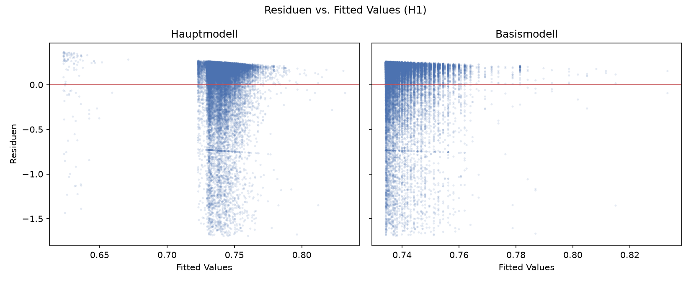
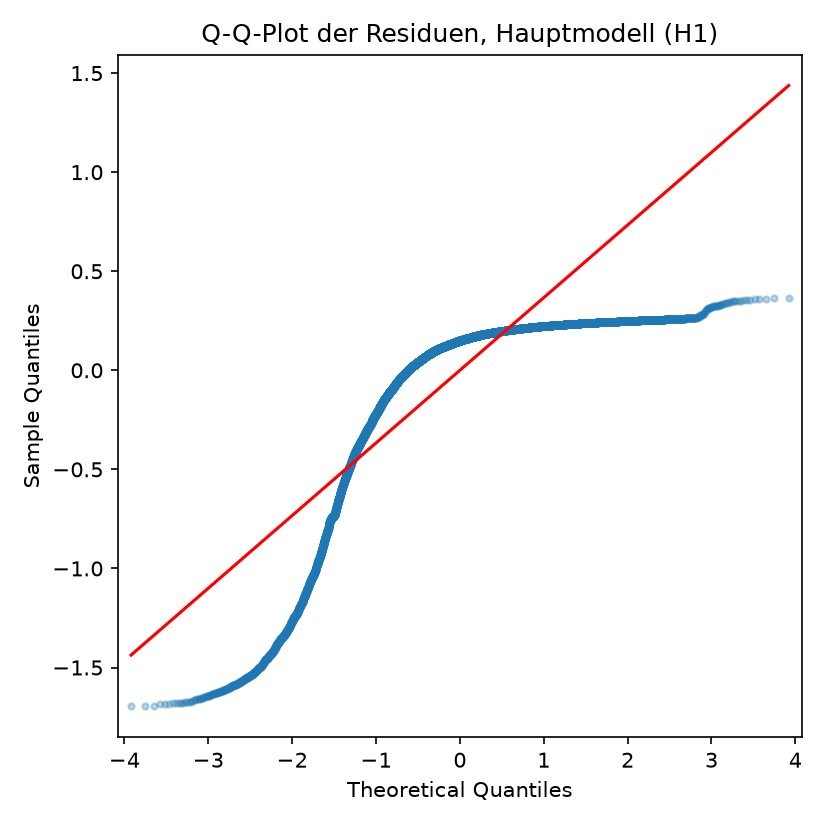
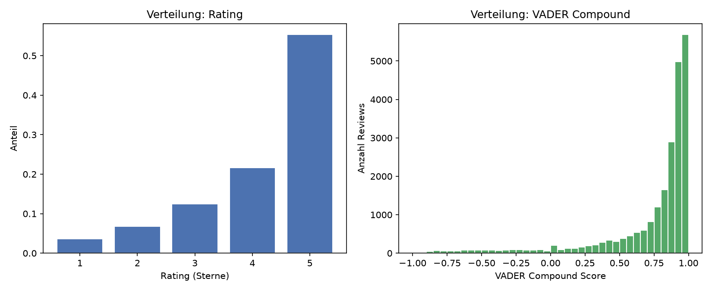
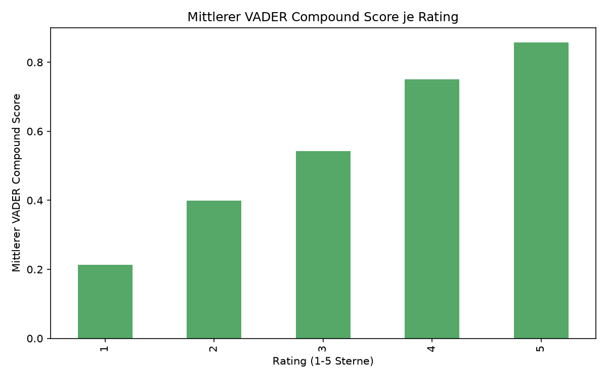
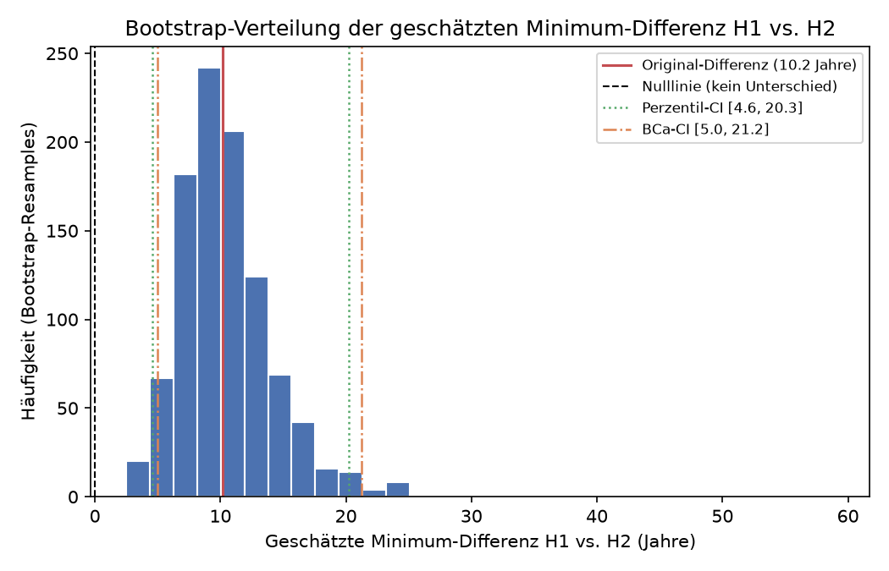
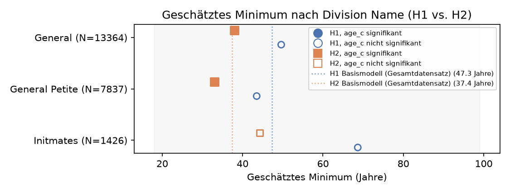
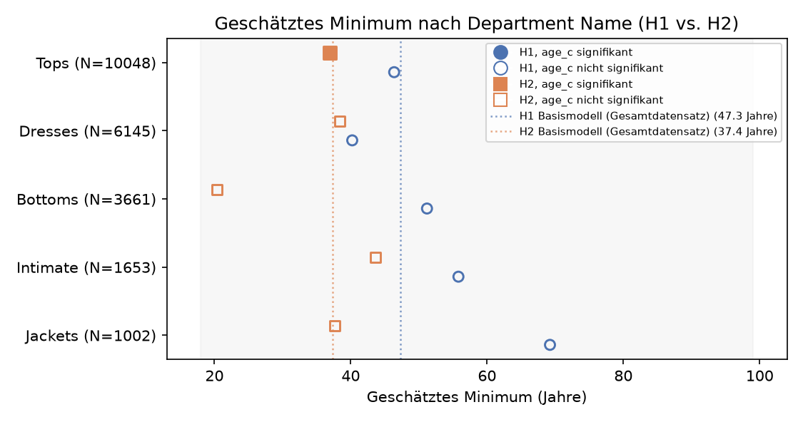
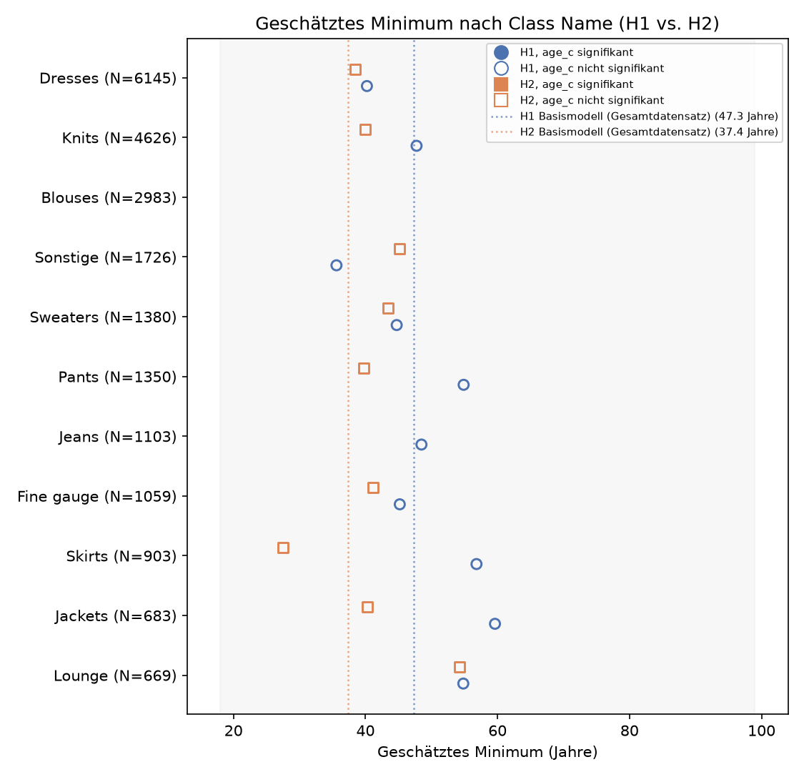
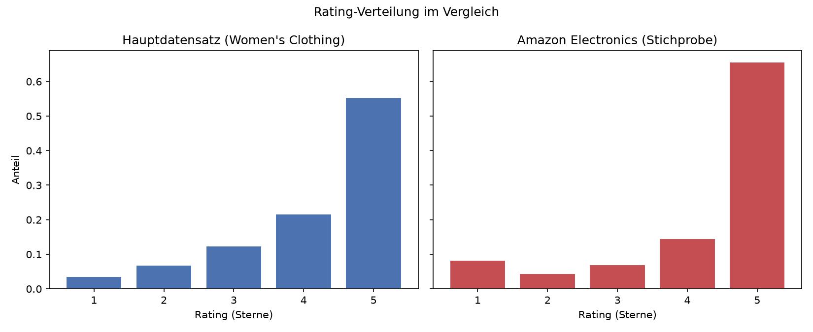

# 05: Konsolidierte Zusammenfassung der Ergebnisse

## Einleitung

Dieses Notebook führt die zentralen Ergebnisse aus `04_Regression.ipynb` (H1, H2, H3 sowie die kategorienbasierte Robustheitsprüfung) und `06_Amazon_Robustness.ipynb` (externe Robustheitsprüfung an einer Amazon-Electronics-Stichprobe) für die Bachelorarbeit zusammen. Es werden ausschliesslich bereits vorliegende Ergebnisse aus den Ordnern `results/` und `figures/` eingelesen, tabellarisch beziehungsweise grafisch aufbereitet und knapp interpretiert. Es finden in diesem Notebook keine neuen Modellschätzungen oder sonstigen Berechnungen statt; sämtliche gezeigten Zahlen und Grafiken wurden bereits in den beiden genannten Notebooks erzeugt und dort gespeichert.


```python
import pandas as pd
from pathlib import Path
from IPython.display import display, Markdown

pd.set_option("display.max_columns", None)
pd.set_option("display.width", 160)
pd.set_option("display.max_colwidth", 80)

PROJECT_ROOT = Path.cwd().parent
RESULTS_DIR = PROJECT_ROOT / "results"
FIGURES_DIR = PROJECT_ROOT / "figures"


def show_txt(filename):
    """Liest eine bestehende .txt-Ergebnisdatei ein und gibt sie unverändert aus."""
    path = RESULTS_DIR / filename
    print(f"--- {filename} " + "-" * max(0, 60 - len(filename)))
    print(path.read_text())


def load_csv(filename, **kwargs):
    """Liest eine bestehende .csv-Ergebnisdatei ein (kein Neuberechnen, nur Einlesen)."""
    return pd.read_csv(RESULTS_DIR / filename, **kwargs)

```

## H1: Sentiment ~ Alter

H1 prüft mittels OLS-Regression, ob zwischen `Age` und dem Sentiment-Mass `VADER Compound` ein (nicht linearer) Zusammenhang besteht; verglichen werden ein Basismodell (nur Alter), ein Hauptmodell (zusätzlich `Division Name`, `Department Name`) sowie zwei Robustheitsmodelle (zusätzlich `Recommended IND` beziehungsweise `Positive Feedback Count`).

**Einordnung `h1_regression_updated.csv` versus `h1_regression_fit_stats.csv`:** Ein Vergleich beider Dateien zeigt, dass es sich um unterschiedliche, einander ergänzende Tabellenformate handelt, nicht um denselben Inhalt in anderer Form. `h1_regression_updated.csv` ist eine Koeffiziententabelle im Langformat (Spalten `Modelltyp`, `Term`, `Koeffizient`, `SE`, `Statistik`, `p_Wert`): Sie enthält sämtliche Einzelkoeffizienten aller vier Modelle und, an diese Zeilen angehängt, zusätzlich einen Kennzahlenblock je Modell (Wendepunkt, R², Adj. R², AIC, N, Condition Number). `h1_regression_fit_stats.csv` ist demgegenüber eine schlanke, breite Übersichtstabelle, die ausschliesslich die globalen Gütemasse (N, R², Adj. R², AIC, BIC) der vier Modelle nebeneinander zeigt, ohne Einzelkoeffizienten. Im Folgenden wird `h1_regression_fit_stats.csv` für den direkten Modellvergleich der Gütemasse verwendet, `h1_regression_updated.csv` ergänzend für den Blick auf einzelne Koeffizienten.


```python
h1_fit_stats = load_csv("h1_regression_fit_stats.csv", index_col=0)
display(h1_fit_stats)

```


<div>
<style scoped>
    .dataframe tbody tr th:only-of-type {
        vertical-align: middle;
    }

    .dataframe tbody tr th {
        vertical-align: top;
    }

    .dataframe thead th {
        text-align: right;
    }
</style>
<table border="1" class="dataframe">
  <thead>
    <tr style="text-align: right;">
      <th></th>
      <th>Basismodell</th>
      <th>Hauptmodell</th>
      <th>Robustheitsmodell A (+Recommended IND)</th>
      <th>Robustheitsmodell B (+PFC)</th>
    </tr>
  </thead>
  <tbody>
    <tr>
      <th>N</th>
      <td>22640.000000</td>
      <td>22627.000000</td>
      <td>22627.000000</td>
      <td>22627.000000</td>
    </tr>
    <tr>
      <th>R2</th>
      <td>0.000383</td>
      <td>0.001148</td>
      <td>0.192036</td>
      <td>0.001650</td>
    </tr>
    <tr>
      <th>Adj. R2</th>
      <td>0.000295</td>
      <td>0.000750</td>
      <td>0.191679</td>
      <td>0.001209</td>
    </tr>
    <tr>
      <th>AIC</th>
      <td>18826.487834</td>
      <td>18820.860405</td>
      <td>14023.919467</td>
      <td>18811.474115</td>
    </tr>
    <tr>
      <th>BIC</th>
      <td>18850.570254</td>
      <td>18901.129396</td>
      <td>14112.215358</td>
      <td>18899.770006</td>
    </tr>
  </tbody>
</table>
</div>


Die Gütemasse zeigen, dass Basismodell, Hauptmodell und Robustheitsmodell B praktisch keine Varianz erklären (R² jeweils unter 0.002), während Robustheitsmodell A mit R² = 0.192 deutlich heraussticht. Dieser Sprung ist auf `recommended_ind` zurückzuführen, eine der Bewertung zeitlich nachgelagerte Variable („bad control“), weshalb dieses Modell im Regressionsnotebook bewusst nicht als Hauptmodell verwendet wird. AIC und BIC bestätigen dasselbe Bild: Nur Robustheitsmodell A weicht deutlich von den übrigen drei Modellen ab.


Zur vollständigen Dokumentation folgen nachfolgend die vier statsmodels-Regressionsausgaben im Original.


```python
for fname in [
    "h1_regression_basismodell.txt",
    "h1_regression_hauptmodell.txt",
    "h1_regression_robustheitsmodell_a.txt",
    "h1_regression_robustheitsmodell_b.txt",
]:
    show_txt(fname)
    print()

```

    --- h1_regression_basismodell.txt -------------------------------
                                OLS Regression Results                            
    ==============================================================================
    Dep. Variable:         vader_compound   R-squared:                       0.000
    Model:                            OLS   Adj. R-squared:                  0.000
    Method:                 Least Squares   F-statistic:                     4.336
    Date:                Sun, 30 Aug 2026   Prob (F-statistic):             0.0131
    Time:                        13:39:09   Log-Likelihood:                -9410.2
    No. Observations:               22640   AIC:                         1.883e+04
    Df Residuals:                   22637   BIC:                         1.885e+04
    Df Model:                           2                                         
    Covariance Type:            nonrobust                                         
    ==============================================================================
                     coef    std err          t      P>|t|      [0.025      0.975]
    ------------------------------------------------------------------------------
    Intercept      0.7349      0.003    236.664      0.000       0.729       0.741
    age_c         -0.0003      0.000     -1.407      0.160      -0.001       0.000
    age_c_sq    3.706e-05   1.27e-05      2.927      0.003    1.22e-05    6.19e-05
    ==============================================================================
    Omnibus:                    11014.983   Durbin-Watson:                   1.980
    Prob(Omnibus):                  0.000   Jarque-Bera (JB):            53398.272
    Skew:                          -2.430   Prob(JB):                         0.00
    Kurtosis:                       8.744   Cond. No.                         328.
    ==============================================================================
    
    Notes:
    [1] Standard Errors assume that the covariance matrix of the errors is correctly specified.
    
    --- h1_regression_hauptmodell.txt -------------------------------
                                OLS Regression Results                            
    ==============================================================================
    Dep. Variable:         vader_compound   R-squared:                       0.001
    Model:                            OLS   Adj. R-squared:                  0.001
    Method:                 Least Squares   F-statistic:                     2.887
    Date:                Sun, 30 Aug 2026   Prob (F-statistic):            0.00206
    Time:                        13:39:09   Log-Likelihood:                -9400.4
    No. Observations:               22627   AIC:                         1.882e+04
    Df Residuals:                   22617   BIC:                         1.890e+04
    Df Model:                           9                                         
    Covariance Type:            nonrobust                                         
    ======================================================================================================
                                             coef    std err          t      P>|t|      [0.025      0.975]
    ------------------------------------------------------------------------------------------------------
    Intercept                              0.7434      0.007    113.358      0.000       0.731       0.756
    C(division_name)[T.General Petite]     0.0075      0.005      1.428      0.153      -0.003       0.018
    C(division_name)[T.Initmates]          0.0006      0.027      0.023      0.981      -0.052       0.053
    C(department_name)[T.Dresses]         -0.0130      0.008     -1.700      0.089      -0.028       0.002
    C(department_name)[T.Intimate]        -0.0202      0.025     -0.799      0.424      -0.070       0.029
    C(department_name)[T.Jackets]         -0.0105      0.013     -0.803      0.422      -0.036       0.015
    C(department_name)[T.Tops]            -0.0117      0.007     -1.655      0.098      -0.026       0.002
    C(department_name)[T.Trend]           -0.1195      0.034     -3.485      0.000      -0.187      -0.052
    age_c                                 -0.0003      0.000     -1.471      0.141      -0.001       0.000
    age_c_sq                            3.803e-05   1.27e-05      3.000      0.003    1.32e-05    6.29e-05
    ==============================================================================
    Omnibus:                    10998.416   Durbin-Watson:                   1.980
    Prob(Omnibus):                  0.000   Jarque-Bera (JB):            53263.994
    Skew:                          -2.427   Prob(JB):                         0.00
    Kurtosis:                       8.738   Cond. No.                     3.81e+03
    ==============================================================================
    
    Notes:
    [1] Standard Errors assume that the covariance matrix of the errors is correctly specified.
    [2] The condition number is large, 3.81e+03. This might indicate that there are
    strong multicollinearity or other numerical problems.
    
    --- h1_regression_robustheitsmodell_a.txt -----------------------
                                OLS Regression Results                            
    ==============================================================================
    Dep. Variable:         vader_compound   R-squared:                       0.192
    Model:                            OLS   Adj. R-squared:                  0.192
    Method:                 Least Squares   F-statistic:                     537.5
    Date:                Sun, 30 Aug 2026   Prob (F-statistic):               0.00
    Time:                        13:39:09   Log-Likelihood:                -7001.0
    No. Observations:               22627   AIC:                         1.402e+04
    Df Residuals:                   22616   BIC:                         1.411e+04
    Df Model:                          10                                         
    Covariance Type:            nonrobust                                         
    ======================================================================================================
                                             coef    std err          t      P>|t|      [0.025      0.975]
    ------------------------------------------------------------------------------------------------------
    Intercept                              0.3924      0.008     51.599      0.000       0.378       0.407
    C(division_name)[T.General Petite]     0.0036      0.005      0.749      0.454      -0.006       0.013
    C(division_name)[T.Initmates]         -0.0079      0.024     -0.330      0.741      -0.055       0.039
    C(department_name)[T.Dresses]          0.0054      0.007      0.787      0.431      -0.008       0.019
    C(department_name)[T.Intimate]        -0.0127      0.023     -0.559      0.576      -0.057       0.032
    C(department_name)[T.Jackets]         -0.0028      0.012     -0.239      0.811      -0.026       0.020
    C(department_name)[T.Tops]             0.0051      0.006      0.800      0.424      -0.007       0.018
    C(department_name)[T.Trend]           -0.0764      0.031     -2.476      0.013      -0.137      -0.016
    age_c                                 -0.0007      0.000     -3.577      0.000      -0.001      -0.000
    age_c_sq                            2.489e-05   1.14e-05      2.183      0.029    2.54e-06    4.72e-05
    recommended_ind                        0.4168      0.006     73.097      0.000       0.406       0.428
    ==============================================================================
    Omnibus:                     9391.364   Durbin-Watson:                   2.001
    Prob(Omnibus):                  0.000   Jarque-Bera (JB):            42368.899
    Skew:                          -2.029   Prob(JB):                         0.00
    Kurtosis:                       8.337   Cond. No.                     3.81e+03
    ==============================================================================
    
    Notes:
    [1] Standard Errors assume that the covariance matrix of the errors is correctly specified.
    [2] The condition number is large, 3.81e+03. This might indicate that there are
    strong multicollinearity or other numerical problems.
    
    --- h1_regression_robustheitsmodell_b.txt -----------------------
                                OLS Regression Results                            
    ==============================================================================
    Dep. Variable:         vader_compound   R-squared:                       0.002
    Model:                            OLS   Adj. R-squared:                  0.001
    Method:                 Least Squares   F-statistic:                     3.738
    Date:                Sun, 30 Aug 2026   Prob (F-statistic):           4.91e-05
    Time:                        13:39:09   Log-Likelihood:                -9394.7
    No. Observations:               22627   AIC:                         1.881e+04
    Df Residuals:                   22616   BIC:                         1.890e+04
    Df Model:                          10                                         
    Covariance Type:            nonrobust                                         
    ======================================================================================================
                                             coef    std err          t      P>|t|      [0.025      0.975]
    ------------------------------------------------------------------------------------------------------
    Intercept                              0.7466      0.007    112.666      0.000       0.734       0.760
    C(division_name)[T.General Petite]     0.0075      0.005      1.423      0.155      -0.003       0.018
    C(division_name)[T.Initmates]         -0.0002      0.027     -0.007      0.994      -0.053       0.052
    C(department_name)[T.Dresses]         -0.0116      0.008     -1.511      0.131      -0.027       0.003
    C(department_name)[T.Intimate]        -0.0198      0.025     -0.781      0.435      -0.069       0.030
    C(department_name)[T.Jackets]         -0.0095      0.013     -0.726      0.468      -0.035       0.016
    C(department_name)[T.Tops]            -0.0113      0.007     -1.592      0.112      -0.025       0.003
    C(department_name)[T.Trend]           -0.1178      0.034     -3.436      0.001      -0.185      -0.051
    age_c                                 -0.0003      0.000     -1.313      0.189      -0.001       0.000
    age_c_sq                            3.723e-05   1.27e-05      2.937      0.003    1.24e-05    6.21e-05
    positive_feedback_count               -0.0014      0.000     -3.374      0.001      -0.002      -0.001
    ==============================================================================
    Omnibus:                    10985.782   Durbin-Watson:                   1.980
    Prob(Omnibus):                  0.000   Jarque-Bera (JB):            53129.632
    Skew:                          -2.425   Prob(JB):                         0.00
    Kurtosis:                       8.731   Cond. No.                     3.81e+03
    ==============================================================================
    
    Notes:
    [1] Standard Errors assume that the covariance matrix of the errors is correctly specified.
    [2] The condition number is large, 3.81e+03. This might indicate that there are
    strong multicollinearity or other numerical problems.
    


In allen vier Modellen ist der quadratische Term `age_c_sq` signifikant (p ≤ 0.029), der lineare Term `age_c` dagegen nur in Robustheitsmodell A. Dies deutet auf eine schwache, aber durchgängige U-förmige Krümmung des Alterseffekts auf `VADER Compound` hin, deren praktische Bedeutung angesichts der insgesamt geringen erklärten Varianz jedoch begrenzt bleibt. Unter den Kontrollvariablen ist ausschliesslich `department_name = Trend` in Haupt- und Robustheitsmodell B signifikant negativ mit `VADER Compound` assoziiert.


Ergänzend zeigt `h1_regression_updated.csv` dieselben Koeffizienten im Langformat inklusive Standardfehlern, Teststatistiken und p-Werten je Modellterm, gefolgt vom bereits angesprochenen angehängten Kennzahlenblock.


```python
h1_updated = load_csv("h1_regression_updated.csv")
display(h1_updated)

```


<div>
<style scoped>
    .dataframe tbody tr th:only-of-type {
        vertical-align: middle;
    }

    .dataframe tbody tr th {
        vertical-align: top;
    }

    .dataframe thead th {
        text-align: right;
    }
</style>
<table border="1" class="dataframe">
  <thead>
    <tr style="text-align: right;">
      <th></th>
      <th>Modelltyp</th>
      <th>Term</th>
      <th>Koeffizient</th>
      <th>SE</th>
      <th>Statistik</th>
      <th>p_Wert</th>
    </tr>
  </thead>
  <tbody>
    <tr>
      <th>0</th>
      <td>Basismodell</td>
      <td>Intercept</td>
      <td>0.734893</td>
      <td>0.003105</td>
      <td>236.664140</td>
      <td>0.000000</td>
    </tr>
    <tr>
      <th>1</th>
      <td>Basismodell</td>
      <td>age_c</td>
      <td>-0.000300</td>
      <td>0.000213</td>
      <td>-1.406618</td>
      <td>0.159555</td>
    </tr>
    <tr>
      <th>2</th>
      <td>Basismodell</td>
      <td>age_c_sq</td>
      <td>0.000037</td>
      <td>0.000013</td>
      <td>2.926743</td>
      <td>0.003429</td>
    </tr>
    <tr>
      <th>3</th>
      <td>Hauptmodell</td>
      <td>Intercept</td>
      <td>0.743390</td>
      <td>0.006558</td>
      <td>113.358002</td>
      <td>0.000000</td>
    </tr>
    <tr>
      <th>4</th>
      <td>Hauptmodell</td>
      <td>C(division_name)[T.General Petite]</td>
      <td>0.007540</td>
      <td>0.005279</td>
      <td>1.428240</td>
      <td>0.153237</td>
    </tr>
    <tr>
      <th>...</th>
      <td>...</td>
      <td>...</td>
      <td>...</td>
      <td>...</td>
      <td>...</td>
      <td>...</td>
    </tr>
    <tr>
      <th>58</th>
      <td>Robustheitsmodell B (+ Positive Feedback Count)</td>
      <td>Adj. R2</td>
      <td>0.001209</td>
      <td>NaN</td>
      <td>NaN</td>
      <td>NaN</td>
    </tr>
    <tr>
      <th>59</th>
      <td>Robustheitsmodell B (+ Positive Feedback Count)</td>
      <td>AIC</td>
      <td>18811.474115</td>
      <td>NaN</td>
      <td>NaN</td>
      <td>NaN</td>
    </tr>
    <tr>
      <th>60</th>
      <td>Robustheitsmodell B (+ Positive Feedback Count)</td>
      <td>N</td>
      <td>22627.000000</td>
      <td>NaN</td>
      <td>NaN</td>
      <td>NaN</td>
    </tr>
    <tr>
      <th>61</th>
      <td>Robustheitsmodell B (+ Positive Feedback Count)</td>
      <td>Condition Number (roh)</td>
      <td>34519.629762</td>
      <td>NaN</td>
      <td>NaN</td>
      <td>NaN</td>
    </tr>
    <tr>
      <th>62</th>
      <td>Robustheitsmodell B (+ Positive Feedback Count)</td>
      <td>Condition Number (zentriert)</td>
      <td>3805.685120</td>
      <td>NaN</td>
      <td>NaN</td>
      <td>NaN</td>
    </tr>
  </tbody>
</table>
<p>63 rows × 6 columns</p>
</div>


Als kompakte, nebeneinandergestellte Fassung derselben Information liegt zusätzlich `h1_regression_vergleich.txt` vor.


```python
show_txt("h1_regression_vergleich.txt")

```

    --- h1_regression_vergleich.txt ---------------------------------
    
    ============================================================================================================================
                                       Basismodell Hauptmodell Robustheitsmodell A (+Recommended IND) Robustheitsmodell B (+PFC)
    ----------------------------------------------------------------------------------------------------------------------------
    Intercept                          0.7349***   0.7434***   0.3924***                              0.7466***                 
                                       (0.0031)    (0.0066)    (0.0076)                               (0.0066)                  
    age_c                              -0.0003     -0.0003     -0.0007***                             -0.0003                   
                                       (0.0002)    (0.0002)    (0.0002)                               (0.0002)                  
    age_c_sq                           0.0000***   0.0000***   0.0000**                               0.0000***                 
                                       (0.0000)    (0.0000)    (0.0000)                               (0.0000)                  
    C(division_name)[T.General Petite]             0.0075      0.0036                                 0.0075                    
                                                   (0.0053)    (0.0047)                               (0.0053)                  
    C(division_name)[T.Initmates]                  0.0006      -0.0079                                -0.0002                   
                                                   (0.0267)    (0.0240)                               (0.0267)                  
    C(department_name)[T.Dresses]                  -0.0130*    0.0054                                 -0.0116                   
                                                   (0.0077)    (0.0069)                               (0.0077)                  
    C(department_name)[T.Intimate]                 -0.0202     -0.0127                                -0.0198                   
                                                   (0.0253)    (0.0228)                               (0.0253)                  
    C(department_name)[T.Jackets]                  -0.0105     -0.0028                                -0.0095                   
                                                   (0.0131)    (0.0118)                               (0.0131)                  
    C(department_name)[T.Tops]                     -0.0117*    0.0051                                 -0.0113                   
                                                   (0.0071)    (0.0064)                               (0.0071)                  
    C(department_name)[T.Trend]                    -0.1195***  -0.0764**                              -0.1178***                
                                                   (0.0343)    (0.0309)                               (0.0343)                  
    recommended_ind                                            0.4168***                                                        
                                                               (0.0057)                                                         
    positive_feedback_count                                                                           -0.0014***                
                                                                                                      (0.0004)                  
    R-squared                          0.0004      0.0011      0.1920                                 0.0017                    
    R-squared Adj.                     0.0003      0.0008      0.1917                                 0.0012                    
    AIC                                18826.5     18820.9     14023.9                                18811.5                   
    Adj. R2                            0.000295    0.000750    0.191679                               0.001209                  
    BIC                                18850.6     18901.1     14112.2                                18899.8                   
    N                                  22640       22627       22627                                  22627                     
    R2                                 0.0004      0.0011      0.1920                                 0.0017                    
    ============================================================================================================================
    Standard errors in parentheses.
    * p<.1, ** p<.05, ***p<.01


Die Vergleichstabelle bestätigt noch einmal kompakt: Nur Robustheitsmodell A weicht in Erklärungskraft und im Vorzeichen beziehungsweise in der Signifikanz des linearen Alterseffekts deutlich von den übrigen drei Modellen ab, die untereinander ein konsistentes Bild zeigen.


Die Residualdiagnostik prüft die OLS-Annahmen (Homoskedastizität, Normalverteilung der Residuen, Gesamtsignifikanz) für Basis- und Hauptmodell.


```python
h1_resid = load_csv("h1_residual_diagnostics.csv")
display(h1_resid.pivot(index="Kennzahl", columns="Modelltyp", values="Wert"))

```


<div>
<style scoped>
    .dataframe tbody tr th:only-of-type {
        vertical-align: middle;
    }

    .dataframe tbody tr th {
        vertical-align: top;
    }

    .dataframe thead th {
        text-align: right;
    }
</style>
<table border="1" class="dataframe">
  <thead>
    <tr style="text-align: right;">
      <th>Modelltyp</th>
      <th>Basismodell</th>
      <th>Hauptmodell</th>
    </tr>
    <tr>
      <th>Kennzahl</th>
      <th></th>
      <th></th>
    </tr>
  </thead>
  <tbody>
    <tr>
      <th>Breusch-Pagan Statistik</th>
      <td>0.678533</td>
      <td>13.212369</td>
    </tr>
    <tr>
      <th>Breusch-Pagan p-Wert</th>
      <td>0.712293</td>
      <td>0.153230</td>
    </tr>
    <tr>
      <th>Exzess-Kurtosis</th>
      <td>5.743834</td>
      <td>5.738204</td>
    </tr>
    <tr>
      <th>F-Statistik</th>
      <td>4.336414</td>
      <td>2.887473</td>
    </tr>
    <tr>
      <th>F-Test p-Wert</th>
      <td>0.013094</td>
      <td>0.002061</td>
    </tr>
    <tr>
      <th>Jarque-Bera Statistik</th>
      <td>53398.271925</td>
      <td>53263.993957</td>
    </tr>
    <tr>
      <th>Jarque-Bera p-Wert</th>
      <td>0.000000</td>
      <td>0.000000</td>
    </tr>
    <tr>
      <th>Skewness</th>
      <td>-2.429728</td>
      <td>-2.427398</td>
    </tr>
  </tbody>
</table>
</div>


Der Breusch-Pagan-Test zeigt für beide Modelle keine signifikante Heteroskedastizität (p = 0.153 im Hauptmodell, p = 0.712 im Basismodell). Der Jarque-Bera-Test ist dagegen in beiden Modellen hochsignifikant, bei einer Skewness von rund minus 2.4 und einer deutlich erhöhten Exzess-Kurtosis; dies ist angesichts der Deckelung von `VADER Compound` auf das Intervall von minus 1 bis 1 sowie der Konzentration der Werte am positiven Rand plausibel und wird als Limitation vermerkt, ohne die Punktschätzer selbst infrage zu stellen. Der F-Test bestätigt für beide Modelle eine formale Gesamtsignifikanz, deren praktische Relevanz angesichts der geringen R²-Werte gering bleibt.


Die zugehörigen Diagnostikgrafiken veranschaulichen dieses Bild.






Der Residuen-vs-Fitted-Plot zeigt keine erkennbare Bogenform, sondern senkrechte Punktbänder, die auf die kategorialen Kontrollvariablen zurückzuführen sind; ein systematischer Linearitätsverstoss lässt sich daraus nicht ableiten. Der Q-Q-Plot bestätigt die im Jarque-Bera-Test festgestellte Abweichung von der Normalverteilung: Die Punkte weichen insbesondere an den Rändern deutlich von der Referenzgeraden ab, was der linksschiefen Verteilung der Residuen entspricht.


## H2: Rating ~ Alter

H2 prüft mittels ordinaler logistischer Regression (`OrderedModel`, proportional-odds-Ansatz), ob zwischen `Age` und der Sternebewertung `Rating` ein nicht linearer Zusammenhang besteht; zusätzlich wird die Proportional-Odds-Annahme selbst getestet.


```python
h2_fit_stats = load_csv("h2_ordinal_fit_stats.csv", index_col=0)
display(h2_fit_stats)

```


<div>
<style scoped>
    .dataframe tbody tr th:only-of-type {
        vertical-align: middle;
    }

    .dataframe tbody tr th {
        vertical-align: top;
    }

    .dataframe thead th {
        text-align: right;
    }
</style>
<table border="1" class="dataframe">
  <thead>
    <tr style="text-align: right;">
      <th></th>
      <th>Basismodell</th>
      <th>Hauptmodell</th>
      <th>Robustheit A (+Recommended IND)</th>
      <th>Robustheit B (+PFC)</th>
    </tr>
  </thead>
  <tbody>
    <tr>
      <th>N</th>
      <td>22640.000000</td>
      <td>22627.000000</td>
      <td>22627.000000</td>
      <td>22627.000000</td>
    </tr>
    <tr>
      <th>Log-Likelihood</th>
      <td>-27640.082792</td>
      <td>-27589.379675</td>
      <td>-20168.445186</td>
      <td>-27557.778700</td>
    </tr>
    <tr>
      <th>Log-Likelihood (Null)</th>
      <td>-27667.636673</td>
      <td>-27659.952297</td>
      <td>-27659.952297</td>
      <td>-27659.952297</td>
    </tr>
    <tr>
      <th>McFadden Pseudo-R2</th>
      <td>0.000996</td>
      <td>0.002551</td>
      <td>0.270843</td>
      <td>0.003694</td>
    </tr>
    <tr>
      <th>AIC</th>
      <td>55292.165584</td>
      <td>55204.759351</td>
      <td>40364.890372</td>
      <td>55143.557399</td>
    </tr>
    <tr>
      <th>Wendepunkt (Age)</th>
      <td>37.388697</td>
      <td>37.227537</td>
      <td>43.558152</td>
      <td>36.361844</td>
    </tr>
  </tbody>
</table>
</div>


Wie bei H1 fällt Robustheitsmodell A (mit `Recommended IND`) deutlich aus dem Rahmen: Das McFadden-Pseudo-R² springt von rund 0.003 (Hauptmodell) auf 0.271, begleitet von einem deutlich niedrigeren AIC. Da `Recommended IND` inhaltlich kaum von `Rating` selbst zu trennen ist, wird dieser Anstieg als Tautologie-Artefakt eingeordnet und nicht als eigenständiger Befund gewertet. Basismodell, Hauptmodell und Robustheitsmodell B liegen mit Pseudo-R²-Werten zwischen 0.001 und 0.004 dagegen nahe beieinander.


```python
h2_updated = load_csv("h2_ordinal_regression_updated.csv")
display(h2_updated)

```


<div>
<style scoped>
    .dataframe tbody tr th:only-of-type {
        vertical-align: middle;
    }

    .dataframe tbody tr th {
        vertical-align: top;
    }

    .dataframe thead th {
        text-align: right;
    }
</style>
<table border="1" class="dataframe">
  <thead>
    <tr style="text-align: right;">
      <th></th>
      <th>Modelltyp</th>
      <th>Term</th>
      <th>Koeffizient</th>
      <th>SE</th>
      <th>Statistik</th>
      <th>p_Wert</th>
    </tr>
  </thead>
  <tbody>
    <tr>
      <th>0</th>
      <td>Basismodell</td>
      <td>Age_c</td>
      <td>0.003947</td>
      <td>0.001120</td>
      <td>3.522722</td>
      <td>0.000427</td>
    </tr>
    <tr>
      <th>1</th>
      <td>Basismodell</td>
      <td>Age_c_sq</td>
      <td>0.000335</td>
      <td>0.000069</td>
      <td>4.828083</td>
      <td>0.000001</td>
    </tr>
    <tr>
      <th>2</th>
      <td>Basismodell</td>
      <td>1/2</td>
      <td>-3.233693</td>
      <td>0.036926</td>
      <td>-87.572968</td>
      <td>0.000000</td>
    </tr>
    <tr>
      <th>3</th>
      <td>Basismodell</td>
      <td>2/3</td>
      <td>0.125786</td>
      <td>0.025856</td>
      <td>4.864883</td>
      <td>0.000001</td>
    </tr>
    <tr>
      <th>4</th>
      <td>Basismodell</td>
      <td>3/4</td>
      <td>-0.066752</td>
      <td>0.018252</td>
      <td>-3.657319</td>
      <td>0.000255</td>
    </tr>
    <tr>
      <th>...</th>
      <td>...</td>
      <td>...</td>
      <td>...</td>
      <td>...</td>
      <td>...</td>
      <td>...</td>
    </tr>
    <tr>
      <th>66</th>
      <td>Robustheitsmodell B (+ Positive Feedback Count)</td>
      <td>McFadden Pseudo-R2</td>
      <td>0.003694</td>
      <td>NaN</td>
      <td>NaN</td>
      <td>NaN</td>
    </tr>
    <tr>
      <th>67</th>
      <td>Robustheitsmodell B (+ Positive Feedback Count)</td>
      <td>AIC</td>
      <td>55143.557399</td>
      <td>NaN</td>
      <td>NaN</td>
      <td>NaN</td>
    </tr>
    <tr>
      <th>68</th>
      <td>Robustheitsmodell B (+ Positive Feedback Count)</td>
      <td>N</td>
      <td>22627.000000</td>
      <td>NaN</td>
      <td>NaN</td>
      <td>NaN</td>
    </tr>
    <tr>
      <th>69</th>
      <td>Robustheitsmodell B (+ Positive Feedback Count)</td>
      <td>Condition Number (roh)</td>
      <td>34501.322173</td>
      <td>NaN</td>
      <td>NaN</td>
      <td>NaN</td>
    </tr>
    <tr>
      <th>70</th>
      <td>Robustheitsmodell B (+ Positive Feedback Count)</td>
      <td>Condition Number (zentriert)</td>
      <td>3790.519907</td>
      <td>NaN</td>
      <td>NaN</td>
      <td>NaN</td>
    </tr>
  </tbody>
</table>
<p>71 rows × 6 columns</p>
</div>


Über alle vier Modelle hinweg sind `Age_c` und `Age_c_sq` signifikant (p < 0.001), mit Ausnahme von `Age_c` in Robustheitsmodell A, wo der Koeffizient durch `Recommended_IND` seine Signifikanz vollständig verliert (p = 0.903). Dies bestätigt den bereits bei den Gütemassen sichtbaren Sonderstatus dieses Modells. Von den Kontrollvariablen im Hauptmodell sind `Department_Dresses`, `Department_Tops` und `Department_Trend` signifikant negativ mit dem Rating assoziiert.


```python
h2_brant = load_csv("h2_proportional_odds_tests.csv")
display(h2_brant)

```


<div>
<style scoped>
    .dataframe tbody tr th:only-of-type {
        vertical-align: middle;
    }

    .dataframe tbody tr th {
        vertical-align: top;
    }

    .dataframe thead th {
        text-align: right;
    }
</style>
<table border="1" class="dataframe">
  <thead>
    <tr style="text-align: right;">
      <th></th>
      <th>Modell</th>
      <th>Test</th>
      <th>Variable</th>
      <th>Statistik</th>
      <th>df</th>
      <th>p_Wert</th>
      <th>Interpretation</th>
    </tr>
  </thead>
  <tbody>
    <tr>
      <th>0</th>
      <td>Basismodell</td>
      <td>Brant (Wald)</td>
      <td>Omnibus (alle Prädiktoren)</td>
      <td>21.367622</td>
      <td>6</td>
      <td>0.001575</td>
      <td>Annahme verletzt (p &lt; .05)</td>
    </tr>
    <tr>
      <th>1</th>
      <td>Basismodell</td>
      <td>Brant (Wald)</td>
      <td>Age_c</td>
      <td>11.440555</td>
      <td>3</td>
      <td>0.009567</td>
      <td>Annahme verletzt (p &lt; .05)</td>
    </tr>
    <tr>
      <th>2</th>
      <td>Basismodell</td>
      <td>Brant (Wald)</td>
      <td>Age_c_sq</td>
      <td>5.474063</td>
      <td>3</td>
      <td>0.140198</td>
      <td>Annahme erfüllt (p &gt; .05)</td>
    </tr>
    <tr>
      <th>3</th>
      <td>Basismodell</td>
      <td>Brant (Wald, gemeinsamer Block)</td>
      <td>Age-Block (Age_c + Age_c_sq, gemeinsam)</td>
      <td>21.367622</td>
      <td>6</td>
      <td>0.001575</td>
      <td>Annahme verletzt (p &lt; .05)</td>
    </tr>
    <tr>
      <th>4</th>
      <td>Hauptmodell</td>
      <td>Brant (Wald)</td>
      <td>Omnibus (alle Prädiktoren)</td>
      <td>50.583110</td>
      <td>27</td>
      <td>0.003895</td>
      <td>Annahme verletzt (p &lt; .05)</td>
    </tr>
    <tr>
      <th>5</th>
      <td>Hauptmodell</td>
      <td>Brant (Wald)</td>
      <td>Age_c</td>
      <td>11.409172</td>
      <td>3</td>
      <td>0.009707</td>
      <td>Annahme verletzt (p &lt; .05)</td>
    </tr>
    <tr>
      <th>6</th>
      <td>Hauptmodell</td>
      <td>Brant (Wald)</td>
      <td>Age_c_sq</td>
      <td>5.283277</td>
      <td>3</td>
      <td>0.152191</td>
      <td>Annahme erfüllt (p &gt; .05)</td>
    </tr>
    <tr>
      <th>7</th>
      <td>Hauptmodell</td>
      <td>Brant (Wald)</td>
      <td>Division_General Petite</td>
      <td>3.436252</td>
      <td>3</td>
      <td>0.329125</td>
      <td>Annahme erfüllt (p &gt; .05)</td>
    </tr>
    <tr>
      <th>8</th>
      <td>Hauptmodell</td>
      <td>Brant (Wald)</td>
      <td>Division_Initmates</td>
      <td>0.486826</td>
      <td>3</td>
      <td>0.921776</td>
      <td>Annahme erfüllt (p &gt; .05)</td>
    </tr>
    <tr>
      <th>9</th>
      <td>Hauptmodell</td>
      <td>Brant (Wald)</td>
      <td>Department_Dresses</td>
      <td>1.928619</td>
      <td>3</td>
      <td>0.587353</td>
      <td>Annahme erfüllt (p &gt; .05)</td>
    </tr>
    <tr>
      <th>10</th>
      <td>Hauptmodell</td>
      <td>Brant (Wald)</td>
      <td>Department_Intimate</td>
      <td>0.985220</td>
      <td>3</td>
      <td>0.804828</td>
      <td>Annahme erfüllt (p &gt; .05)</td>
    </tr>
    <tr>
      <th>11</th>
      <td>Hauptmodell</td>
      <td>Brant (Wald)</td>
      <td>Department_Jackets</td>
      <td>10.668267</td>
      <td>3</td>
      <td>0.013662</td>
      <td>Annahme verletzt (p &lt; .05)</td>
    </tr>
    <tr>
      <th>12</th>
      <td>Hauptmodell</td>
      <td>Brant (Wald)</td>
      <td>Department_Tops</td>
      <td>1.638588</td>
      <td>3</td>
      <td>0.650672</td>
      <td>Annahme erfüllt (p &gt; .05)</td>
    </tr>
    <tr>
      <th>13</th>
      <td>Hauptmodell</td>
      <td>Brant (Wald)</td>
      <td>Department_Trend</td>
      <td>1.665889</td>
      <td>3</td>
      <td>0.644544</td>
      <td>Annahme erfüllt (p &gt; .05)</td>
    </tr>
    <tr>
      <th>14</th>
      <td>Hauptmodell</td>
      <td>Brant (Wald, gemeinsamer Block)</td>
      <td>Age-Block (Age_c + Age_c_sq, gemeinsam)</td>
      <td>20.947558</td>
      <td>6</td>
      <td>0.001875</td>
      <td>Annahme verletzt (p &lt; .05)</td>
    </tr>
    <tr>
      <th>15</th>
      <td>Basismodell</td>
      <td>Likelihood-Ratio (MNLogit vs. OrderedModel)</td>
      <td>Omnibus (alle Prädiktoren)</td>
      <td>19.539337</td>
      <td>6</td>
      <td>0.003343</td>
      <td>Annahme verletzt (p &lt; .05)</td>
    </tr>
    <tr>
      <th>16</th>
      <td>Hauptmodell</td>
      <td>Likelihood-Ratio (MNLogit vs. OrderedModel)</td>
      <td>Omnibus (alle Prädiktoren)</td>
      <td>45.920133</td>
      <td>27</td>
      <td>0.012977</td>
      <td>Annahme verletzt (p &lt; .05)</td>
    </tr>
  </tbody>
</table>
</div>


Sowohl der Brant-Test als auch der Likelihood-Ratio-Cross-Check zeigen für Basis- und Hauptmodell eine signifikante Verletzung der Proportional-Odds-Annahme beim gemeinsamen Alters-Block (`Age_c` und `Age_c_sq` gemeinsam, jeweils p < 0.01). Der Effekt des Alters auf das Rating ist demnach nicht über alle Rating-Übergänge hinweg konstant. Im Hauptmodell verletzt zusätzlich `Department_Jackets` die Annahme (p = 0.014), obwohl der gepoolte Koeffizient dieser Kategorie selbst nicht signifikant ist.


```python
h2_jackets = load_csv("h2_department_jackets_thresholds.csv")
display(h2_jackets)

```


<div>
<style scoped>
    .dataframe tbody tr th:only-of-type {
        vertical-align: middle;
    }

    .dataframe tbody tr th {
        vertical-align: top;
    }

    .dataframe thead th {
        text-align: right;
    }
</style>
<table border="1" class="dataframe">
  <thead>
    <tr style="text-align: right;">
      <th></th>
      <th>Schwelle</th>
      <th>Koeffizient</th>
      <th>SE</th>
      <th>z</th>
      <th>p_Wert</th>
    </tr>
  </thead>
  <tbody>
    <tr>
      <th>0</th>
      <td>Rating &gt; 1</td>
      <td>-0.444858</td>
      <td>0.176013</td>
      <td>-2.527411</td>
      <td>0.011491</td>
    </tr>
    <tr>
      <th>1</th>
      <td>Rating &gt; 2</td>
      <td>-0.251749</td>
      <td>0.117690</td>
      <td>-2.139086</td>
      <td>0.032429</td>
    </tr>
    <tr>
      <th>2</th>
      <td>Rating &gt; 3</td>
      <td>-0.014524</td>
      <td>0.089653</td>
      <td>-0.162001</td>
      <td>0.871305</td>
    </tr>
    <tr>
      <th>3</th>
      <td>Rating &gt; 4</td>
      <td>0.039107</td>
      <td>0.073083</td>
      <td>0.535106</td>
      <td>0.592577</td>
    </tr>
  </tbody>
</table>
</div>


Die schwellenspezifische Zerlegung für `Department: Jackets` klärt diesen scheinbaren Widerspruch auf: An den unteren Schwellen (`Rating > 1`, `Rating > 2`) ist der Koeffizient signifikant negativ, an den oberen Schwellen (`Rating > 3`, `Rating > 4`) dagegen praktisch null und nicht signifikant. Jacken-Reviews sind somit überproportional im untersten Bereich der Ratingskala vertreten, unterscheiden sich in der oberen Hälfte der Skala aber nicht von der Referenzkategorie, was erklärt, weshalb der gepoolte Hauptmodell-Koeffizient unauffällig bleibt.

Für H2 liegt im `figures/`-Ordner keine eigenständige, ausschliesslich diesem Abschnitt zuordenbare Grafik vor; die kategorienbezogenen und die Wendepunkt-Grafiken, die H2 mit einbeziehen, werden in den entsprechenden späteren Abschnitten gezeigt.


## H3: Sentiment ~ Rating

H3 prüft den Zusammenhang zwischen Freitext-Sentiment (`VADER Compound`) und Sternebewertung (`Rating`) in der Kausalrichtung Sentiment als Prädiktor für Rating, mittels ordinaler logistischer Regression sowie Pearson- und Spearman-Korrelation.


```python
h3 = load_csv("h3_sentiment_rating.csv")
display(h3)

```


<div>
<style scoped>
    .dataframe tbody tr th:only-of-type {
        vertical-align: middle;
    }

    .dataframe tbody tr th {
        vertical-align: top;
    }

    .dataframe thead th {
        text-align: right;
    }
</style>
<table border="1" class="dataframe">
  <thead>
    <tr style="text-align: right;">
      <th></th>
      <th>Modelltyp</th>
      <th>Term</th>
      <th>Koeffizient</th>
      <th>SE</th>
      <th>Statistik</th>
      <th>p_Wert</th>
      <th>df</th>
    </tr>
  </thead>
  <tbody>
    <tr>
      <th>0</th>
      <td>OrderedModel: Rating ~ VADER Compound</td>
      <td>VADER_Compound</td>
      <td>2.400787</td>
      <td>0.037222</td>
      <td>64.498592</td>
      <td>0.000000e+00</td>
      <td>NaN</td>
    </tr>
    <tr>
      <th>1</th>
      <td>OrderedModel: Rating ~ VADER Compound</td>
      <td>1/2</td>
      <td>-2.028423</td>
      <td>0.040172</td>
      <td>-50.493572</td>
      <td>0.000000e+00</td>
      <td>NaN</td>
    </tr>
    <tr>
      <th>2</th>
      <td>OrderedModel: Rating ~ VADER Compound</td>
      <td>2/3</td>
      <td>0.276705</td>
      <td>0.025109</td>
      <td>11.020119</td>
      <td>3.056545e-28</td>
      <td>NaN</td>
    </tr>
    <tr>
      <th>3</th>
      <td>OrderedModel: Rating ~ VADER Compound</td>
      <td>3/4</td>
      <td>0.134537</td>
      <td>0.018186</td>
      <td>7.397752</td>
      <td>1.385092e-13</td>
      <td>NaN</td>
    </tr>
    <tr>
      <th>4</th>
      <td>OrderedModel: Rating ~ VADER Compound</td>
      <td>4/5</td>
      <td>0.167697</td>
      <td>0.013278</td>
      <td>12.629612</td>
      <td>1.449919e-36</td>
      <td>NaN</td>
    </tr>
    <tr>
      <th>5</th>
      <td>OrderedModel: Rating ~ VADER Compound</td>
      <td>McFadden Pseudo-R2</td>
      <td>0.082737</td>
      <td>NaN</td>
      <td>NaN</td>
      <td>NaN</td>
      <td>NaN</td>
    </tr>
    <tr>
      <th>6</th>
      <td>OrderedModel: Rating ~ VADER Compound</td>
      <td>AIC</td>
      <td>50767.013400</td>
      <td>NaN</td>
      <td>NaN</td>
      <td>NaN</td>
      <td>NaN</td>
    </tr>
    <tr>
      <th>7</th>
      <td>OrderedModel: Rating ~ VADER Compound</td>
      <td>N</td>
      <td>22640.000000</td>
      <td>NaN</td>
      <td>NaN</td>
      <td>NaN</td>
      <td>NaN</td>
    </tr>
    <tr>
      <th>8</th>
      <td>H3: Rating ~ VADER Compound</td>
      <td>Brant (Wald) – Omnibus (alle Prädiktoren)</td>
      <td>123.409342</td>
      <td>NaN</td>
      <td>NaN</td>
      <td>0.000000e+00</td>
      <td>3.0</td>
    </tr>
    <tr>
      <th>9</th>
      <td>H3: Rating ~ VADER Compound</td>
      <td>Brant (Wald) – VADER_Compound</td>
      <td>123.409342</td>
      <td>NaN</td>
      <td>NaN</td>
      <td>0.000000e+00</td>
      <td>3.0</td>
    </tr>
    <tr>
      <th>10</th>
      <td>Korrelation Sentiment/Rating: Pearson (linear)</td>
      <td>Korrelationskoeffizient</td>
      <td>0.473441</td>
      <td>NaN</td>
      <td>NaN</td>
      <td>0.000000e+00</td>
      <td>NaN</td>
    </tr>
    <tr>
      <th>11</th>
      <td>Korrelation Sentiment/Rating: Spearman (Rang)</td>
      <td>Korrelationskoeffizient</td>
      <td>0.432461</td>
      <td>NaN</td>
      <td>NaN</td>
      <td>0.000000e+00</td>
      <td>NaN</td>
    </tr>
  </tbody>
</table>
</div>


`VADER Compound` ist im `OrderedModel` hochsignifikant (Koeffizient 2.401, p < 0.001); das Modell erklärt mit einem McFadden-Pseudo-R² von 0.083 einen grösseren Anteil der Rating-Varianz als die reinen Alters-Modelle aus H2. Wie in H2 ist die Proportional-Odds-Annahme jedoch deutlich verletzt (Brant-Omnibus-Chi-Quadrat = 123.4, p < 0.001). Pearson- (r = 0.473) und Spearman-Korrelation (rho = 0.432) liegen eng beieinander und deuten auf einen positiven, moderaten, aber keinen perfekten Gleichlauf zwischen Sentiment-Ton und Sternebewertung hin.


Die folgenden Grafiken veranschaulichen zunächst die Randverteilungen und anschliessend den bivariaten Zusammenhang.






Die Randverteilungen zeigen die bereits mehrfach angesprochene Rechtsschiefe von `Rating` und `VADER Compound`; beide Masse konzentrieren sich stark am jeweils oberen beziehungsweise positiven Ende der Skala. Der mittlere `VADER Compound`-Score steigt jedoch über alle fünf Rating-Stufen hinweg streng monoton an, was den moderaten, aber konsistent positiven Zusammenhang bildlich bestätigt.


## Wendepunkt-Vergleich H1 vs. H2

Die aus H1 und H2 resultierenden Wendepunkte der U-förmigen Alterskurve wurden bislang nur als Punktschätzer gegenübergestellt; hier liegt zusätzlich ein gepaarter Bootstrap-Test der Differenz vor.


```python
turning_point = load_csv("h1_h2_turning_point_bootstrap.csv")
display(turning_point.T)

```


<div>
<style scoped>
    .dataframe tbody tr th:only-of-type {
        vertical-align: middle;
    }

    .dataframe tbody tr th {
        vertical-align: top;
    }

    .dataframe thead th {
        text-align: right;
    }
</style>
<table border="1" class="dataframe">
  <thead>
    <tr style="text-align: right;">
      <th></th>
      <th>0</th>
    </tr>
  </thead>
  <tbody>
    <tr>
      <th>N_Bootstrap_erfolgreich</th>
      <td>300.000000</td>
    </tr>
    <tr>
      <th>N_Bootstrap_fehlgeschlagen</th>
      <td>0.000000</td>
    </tr>
    <tr>
      <th>Wendepunkt H1 (Original)</th>
      <td>47.422867</td>
    </tr>
    <tr>
      <th>Wendepunkt H2 (Original)</th>
      <td>37.227537</td>
    </tr>
    <tr>
      <th>Differenz H1-H2 (Original)</th>
      <td>10.195330</td>
    </tr>
    <tr>
      <th>Differenz Bootstrap-Mittelwert</th>
      <td>10.355855</td>
    </tr>
    <tr>
      <th>Bootstrap SE</th>
      <td>3.958427</td>
    </tr>
    <tr>
      <th>95%-CI untere Grenze</th>
      <td>3.820353</td>
    </tr>
    <tr>
      <th>95%-CI obere Grenze</th>
      <td>20.491917</td>
    </tr>
    <tr>
      <th>p-Wert (zweiseitig, Anteils-basiert)</th>
      <td>0.000000</td>
    </tr>
    <tr>
      <th>BCa z0</th>
      <td>0.117244</td>
    </tr>
    <tr>
      <th>BCa a (Beschleunigung)</th>
      <td>-0.010348</td>
    </tr>
    <tr>
      <th>BCa-CI untere Grenze</th>
      <td>4.419024</td>
    </tr>
    <tr>
      <th>BCa-CI obere Grenze</th>
      <td>21.262606</td>
    </tr>
    <tr>
      <th>Jackknife-Gruppen (BCa)</th>
      <td>50.000000</td>
    </tr>
  </tbody>
</table>
</div>


Der Wendepunkt liegt im H1-Hauptmodell bei rund 47.4 Jahren und im H2-Hauptmodell bei rund 37.2 Jahren, eine Differenz von rund 10.2 Jahren. Sowohl das Perzentil- als auch das BCa-Konfidenzintervall (bezogen auf 300 erfolgreiche Bootstrap-Resamples) schliessen die Null vollständig aus, der zweiseitige, anteilsbasierte p-Wert beträgt 0.0. Der unterschiedliche Wendepunkt zwischen dem Alterseffekt auf Sentiment (H1) und auf Rating (H2) ist damit statistisch abgesichert und nicht als Stichprobenrauschen zu interpretieren.





Die Bootstrap-Verteilung ist sichtbar rechtsschief, weshalb ergänzend zum symmetrischen Perzentilintervall auch das verzerrungskorrigierte und beschleunigte (BCa) Intervall herangezogen wird; beide Intervalle schliessen die Nulllinie jedoch übereinstimmend aus.


## Robustheit nach Produktkategorie

Dieser Abschnitt prüft, ob der Alterseffekt aus H1 und H2 über die Produktkategorien `Division Name`, `Department Name` und `Class Name` hinweg konsistent ist oder nur in Teilkategorien auftritt.


```python
kat_division = load_csv("h1_h2_kategorien_robustheit_division.csv")
display(kat_division)

```


<div>
<style scoped>
    .dataframe tbody tr th:only-of-type {
        vertical-align: middle;
    }

    .dataframe tbody tr th {
        vertical-align: top;
    }

    .dataframe thead th {
        text-align: right;
    }
</style>
<table border="1" class="dataframe">
  <thead>
    <tr style="text-align: right;">
      <th></th>
      <th>Kategorie</th>
      <th>N</th>
      <th>VADER Compound (Mittelwert)</th>
      <th>Wendepunkt H1</th>
      <th>p (age_c, H1)</th>
      <th>Signifikanz age_c H1</th>
      <th>p (age_c_sq, H1)</th>
      <th>Signifikanz age_c_sq H1</th>
      <th>Wendepunkt H1 im Altersbereich</th>
      <th>Wendepunkt H2</th>
      <th>p (age_c, H2)</th>
      <th>Signifikanz age_c H2</th>
      <th>p (age_c_sq, H2)</th>
      <th>Signifikanz age_c_sq H2</th>
      <th>Wendepunkt H2 im Altersbereich</th>
      <th>H2 konvergiert</th>
    </tr>
  </thead>
  <tbody>
    <tr>
      <th>0</th>
      <td>General</td>
      <td>13364</td>
      <td>0.738492</td>
      <td>49.608252</td>
      <td>0.117386</td>
      <td>nein</td>
      <td>0.035446</td>
      <td>ja</td>
      <td>ja</td>
      <td>37.990320</td>
      <td>0.009902</td>
      <td>ja</td>
      <td>0.000079</td>
      <td>ja</td>
      <td>ja</td>
      <td>True</td>
    </tr>
    <tr>
      <th>1</th>
      <td>General Petite</td>
      <td>7837</td>
      <td>0.745749</td>
      <td>43.501126</td>
      <td>0.952998</td>
      <td>nein</td>
      <td>0.027288</td>
      <td>ja</td>
      <td>ja</td>
      <td>32.981597</td>
      <td>0.002593</td>
      <td>ja</td>
      <td>0.019765</td>
      <td>ja</td>
      <td>ja</td>
      <td>True</td>
    </tr>
    <tr>
      <th>2</th>
      <td>Initmates</td>
      <td>1426</td>
      <td>0.730549</td>
      <td>68.657519</td>
      <td>0.377521</td>
      <td>nein</td>
      <td>0.760681</td>
      <td>nein</td>
      <td>ja</td>
      <td>44.305146</td>
      <td>0.877960</td>
      <td>nein</td>
      <td>0.201464</td>
      <td>nein</td>
      <td>ja</td>
      <td>True</td>
    </tr>
  </tbody>
</table>
</div>





Auf Divisionsebene liegen die Wendepunkte für `General` und `General Petite` in beiden Hypothesen nahe an den Referenzwerten des Gesamtmodells. Für die kleinste Division `Initmates` (N = 1426) sind dagegen weder `age_c` noch `age_c_sq` in einem der beiden Modelle signifikant, sodass der dort abweichende Wendepunkt nicht von Stichprobenrauschen zu unterscheiden ist.


```python
kat_department = load_csv("h1_h2_kategorien_robustheit_department.csv")
display(kat_department)

```


<div>
<style scoped>
    .dataframe tbody tr th:only-of-type {
        vertical-align: middle;
    }

    .dataframe tbody tr th {
        vertical-align: top;
    }

    .dataframe thead th {
        text-align: right;
    }
</style>
<table border="1" class="dataframe">
  <thead>
    <tr style="text-align: right;">
      <th></th>
      <th>Kategorie</th>
      <th>N</th>
      <th>VADER Compound (Mittelwert)</th>
      <th>Wendepunkt H1</th>
      <th>p (age_c, H1)</th>
      <th>Signifikanz age_c H1</th>
      <th>p (age_c_sq, H1)</th>
      <th>Signifikanz age_c_sq H1</th>
      <th>Wendepunkt H1 im Altersbereich</th>
      <th>Wendepunkt H2</th>
      <th>p (age_c, H2)</th>
      <th>Signifikanz age_c H2</th>
      <th>p (age_c_sq, H2)</th>
      <th>Signifikanz age_c_sq H2</th>
      <th>Wendepunkt H2 im Altersbereich</th>
      <th>H2 konvergiert</th>
      <th>Hinweis</th>
    </tr>
  </thead>
  <tbody>
    <tr>
      <th>0</th>
      <td>Tops</td>
      <td>10048</td>
      <td>0.739959</td>
      <td>46.369002</td>
      <td>0.272800</td>
      <td>nein</td>
      <td>0.002466</td>
      <td>ja</td>
      <td>ja</td>
      <td>36.927978</td>
      <td>0.001740</td>
      <td>ja</td>
      <td>0.000063</td>
      <td>ja</td>
      <td>ja</td>
      <td>True</td>
      <td>NaN</td>
    </tr>
    <tr>
      <th>1</th>
      <td>Dresses</td>
      <td>6145</td>
      <td>0.739337</td>
      <td>40.217742</td>
      <td>0.762686</td>
      <td>nein</td>
      <td>0.408453</td>
      <td>nein</td>
      <td>ja</td>
      <td>38.391211</td>
      <td>0.210245</td>
      <td>nein</td>
      <td>0.039035</td>
      <td>ja</td>
      <td>ja</td>
      <td>True</td>
      <td>NaN</td>
    </tr>
    <tr>
      <th>2</th>
      <td>Bottoms</td>
      <td>3661</td>
      <td>0.751239</td>
      <td>51.187670</td>
      <td>0.309245</td>
      <td>nein</td>
      <td>0.299228</td>
      <td>nein</td>
      <td>ja</td>
      <td>20.346004</td>
      <td>0.092454</td>
      <td>nein</td>
      <td>0.566883</td>
      <td>nein</td>
      <td>ja</td>
      <td>True</td>
      <td>NaN</td>
    </tr>
    <tr>
      <th>3</th>
      <td>Intimate</td>
      <td>1653</td>
      <td>0.731338</td>
      <td>55.800090</td>
      <td>0.359732</td>
      <td>nein</td>
      <td>0.515081</td>
      <td>nein</td>
      <td>ja</td>
      <td>43.659587</td>
      <td>0.944559</td>
      <td>nein</td>
      <td>0.115328</td>
      <td>nein</td>
      <td>ja</td>
      <td>True</td>
      <td>NaN</td>
    </tr>
    <tr>
      <th>4</th>
      <td>Jackets</td>
      <td>1002</td>
      <td>0.741956</td>
      <td>69.232729</td>
      <td>0.256856</td>
      <td>nein</td>
      <td>0.712652</td>
      <td>nein</td>
      <td>ja</td>
      <td>37.613189</td>
      <td>0.357169</td>
      <td>nein</td>
      <td>0.186777</td>
      <td>nein</td>
      <td>ja</td>
      <td>True</td>
      <td>NaN</td>
    </tr>
    <tr>
      <th>5</th>
      <td>Sonstige</td>
      <td>118</td>
      <td>0.630832</td>
      <td>NaN</td>
      <td>NaN</td>
      <td>NaN</td>
      <td>NaN</td>
      <td>NaN</td>
      <td>NaN</td>
      <td>NaN</td>
      <td>NaN</td>
      <td>NaN</td>
      <td>NaN</td>
      <td>NaN</td>
      <td>NaN</td>
      <td>NaN</td>
      <td>N &lt; 500, nur deskriptiv (kein Modellfit)</td>
    </tr>
  </tbody>
</table>
</div>





Auf Department-Ebene ist nur die grösste Kategorie `Tops` (N = 10048) in H1 im quadratischen und in H2 im linearen Alters-Term signifikant; `Trend` (N = 118) wird aus Fallzahlgründen nur deskriptiv ausgewiesen und fällt bereits im mittleren `VADER Compound`-Wert (0.63 gegenüber 0.73 bis 0.75 in den übrigen Departments) auf. In den restlichen Departments (`Dresses`, `Bottoms`, `Intimate`, `Jackets`) ist keiner der beiden Alters-Terme signifikant, die berichteten Wendepunkte sind dort entsprechend nicht belastbar interpretierbar.


```python
kat_class = load_csv("h1_h2_kategorien_robustheit_class.csv")
display(kat_class)

```


<div>
<style scoped>
    .dataframe tbody tr th:only-of-type {
        vertical-align: middle;
    }

    .dataframe tbody tr th {
        vertical-align: top;
    }

    .dataframe thead th {
        text-align: right;
    }
</style>
<table border="1" class="dataframe">
  <thead>
    <tr style="text-align: right;">
      <th></th>
      <th>Kategorie</th>
      <th>N</th>
      <th>VADER Compound (Mittelwert)</th>
      <th>Wendepunkt H1</th>
      <th>p (age_c, H1)</th>
      <th>Signifikanz age_c H1</th>
      <th>p (age_c_sq, H1)</th>
      <th>Signifikanz age_c_sq H1</th>
      <th>Wendepunkt H1 im Altersbereich</th>
      <th>Wendepunkt H2</th>
      <th>p (age_c, H2)</th>
      <th>Signifikanz age_c H2</th>
      <th>p (age_c_sq, H2)</th>
      <th>Signifikanz age_c_sq H2</th>
      <th>Wendepunkt H2 im Altersbereich</th>
      <th>H2 konvergiert</th>
    </tr>
  </thead>
  <tbody>
    <tr>
      <th>0</th>
      <td>Dresses</td>
      <td>6145</td>
      <td>0.739337</td>
      <td>40.217742</td>
      <td>0.762686</td>
      <td>nein</td>
      <td>0.408453</td>
      <td>nein</td>
      <td>ja</td>
      <td>38.391211</td>
      <td>0.210245</td>
      <td>nein</td>
      <td>0.039035</td>
      <td>ja</td>
      <td>ja</td>
      <td>True</td>
    </tr>
    <tr>
      <th>1</th>
      <td>Knits</td>
      <td>4626</td>
      <td>0.741629</td>
      <td>47.736212</td>
      <td>0.504663</td>
      <td>nein</td>
      <td>0.214734</td>
      <td>nein</td>
      <td>ja</td>
      <td>39.934092</td>
      <td>0.128389</td>
      <td>nein</td>
      <td>0.000371</td>
      <td>ja</td>
      <td>ja</td>
      <td>True</td>
    </tr>
    <tr>
      <th>2</th>
      <td>Blouses</td>
      <td>2983</td>
      <td>0.752932</td>
      <td>2108.254499</td>
      <td>0.642352</td>
      <td>nein</td>
      <td>0.998562</td>
      <td>nein</td>
      <td>nein</td>
      <td>112.250243</td>
      <td>0.000923</td>
      <td>ja</td>
      <td>0.711822</td>
      <td>nein</td>
      <td>nein</td>
      <td>True</td>
    </tr>
    <tr>
      <th>3</th>
      <td>Sonstige</td>
      <td>1726</td>
      <td>0.726884</td>
      <td>35.602105</td>
      <td>0.456637</td>
      <td>nein</td>
      <td>0.397788</td>
      <td>nein</td>
      <td>ja</td>
      <td>45.113069</td>
      <td>0.622890</td>
      <td>nein</td>
      <td>0.024569</td>
      <td>ja</td>
      <td>ja</td>
      <td>True</td>
    </tr>
    <tr>
      <th>4</th>
      <td>Sweaters</td>
      <td>1380</td>
      <td>0.713748</td>
      <td>44.727460</td>
      <td>0.710245</td>
      <td>nein</td>
      <td>0.011875</td>
      <td>ja</td>
      <td>ja</td>
      <td>43.443458</td>
      <td>0.962128</td>
      <td>nein</td>
      <td>0.007665</td>
      <td>ja</td>
      <td>ja</td>
      <td>True</td>
    </tr>
    <tr>
      <th>5</th>
      <td>Pants</td>
      <td>1350</td>
      <td>0.749371</td>
      <td>54.870911</td>
      <td>0.654595</td>
      <td>nein</td>
      <td>0.746860</td>
      <td>nein</td>
      <td>ja</td>
      <td>39.690037</td>
      <td>0.566596</td>
      <td>nein</td>
      <td>0.198919</td>
      <td>nein</td>
      <td>ja</td>
      <td>True</td>
    </tr>
    <tr>
      <th>6</th>
      <td>Jeans</td>
      <td>1103</td>
      <td>0.755904</td>
      <td>48.478630</td>
      <td>0.116047</td>
      <td>nein</td>
      <td>0.011547</td>
      <td>ja</td>
      <td>ja</td>
      <td>-29.761250</td>
      <td>0.070467</td>
      <td>nein</td>
      <td>0.850698</td>
      <td>nein</td>
      <td>nein</td>
      <td>True</td>
    </tr>
    <tr>
      <th>7</th>
      <td>Fine gauge</td>
      <td>1059</td>
      <td>0.730283</td>
      <td>45.193104</td>
      <td>0.525161</td>
      <td>nein</td>
      <td>0.002858</td>
      <td>ja</td>
      <td>ja</td>
      <td>41.101593</td>
      <td>0.588813</td>
      <td>nein</td>
      <td>0.034409</td>
      <td>ja</td>
      <td>ja</td>
      <td>True</td>
    </tr>
    <tr>
      <th>8</th>
      <td>Skirts</td>
      <td>903</td>
      <td>0.754786</td>
      <td>56.816782</td>
      <td>0.771520</td>
      <td>nein</td>
      <td>0.868650</td>
      <td>nein</td>
      <td>ja</td>
      <td>27.540617</td>
      <td>0.695615</td>
      <td>nein</td>
      <td>0.848283</td>
      <td>nein</td>
      <td>ja</td>
      <td>True</td>
    </tr>
    <tr>
      <th>9</th>
      <td>Jackets</td>
      <td>683</td>
      <td>0.744348</td>
      <td>59.616895</td>
      <td>0.694363</td>
      <td>nein</td>
      <td>0.849848</td>
      <td>nein</td>
      <td>ja</td>
      <td>40.306245</td>
      <td>0.651736</td>
      <td>nein</td>
      <td>0.250066</td>
      <td>nein</td>
      <td>ja</td>
      <td>True</td>
    </tr>
    <tr>
      <th>10</th>
      <td>Lounge</td>
      <td>669</td>
      <td>0.728086</td>
      <td>54.816970</td>
      <td>0.146188</td>
      <td>nein</td>
      <td>0.260276</td>
      <td>nein</td>
      <td>ja</td>
      <td>54.229395</td>
      <td>0.337757</td>
      <td>nein</td>
      <td>0.433731</td>
      <td>nein</td>
      <td>ja</td>
      <td>True</td>
    </tr>
  </tbody>
</table>
</div>





Auf Class-Ebene zeigen sich bei `Blouses` (H1) und `Jeans` (H2) rechnerische Wendepunkte weit ausserhalb des beobachteten Altersbereichs (`Age` von 18 bis 99 Jahren), die auf einen statistisch nicht von null unterscheidbaren `age_c_sq`-Koeffizienten zurückzuführen sind und daher keine inhaltliche Bedeutung haben. Insgesamt reicht die Fallzahl in den meisten Einzelkategorien nicht aus, um einen signifikanten Alterseffekt nachzuweisen, was angesichts des bereits im Gesamtmodell schwachen Effekts plausibel ist; der kategorienübergreifende Alterseffekt sollte daher nicht überinterpretiert werden.


## Externe Robustheit (Amazon Electronics)

Dieser Abschnitt prüft die externe Validität von H3 anhand einer unabhängigen Stichprobe von 24992 Amazon-Electronics-Reviews aus einer anderen Produktkategorie und Plattform-Domäne.


```python
amazon = load_csv("robustness_amazon_electronics.csv")
display(amazon)

```


<div>
<style scoped>
    .dataframe tbody tr th:only-of-type {
        vertical-align: middle;
    }

    .dataframe tbody tr th {
        vertical-align: top;
    }

    .dataframe thead th {
        text-align: right;
    }
</style>
<table border="1" class="dataframe">
  <thead>
    <tr style="text-align: right;">
      <th></th>
      <th>Datensatz</th>
      <th>Modelltyp</th>
      <th>Term</th>
      <th>Koeffizient</th>
      <th>SE</th>
      <th>Statistik</th>
      <th>p_Wert</th>
      <th>df</th>
    </tr>
  </thead>
  <tbody>
    <tr>
      <th>0</th>
      <td>Hauptdatensatz (H3)</td>
      <td>Vergleich H3 vs. Amazon</td>
      <td>Pearson r (Compound, Rating)</td>
      <td>0.473441</td>
      <td>NaN</td>
      <td>NaN</td>
      <td>NaN</td>
      <td>NaN</td>
    </tr>
    <tr>
      <th>1</th>
      <td>Hauptdatensatz (H3)</td>
      <td>Vergleich H3 vs. Amazon</td>
      <td>Spearman rho (Compound, Rating)</td>
      <td>0.432461</td>
      <td>NaN</td>
      <td>NaN</td>
      <td>NaN</td>
      <td>NaN</td>
    </tr>
    <tr>
      <th>2</th>
      <td>Hauptdatensatz (H3)</td>
      <td>Vergleich H3 vs. Amazon</td>
      <td>OrderedModel Koeff. VADER Compound</td>
      <td>2.400787</td>
      <td>NaN</td>
      <td>NaN</td>
      <td>NaN</td>
      <td>NaN</td>
    </tr>
    <tr>
      <th>3</th>
      <td>Hauptdatensatz (H3)</td>
      <td>Vergleich H3 vs. Amazon</td>
      <td>OrderedModel McFadden Pseudo-R2</td>
      <td>0.082737</td>
      <td>NaN</td>
      <td>NaN</td>
      <td>NaN</td>
      <td>NaN</td>
    </tr>
    <tr>
      <th>4</th>
      <td>Hauptdatensatz (H3)</td>
      <td>Vergleich H3 vs. Amazon</td>
      <td>OrderedModel AIC</td>
      <td>50767.013400</td>
      <td>NaN</td>
      <td>NaN</td>
      <td>NaN</td>
      <td>NaN</td>
    </tr>
    <tr>
      <th>5</th>
      <td>Hauptdatensatz (H3)</td>
      <td>Vergleich H3 vs. Amazon</td>
      <td>OrderedModel N</td>
      <td>22640.000000</td>
      <td>NaN</td>
      <td>NaN</td>
      <td>NaN</td>
      <td>NaN</td>
    </tr>
    <tr>
      <th>6</th>
      <td>Hauptdatensatz (H3)</td>
      <td>Vergleich H3 vs. Amazon</td>
      <td>Brant Omnibus Statistik</td>
      <td>123.409342</td>
      <td>NaN</td>
      <td>NaN</td>
      <td>NaN</td>
      <td>NaN</td>
    </tr>
    <tr>
      <th>7</th>
      <td>Hauptdatensatz (H3)</td>
      <td>Vergleich H3 vs. Amazon</td>
      <td>Brant Omnibus p-Wert</td>
      <td>0.000000</td>
      <td>NaN</td>
      <td>NaN</td>
      <td>NaN</td>
      <td>NaN</td>
    </tr>
    <tr>
      <th>8</th>
      <td>Amazon Electronics</td>
      <td>Vergleich H3 vs. Amazon</td>
      <td>Pearson r (Compound, Rating)</td>
      <td>0.491704</td>
      <td>NaN</td>
      <td>NaN</td>
      <td>NaN</td>
      <td>NaN</td>
    </tr>
    <tr>
      <th>9</th>
      <td>Amazon Electronics</td>
      <td>Vergleich H3 vs. Amazon</td>
      <td>Spearman rho (Compound, Rating)</td>
      <td>0.355344</td>
      <td>NaN</td>
      <td>NaN</td>
      <td>NaN</td>
      <td>NaN</td>
    </tr>
    <tr>
      <th>10</th>
      <td>Amazon Electronics</td>
      <td>Vergleich H3 vs. Amazon</td>
      <td>OrderedModel Koeff. VADER Compound</td>
      <td>1.960430</td>
      <td>NaN</td>
      <td>NaN</td>
      <td>NaN</td>
      <td>NaN</td>
    </tr>
    <tr>
      <th>11</th>
      <td>Amazon Electronics</td>
      <td>Vergleich H3 vs. Amazon</td>
      <td>OrderedModel McFadden Pseudo-R2</td>
      <td>0.091103</td>
      <td>NaN</td>
      <td>NaN</td>
      <td>NaN</td>
      <td>NaN</td>
    </tr>
    <tr>
      <th>12</th>
      <td>Amazon Electronics</td>
      <td>Vergleich H3 vs. Amazon</td>
      <td>OrderedModel AIC</td>
      <td>49376.146941</td>
      <td>NaN</td>
      <td>NaN</td>
      <td>NaN</td>
      <td>NaN</td>
    </tr>
    <tr>
      <th>13</th>
      <td>Amazon Electronics</td>
      <td>Vergleich H3 vs. Amazon</td>
      <td>OrderedModel N</td>
      <td>24992.000000</td>
      <td>NaN</td>
      <td>NaN</td>
      <td>NaN</td>
      <td>NaN</td>
    </tr>
    <tr>
      <th>14</th>
      <td>Amazon Electronics</td>
      <td>Vergleich H3 vs. Amazon</td>
      <td>Brant Omnibus Statistik</td>
      <td>634.364221</td>
      <td>NaN</td>
      <td>NaN</td>
      <td>NaN</td>
      <td>NaN</td>
    </tr>
    <tr>
      <th>15</th>
      <td>Amazon Electronics</td>
      <td>Vergleich H3 vs. Amazon</td>
      <td>Brant Omnibus p-Wert</td>
      <td>0.000000</td>
      <td>NaN</td>
      <td>NaN</td>
      <td>NaN</td>
      <td>NaN</td>
    </tr>
    <tr>
      <th>16</th>
      <td>Amazon Electronics</td>
      <td>OLS: Sentiment ~ Rating (linear) [Amazon]</td>
      <td>Intercept</td>
      <td>-0.268450</td>
      <td>0.009157</td>
      <td>-29.317642</td>
      <td>8.637160e-186</td>
      <td>NaN</td>
    </tr>
    <tr>
      <th>17</th>
      <td>Amazon Electronics</td>
      <td>OLS: Sentiment ~ Rating (linear) [Amazon]</td>
      <td>rating</td>
      <td>0.184345</td>
      <td>0.002065</td>
      <td>89.266169</td>
      <td>0.000000e+00</td>
      <td>NaN</td>
    </tr>
    <tr>
      <th>18</th>
      <td>Amazon Electronics</td>
      <td>OLS: Sentiment ~ Rating (Dummy) [Amazon]</td>
      <td>Intercept</td>
      <td>-0.100709</td>
      <td>0.009011</td>
      <td>-11.175919</td>
      <td>6.265353e-29</td>
      <td>NaN</td>
    </tr>
    <tr>
      <th>19</th>
      <td>Amazon Electronics</td>
      <td>OLS: Sentiment ~ Rating (Dummy) [Amazon]</td>
      <td>C(rating)[T.2]</td>
      <td>0.183981</td>
      <td>0.015296</td>
      <td>12.028240</td>
      <td>3.119540e-33</td>
      <td>NaN</td>
    </tr>
    <tr>
      <th>20</th>
      <td>Amazon Electronics</td>
      <td>OLS: Sentiment ~ Rating (Dummy) [Amazon]</td>
      <td>C(rating)[T.3]</td>
      <td>0.349188</td>
      <td>0.013266</td>
      <td>26.321570</td>
      <td>1.229848e-150</td>
      <td>NaN</td>
    </tr>
    <tr>
      <th>21</th>
      <td>Amazon Electronics</td>
      <td>OLS: Sentiment ~ Rating (Dummy) [Amazon]</td>
      <td>C(rating)[T.4]</td>
      <td>0.657126</td>
      <td>0.011267</td>
      <td>58.324782</td>
      <td>0.000000e+00</td>
      <td>NaN</td>
    </tr>
    <tr>
      <th>22</th>
      <td>Amazon Electronics</td>
      <td>OLS: Sentiment ~ Rating (Dummy) [Amazon]</td>
      <td>C(rating)[T.5]</td>
      <td>0.741605</td>
      <td>0.009559</td>
      <td>77.580150</td>
      <td>0.000000e+00</td>
      <td>NaN</td>
    </tr>
    <tr>
      <th>23</th>
      <td>Amazon Electronics</td>
      <td>OrderedModel: Rating ~ VADER Compound [Amazon]</td>
      <td>VADER_Compound</td>
      <td>1.960430</td>
      <td>0.028674</td>
      <td>68.368692</td>
      <td>0.000000e+00</td>
      <td>NaN</td>
    </tr>
    <tr>
      <th>24</th>
      <td>Amazon Electronics</td>
      <td>OrderedModel: Rating ~ VADER Compound [Amazon]</td>
      <td>1/2</td>
      <td>-1.797863</td>
      <td>0.024898</td>
      <td>-72.209537</td>
      <td>0.000000e+00</td>
      <td>NaN</td>
    </tr>
    <tr>
      <th>25</th>
      <td>Amazon Electronics</td>
      <td>OrderedModel: Rating ~ VADER Compound [Amazon]</td>
      <td>2/3</td>
      <td>-0.567026</td>
      <td>0.029321</td>
      <td>-19.338419</td>
      <td>2.551806e-83</td>
      <td>NaN</td>
    </tr>
    <tr>
      <th>26</th>
      <td>Amazon Electronics</td>
      <td>OrderedModel: Rating ~ VADER Compound [Amazon]</td>
      <td>3/4</td>
      <td>-0.422635</td>
      <td>0.022949</td>
      <td>-18.416093</td>
      <td>9.759866e-76</td>
      <td>NaN</td>
    </tr>
    <tr>
      <th>27</th>
      <td>Amazon Electronics</td>
      <td>OrderedModel: Rating ~ VADER Compound [Amazon]</td>
      <td>4/5</td>
      <td>-0.093652</td>
      <td>0.015683</td>
      <td>-5.971506</td>
      <td>2.350739e-09</td>
      <td>NaN</td>
    </tr>
    <tr>
      <th>28</th>
      <td>Amazon Electronics</td>
      <td>OLS: Sentiment ~ Rating (linear) [Amazon]</td>
      <td>R2</td>
      <td>0.241773</td>
      <td>NaN</td>
      <td>NaN</td>
      <td>NaN</td>
      <td>NaN</td>
    </tr>
    <tr>
      <th>29</th>
      <td>Amazon Electronics</td>
      <td>OLS: Sentiment ~ Rating (linear) [Amazon]</td>
      <td>AIC</td>
      <td>26411.433231</td>
      <td>NaN</td>
      <td>NaN</td>
      <td>NaN</td>
      <td>NaN</td>
    </tr>
    <tr>
      <th>30</th>
      <td>Amazon Electronics</td>
      <td>OLS: Sentiment ~ Rating (linear) [Amazon]</td>
      <td>N</td>
      <td>24992.000000</td>
      <td>NaN</td>
      <td>NaN</td>
      <td>NaN</td>
      <td>NaN</td>
    </tr>
    <tr>
      <th>31</th>
      <td>Amazon Electronics</td>
      <td>OLS: Sentiment ~ Rating (Dummy) [Amazon]</td>
      <td>R2</td>
      <td>0.247837</td>
      <td>NaN</td>
      <td>NaN</td>
      <td>NaN</td>
      <td>NaN</td>
    </tr>
    <tr>
      <th>32</th>
      <td>Amazon Electronics</td>
      <td>OLS: Sentiment ~ Rating (Dummy) [Amazon]</td>
      <td>AIC</td>
      <td>26216.754446</td>
      <td>NaN</td>
      <td>NaN</td>
      <td>NaN</td>
      <td>NaN</td>
    </tr>
    <tr>
      <th>33</th>
      <td>Amazon Electronics</td>
      <td>OLS: Sentiment ~ Rating (Dummy) [Amazon]</td>
      <td>N</td>
      <td>24992.000000</td>
      <td>NaN</td>
      <td>NaN</td>
      <td>NaN</td>
      <td>NaN</td>
    </tr>
    <tr>
      <th>34</th>
      <td>Amazon Electronics</td>
      <td>OrderedModel: Rating ~ VADER Compound [Amazon]</td>
      <td>McFadden Pseudo-R2</td>
      <td>0.091103</td>
      <td>NaN</td>
      <td>NaN</td>
      <td>NaN</td>
      <td>NaN</td>
    </tr>
    <tr>
      <th>35</th>
      <td>Amazon Electronics</td>
      <td>OrderedModel: Rating ~ VADER Compound [Amazon]</td>
      <td>AIC</td>
      <td>49376.146941</td>
      <td>NaN</td>
      <td>NaN</td>
      <td>NaN</td>
      <td>NaN</td>
    </tr>
    <tr>
      <th>36</th>
      <td>Amazon Electronics</td>
      <td>OrderedModel: Rating ~ VADER Compound [Amazon]</td>
      <td>N</td>
      <td>24992.000000</td>
      <td>NaN</td>
      <td>NaN</td>
      <td>NaN</td>
      <td>NaN</td>
    </tr>
    <tr>
      <th>37</th>
      <td>Amazon Electronics</td>
      <td>Amazon: Rating ~ VADER Compound</td>
      <td>Brant (Wald) – Omnibus (alle Prädiktoren)</td>
      <td>634.364221</td>
      <td>NaN</td>
      <td>NaN</td>
      <td>0.000000e+00</td>
      <td>3.0</td>
    </tr>
    <tr>
      <th>38</th>
      <td>Amazon Electronics</td>
      <td>Amazon: Rating ~ VADER Compound</td>
      <td>Brant (Wald) – VADER_Compound</td>
      <td>634.364221</td>
      <td>NaN</td>
      <td>NaN</td>
      <td>0.000000e+00</td>
      <td>3.0</td>
    </tr>
    <tr>
      <th>39</th>
      <td>Amazon Electronics</td>
      <td>Korrelation Sentiment/Rating [Amazon]: Pearson (linear)</td>
      <td>Korrelationskoeffizient</td>
      <td>0.491704</td>
      <td>NaN</td>
      <td>NaN</td>
      <td>0.000000e+00</td>
      <td>NaN</td>
    </tr>
    <tr>
      <th>40</th>
      <td>Amazon Electronics</td>
      <td>Korrelation Sentiment/Rating [Amazon]: Spearman (Rang)</td>
      <td>Korrelationskoeffizient</td>
      <td>0.355344</td>
      <td>NaN</td>
      <td>NaN</td>
      <td>0.000000e+00</td>
      <td>NaN</td>
    </tr>
  </tbody>
</table>
</div>


Der Sentiment-Rating-Zusammenhang repliziert sich in vergleichbarer Stärke und Richtung: Die Pearson-Korrelation liegt bei 0.492 (Amazon) gegenüber 0.473 (Hauptdatensatz), der `OrderedModel`-Koeffizient von `VADER Compound` bei 1.960 gegenüber 2.401, jeweils mit gleichem Vorzeichen und ähnlicher Grössenordnung. Deutlich stärker ausgeprägt ist bei Amazon dagegen die Verletzung der Proportional-Odds-Annahme (Brant-Omnibus-Chi-Quadrat = 634.4 gegenüber 123.4 im Hauptdatensatz), was mit der dort noch ausgeprägteren J-Shape-Verteilung des Ratings in Verbindung gebracht wird: Die mittleren Rating-Schwellen sind dort dünner besetzt, wodurch der Sentiment-Effekt zwischen den Schwellen stärker variieren kann.





Der direkte Verteilungsvergleich bestätigt dies visuell: Der Anteil von 5-Sterne-Bewertungen liegt bei Amazon bei rund 66 Prozent gegenüber 55 Prozent im Hauptdatensatz, der Anteil von 1-Stern-Bewertungen bei rund 8 Prozent gegenüber 4 Prozent. Die Extremkategorien sind bei Amazon damit insgesamt stärker besetzt, während der grundlegende, positive Sentiment-Rating-Zusammenhang von dieser stärkeren Schiefe unberührt bleibt.


## Gesamtfazit

Über alle drei Hypothesen hinweg zeigt sich ein konsistentes Bild: Sowohl der Alterseffekt auf Sentiment (H1) als auch auf Rating (H2) ist statistisch signifikant und nicht linear (U-förmig), fällt jedoch in seiner erklärten Varianz gering aus und hängt bei H1 im Hauptmodell nicht von mit dem Sentiment beziehungsweise Rating stark konfundierten Variablen wie `Recommended IND` ab, die bewusst aus dem Hauptmodell ausgeschlossen wurden und nur als separates Robustheitsmodell geführt werden. Der Wendepunkt dieser Alterskurve unterscheidet sich zwischen H1 (rund 47 Jahre) und H2 (rund 37 Jahre) statistisch signifikant, wie der Bootstrap-Vergleich zeigt; auf Ebene einzelner Produktkategorien lässt sich dieser Effekt aufgrund geringerer Fallzahlen jedoch meist nicht mehr signifikant absichern, sodass der Alterseffekt insgesamt als schwach, aber robust auf Gesamtdatensatzebene und als nicht generalisierbar auf einzelne, kleinere Produktkategorien einzuordnen ist. Der Zusammenhang zwischen Sentiment und Rating (H3) ist demgegenüber deutlich robuster und liess sich an einer unabhängigen Amazon-Electronics-Stichprobe in vergleichbarer Stärke und Richtung replizieren, was für eine gewisse externe Validität dieses Befunds über Produktkategorie und Plattform hinweg spricht. Als durchgängige methodische Einschränkung bleibt festzuhalten, dass sowohl bei H1 (nicht normalverteilte Residuen laut Jarque-Bera-Test) als auch bei H2 und H3 (Verletzung der Proportional-Odds-Annahme) klassische Modellannahmen nicht vollständig erfüllt sind; dies betrifft in erster Linie die Präzision der berichteten Standardfehler und p-Werte, nicht grundsätzlich die Richtung der gefundenen Punktschätzer.


## Übersicht: Abschnitte, eingelesene Dateien und eingebundene Grafiken

Zur Kontrolle listet dieser Abschnitt auf, welche Zellen/Abschnitte in diesem Notebook erstellt wurden, welche Dateien aus `results/` je Abschnitt eingelesen wurden und welche PNG-Dateien aus `figures/` welchem Abschnitt zugeordnet wurden.

| Abschnitt | Eingelesene Dateien (`results/`) | Eingebundene Grafiken (`figures/`) |
|---|---|---|
| Einleitung | keine Datei (nur Setup-Zelle) | keine |
| H1: Sentiment ~ Alter | `h1_regression_basismodell.txt`, `h1_regression_hauptmodell.txt`, `h1_regression_robustheitsmodell_a.txt`, `h1_regression_robustheitsmodell_b.txt`, `h1_regression_fit_stats.csv`, `h1_regression_updated.csv`, `h1_regression_vergleich.txt`, `h1_residual_diagnostics.csv` | `h1_residuals_vs_fitted.png`, `h1_qqplot_hauptmodell.png` |
| H2: Rating ~ Alter | `h2_ordinal_fit_stats.csv`, `h2_ordinal_regression_updated.csv`, `h2_proportional_odds_tests.csv`, `h2_department_jackets_thresholds.csv` | keine (kein eigenständiges H2-spezifisches PNG vorhanden) |
| H3: Sentiment ~ Rating | `h3_sentiment_rating.csv` | `h3_rating_vs_compound_distribution.png`, `vader_compound_by_rating.png` |
| Wendepunkt-Vergleich H1 vs. H2 | `h1_h2_turning_point_bootstrap.csv` | `h1_h2_turning_point_bootstrap.png` |
| Robustheit nach Produktkategorie | `h1_h2_kategorien_robustheit_division.csv`, `h1_h2_kategorien_robustheit_department.csv`, `h1_h2_kategorien_robustheit_class.csv` | `h1_h2_kategorien_division.png`, `h1_h2_kategorien_department.png`, `h1_h2_kategorien_class.png` |
| Externe Robustheit (Amazon Electronics) | `robustness_amazon_electronics.csv` | `robustness_rating_distribution_comparison.png` |
| Gesamtfazit | keine neue Datei (nur zusammenfassender Text) | keine |

**Hinweis zu nicht verwendeten Grafiken:** Im `figures/`-Ordner liegt zusätzlich `vader_compound_distribution.png` vor. Diese Grafik zeigt die allgemeine Verteilung des `VADER Compound`-Scores ohne Bezug zu Alter oder Rating und stammt inhaltlich aus der Sentimentanalyse in `03_VADER.ipynb`, nicht aus den Regressions- oder Robustheitsergebnissen von `04_Regression.ipynb` oder `06_Amazon_Robustness.ipynb`. Sie wurde daher keinem Abschnitt dieses Notebooks zugeordnet und nicht eingebunden.

